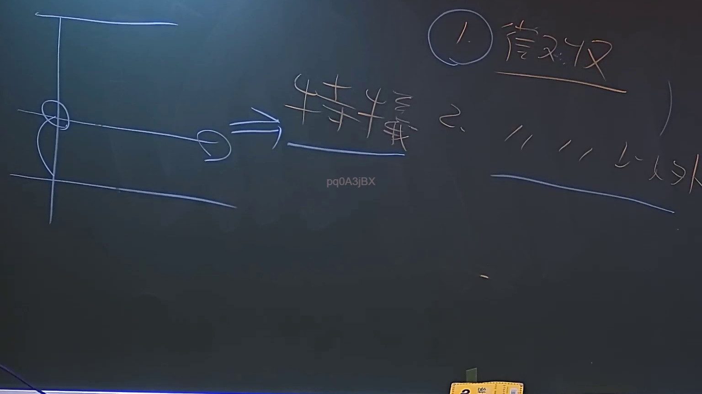

# 🎥 影音教材板書校對筆記
    - **來源影片**: [預約 6 2024-09-03 17-21-06-665](file:///J:/行政法A/ch34/預約 6 2024-09-03 17-21-06-665.mp4)
    - **課程分類**: `[行政法A`
    - **課堂章節**: `ch34]`
    - **影片時間戳記**: `00:47:15` (2835 秒)
    - **板書類型**: `關係圖/邏輯圖板書`
    - **偵測時間**: 2026-07-21 01:33:35
    
    ## 🔍 擷取黑板板書對照圖
    
    
    ## 🧠 AI 智慧理解與知識庫演化註記
    ：
您好，您的訊息中「擷取區域的 OCR 辨識字元」部分為空白，未提供實際辨識出的文字內容。因此我無法進行語意整理、法律條文比對（如民法第184條侵權行為責任、消滅時效等），也無法生成對應的 Mermaid.js 流程圖代碼。

請您補充以下資訊後我再為您完成分析：
1. OCR 辨識出的板書文字內容
2. （如有）老師在該時間點的口語說明摘要

一旦收到完整資料，我將立即依您的要求輸出：
- ：法律條文比對與知識演化註記
-
    
    ## 📊 可編輯之 Mermaid 關係流程圖
    ```mermaid
    ：對應的 Mermaid.js 流程圖程式碼
    ```
    
    ## ✍️ 操作者手動校對修改區
    <!-- 您可以直接修改上方的文字或調整 Mermaid 區塊中的節點，Obsidian 會即時重新渲染 -->
    - [ ] 欄位結構與法律邏輯已校對無誤。
    - **校對筆記**: 
    