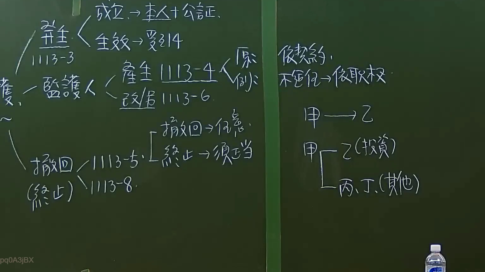

# 🎥 影音教材板書校對筆記
    - **來源影片**: [預約 6 2024-09-21 20-54-56-625](file:///J:/身分法/ch6/預約 6 2024-09-21 20-54-56-625.mp4)
    - **課程分類**: `[身分法`
    - **課堂章節**: `ch6]`
    - **影片時間戳記**: `00:25:15` (1515 秒)
    - **板書類型**: `影音板書`
    - **偵測時間**: 2026-07-19 19:03:40
    
    ## 🔍 擷取黑板板書對照圖
    
    
    ## 🧠 AI 智慧理解與知識庫演化註記
    ：
此板書主要在探討臺灣民法中「意定監護」（民法第1113-2條至第1113-10條）的法律機制。

1. **意定監護要件**：
   - 成立與生效：需依民法第1113-3條，由本人與受任人訂立書面契約，並須經公證（民法第1113-3條第1項），始得發生效力。
2. **意定監護之變動**：
   - 監護人之產生（第1113-4條）與改訂（第1113-6條）。
   - 意定監護之撤回與終止：依民法第1113-5條，本人於監護開始前，得隨時撤回；而監護開始後，若有正當理由，得依民法第1113-8條終止之（需經公證或法院許可）。板書特別註記撤回為「任意」，終止需「正當」。
3. **法律關係與代理權**：
   - 板書右側提到「依契約，不信任→依職權」，強調意定監護本質為委任契約，若受任人不適任，法院可依職權改定監護人。
   - 關於「甲→乙」、「甲→乙(投資)」、「丙、丁(其他)」，此處模擬代理權之範圍，即意定監護契約中對於代理權限之具體約定（如投資行為或日常生活事務管理）。
    
    ## 📊 可編輯之 Mermaid 關係流程圖
    ```mermaid
    ：
graph TD
    A["意定監護"] --> B["成立：本人+公證 - 1113-3"]
    A --> C["生效：受監護 - 1113-4"]
    C --> D["監護人產生 - 1113-4"]
    C --> E["監護人改訂 - 1113-6"]
    A --> F["撤回與終止 - 1113-5 / 1113-8"]
    F --> G["撤回 - 任意"]
    F --> H["終止 - 須正當"]
    I["代理權限範圍"] --> J["甲(本人)"]
    J --> K["乙(受任人/投資)"]
    J --> L["丙、丁(其他事項)"]
    ```
    
    ## ✍️ 操作者手動校對修改區
    <!-- 您可以直接修改上方的文字或調整 Mermaid 區塊中的節點，Obsidian 會即時重新渲染 -->
    - [ ] 欄位結構與法律邏輯已校對無誤。
    - **校對筆記**: 
    