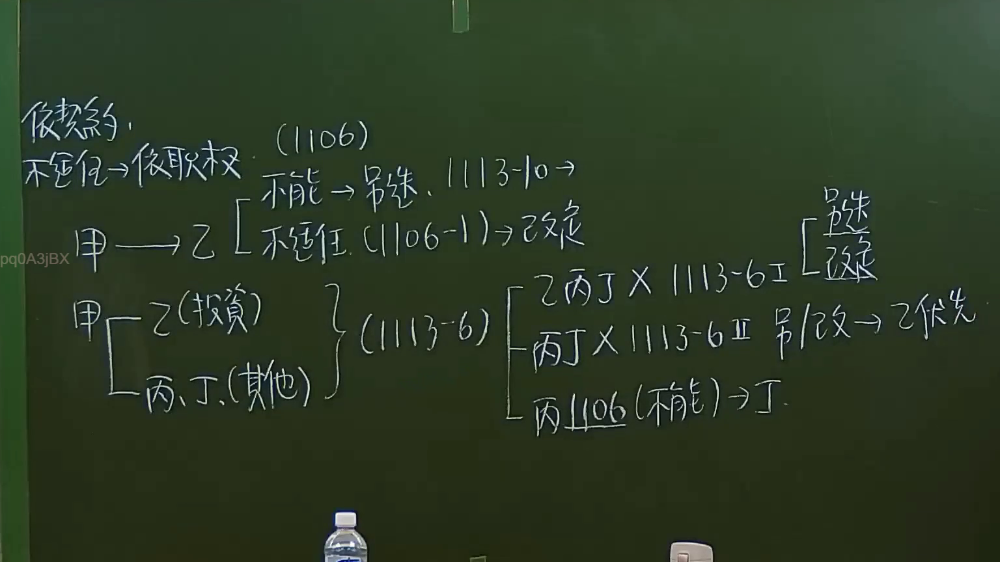

# 🎥 影音教材板書校對筆記
    - **來源影片**: [預約 6 2024-09-21 20-54-56-625](file:///J:/身分法/ch6/預約 6 2024-09-21 20-54-56-625.mp4)
    - **課程分類**: `[身分法`
    - **課堂章節**: `ch6]`
    - **影片時間戳記**: `00:30:15` (1815 秒)
    - **板書類型**: `影音板書`
    - **偵測時間**: 2026-07-19 19:03:48
    
    ## 🔍 擷取黑板板書對照圖
    
    
    ## 🧠 AI 智慧理解與知識庫演化註記
    ：
本板書主要探討臺灣《民法》親屬編關於「監護」及「意定監護」制度的法律適用與改定機制，核心依據為民法第 1106 條、第 1106-1 條及第 1113-6 條。

1. **OCR 辨識內容**：
   - 「意定監護、不適任→依職權」
   - 「(1106) 不能→另選，1113-10→不適任(1106-1)→改定」
   - 「甲→乙」
   - 「甲→乙(投資)」、「丙、丁(其他)」
   - 「(1113-6)→[乙丙丁×1113-6Ⅰ[另選、改定]」、「丙丁×1113-6Ⅱ另改→乙優先」、「丙1106(不能)→丁」

2. **法理與條文對照**：
   - **民法第 1106 條（不能擔任或不適任之更換）**：針對監護人有「不能」管理職務或「不適任」情形，法院得依職權或利害關係人聲請改定。
   - **民法第 1106-1 條**：專門針對意定監護受監護人，若意定監護人有不適任情事，法院得改定之。
   - **民法第 1113-6 條（分任監護職務）**：此條規定法院得選定數人為監護人，並得就職務分配之。板書呈現了將「投資」(乙)與「其他事務」(丙、丁)分權的邏輯。
   - **分權後之改定機制**：板書討論當分權監護中，特定監護人（乙丙丁）發生不適任或不能時的處理：
     - 第 1113-6 條第 1 項：原則上可另選或改定。
     - 第 1113-6 條第 2 項：法院可依職權改定由特定人（如乙）優先承擔部分職務，或針對「丙」發生「不能」狀況時，直接改由「丁」接手。
    
    ## 📊 可編輯之 Mermaid 關係流程圖
    ```mermaid
    ：
graph LR
    A["甲 (受監護人)"]
    B["乙 (監護人-投資)"]
    C["丙 (監護人-其他)"]
    D["丁 (監護人-其他)"]
    
    A -- "依職權/聲請" --> E["改定程序"]
    E -- "民法1106" --> F["不能或不適任"]
    E -- "民法1113-6" --> G["職務分配 (乙、丙、丁)"]
    G -- "乙丙丁不適任" --> H["另選或改定"]
    G -- "丙不能" --> I["丁遞補"]
    G -- "另改" --> J["乙優先"]
    ```
    
    ## ✍️ 操作者手動校對修改區
    <!-- 您可以直接修改上方的文字或調整 Mermaid 區塊中的節點，Obsidian 會即時重新渲染 -->
    - [ ] 欄位結構與法律邏輯已校對無誤。
    - **校對筆記**: 
    