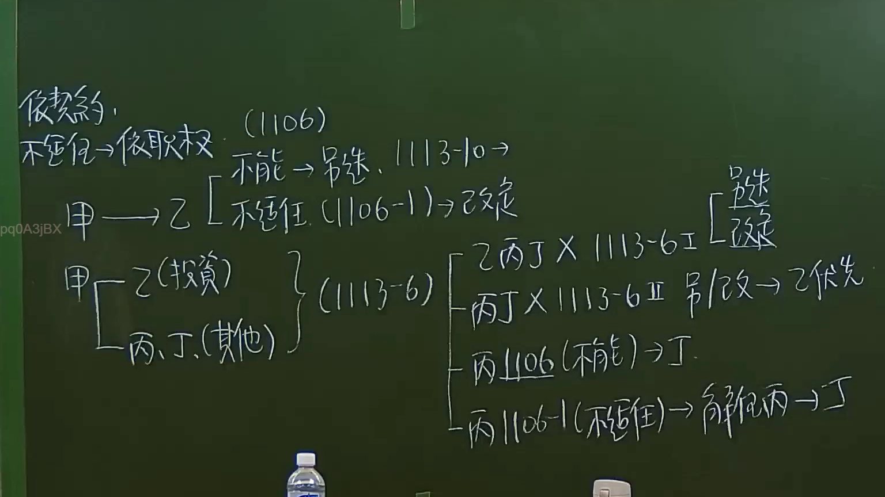

# 🎥 影音教材板書校對筆記
    - **來源影片**: [預約 6 2024-09-21 20-54-56-625](file:///J:/身分法/ch6/預約 6 2024-09-21 20-54-56-625.mp4)
    - **課程分類**: `[身分法`
    - **課堂章節**: `ch6]`
    - **影片時間戳記**: `00:31:30` (1890 秒)
    - **板書類型**: `影音板書`
    - **偵測時間**: 2026-07-19 19:03:58
    
    ## 🔍 擷取黑板板書對照圖
    
    
    ## 🧠 AI 智慧理解與知識庫演化註記
    ：
此板書內容涉及臺灣《民法》親屬編關於「監護」及「意定監護」之法律關係。板書核心在於闡述當監護人無法執行職務或不適任時，相關法律條文的適用與變更流程，特別聚焦於「意定監護」相關法規。

1. **辨識內容**：
   - 頂部：依契約，不適任 -> 依職權（1106）。
   - 中左：甲 -> 乙（不能 -> 另選，1113-10 -> 改定；不適任 1106-1 -> 改定）。
   - 中下：甲 — 乙（投資）/ 丙、丁（其他）} (1113-6)。
   - 右側：1113-6 II：乙丙丁 X 1113-6 II -> 另選/改定，另選 -> 乙優先；丙 1106（不能）-> 丁；丙 1106-1（不適任）-> 解任丙 -> 丁。

2. **法律解析**：
   - **民法第1106條與1106-1條**：規定監護人若有「不能」執行職務或「不適任」情形時，法院應依職權或利害關係人聲請改定之。
   - **意定監護（民法第1113-2條起）**：板書提到的「依契約」與「1113-6」，係指意定監護制度。當事人可事先預約監護人。
   - **邏輯演化**：
     - 當多位監護人（如板書中的乙、丙、丁）同時存在且涉及不同職務（投資與其他事務）時，若發生不能或不適任，法規架構會優先考慮原約定意旨（另選或改定）。
     - 1113-6條規定意定監護人有數人時，若無特別約定，其職務執行之細節及處理方式。
    
    ## 📊 可編輯之 Mermaid 關係流程圖
    ```mermaid
    ：
graph TD
    A["甲"] --> B["乙 (投資)"]
    A --> C["丙、丁 (其他)"]
    B -- "1113-6 II" --> D{"衝突/變更"}
    C -- "1113-6 II" --> D
    D --> E["另選/改定"]
    E --> F["乙優先"]
    D --> G["丙 1106 (不能) -> 丁"]
    D --> H["丙 1106-1 (不適任) -> 解任丙 -> 丁"]
    I["意定監護 (契約)"] --> J["不能 -> 另選 (1113-10)"]
    I --> K["不適任 -> 改定 (1106-1)"]
    ```
    
    ## ✍️ 操作者手動校對修改區
    <!-- 您可以直接修改上方的文字或調整 Mermaid 區塊中的節點，Obsidian 會即時重新渲染 -->
    - [ ] 欄位結構與法律邏輯已校對無誤。
    - **校對筆記**: 
    