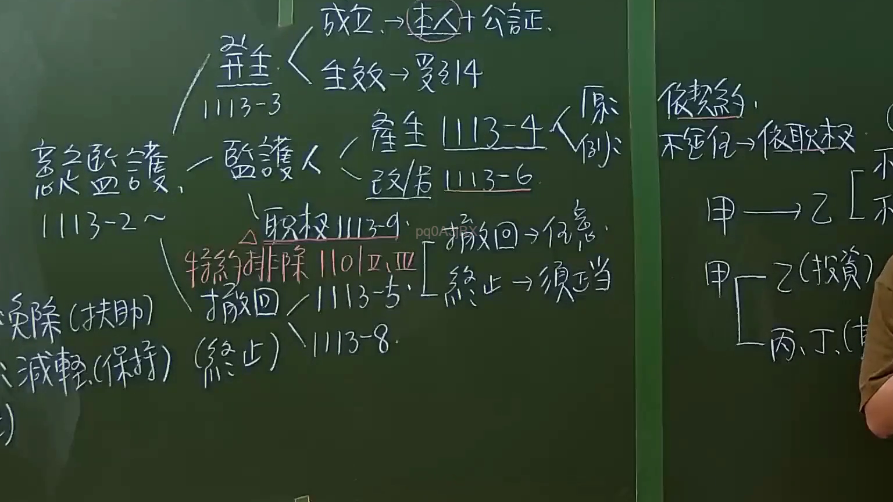

# 🎥 影音教材板書校對筆記
    - **來源影片**: [預約 6 2024-09-21 20-54-56-625](file:///J:/身分法/ch6/預約 6 2024-09-21 20-54-56-625.mp4)
    - **課程分類**: `[身分法`
    - **課堂章節**: `ch6]`
    - **影片時間戳記**: `01:00:45` (3645 秒)
    - **板書類型**: `影音板書`
    - **偵測時間**: 2026-07-19 19:04:25
    
    ## 🔍 擷取黑板板書對照圖
    
    
    ## 🧠 AI 智慧理解與知識庫演化註記
    ：
本板書主要講授《民法》關於「意定監護」的法律規定。
1. **核心概念辨識**：
   - 「意定監護」：對照民法第1113-2條起之意定監護制度。
   - 成立與生效：意定監護需由「本人」與「受任人」簽訂契約，並經「公證」（民法第1113-3條）。契約生效要件則連結至民法第1113-4條。
   - 監護人職務：包含監護人（民法第1113-4、1113-6條）及職務執行（民法第1113-9條）。
   - 撤回與終止：依民法第1113-5條，意定監護契約之撤回屬「任意」性質；契約終止則須具備「正當理由」（須正當）。
   - 特約排除：法律允許透過特約排除部分適用（民法第1110條第2、3項）。
   - 其他機制：提及免除（扶助）與減輕（保持）等相關制度。

2. **法條對照**：
   - 民法第1113-2條：意定監護之定義。
   - 民法第1113-3條：意定監護契約之要式性（公證）。
   - 民法第1113-5條：意定監護契約之撤回與終止規定。
   - 民法第1110條：針對監護人職務執行之限制與排除條款。
    
    ## 📊 可編輯之 Mermaid 關係流程圖
    ```mermaid
    ：
graph TD
    A["意定監護 (1113-2)"] --> B["成立 (本人+公證 1113-3)"]
    A --> C["生效 (1113-4)"]
    A --> D["監護人"]
    D --> E["產生 (1113-4)"]
    D --> F["改任 (1113-6)"]
    D --> G["職務執行 (1113-9)"]
    A --> H["特約排除 (1110 II, III)"]
    A --> I["撤回/終止 (1113-5)"]
    I --> J["撤回 -> 任意"]
    I --> K["終止 -> 須正當"]
    A --> L["免除 (扶助)"]
    A --> M["減輕 (保持)"]
    N["依契約"] --> O["不適任 -> 依職權"]
    P["甲"] --> Q["乙 (投資)"]
    P --> R["丙、丁 (其他)"]
    ```
    
    ## ✍️ 操作者手動校對修改區
    <!-- 您可以直接修改上方的文字或調整 Mermaid 區塊中的節點，Obsidian 會即時重新渲染 -->
    - [ ] 欄位結構與法律邏輯已校對無誤。
    - **校對筆記**: 
    