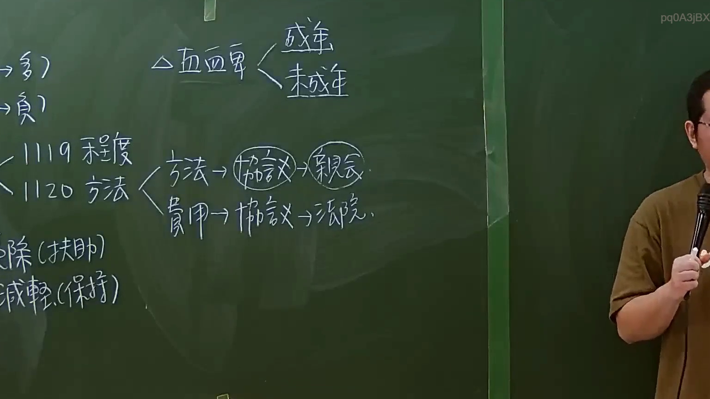

# 🎥 影音教材板書校對筆記
    - **來源影片**: [預約 6 2024-09-21 20-54-56-625](file:///J:/身分法/ch6/預約 6 2024-09-21 20-54-56-625.mp4)
    - **課程分類**: `[身分法`
    - **課堂章節**: `ch6]`
    - **影片時間戳記**: `01:14:15` (4455 秒)
    - **板書類型**: `影音板書`
    - **偵測時間**: 2026-07-19 19:04:37
    
    ## 🔍 擷取黑板板書對照圖
    
    
    ## 🧠 AI 智慧理解與知識庫演化註記
    ：
此板書主要探討我國《民法》親屬編關於「直系血親卑親屬」在扶養或親屬關係上的法律操作邏輯，特別聚焦於扶養義務之履行方式與程序。

1. **辨識內容**：
   - 頂部標註：「直系血親卑親屬」分為「成年」與「未成年」。
   - 左側條文參照：出現「1119 程度」與「1120 方法」。此處係指《民法》第1119條（扶養程度，應按受扶養權利者之需要，與負扶養義務者之經濟能力及身分定之）及第1120條（扶養之方法，由當事人協議定之；不能協議時，由親屬會議定之。但親屬會議不能召開或召開顯有困難者，由法院定之）。
   - 邏輯路徑：
     - 方法 $\rightarrow$ 協議 $\rightarrow$ 親屬會議（此為《民法》第1120條規定之原則程序）。
     - 費用 $\rightarrow$ 協議 $\rightarrow$ 法院（此為無法達成協議或親屬會議無法召開時之救濟程序）。
   - 左下角：提及「除（扶助）」與「減輕（保持）」，應是指《民法》第1118條之1（扶養義務之減輕或免除），即對於扶養權利者有重大虐待、侮辱或無正當理由未盡扶養義務者，法院得減輕或免除其扶養義務。

2. **法條對照**：
   - 民法第1118-1條：扶養義務之減免，係現代親屬法重要爭點，用以調節孝道與權利義務之衡平。
   - 民法第1120條：規範扶養方法之定法，板書精確拆解了「協議」、「親屬會議」與「法院裁定」之順序關係。
    
    ## 📊 可編輯之 Mermaid 關係流程圖
    ```mermaid
    ：
graph TD
    A["直系血親卑親屬"] --> B["成年"]
    A --> C["未成年"]
    D["扶養方法 1120條"] --> E["協議"]
    E --> F["親屬會議"]
    D --> G["費用"]
    G --> H["協議"]
    H --> I["法院"]
    J["減免扶養義務 1118-1條"] --> K["除-扶助"]
    J --> L["減輕-保持"]
    ```
    
    ## ✍️ 操作者手動校對修改區
    <!-- 您可以直接修改上方的文字或調整 Mermaid 區塊中的節點，Obsidian 會即時重新渲染 -->
    - [ ] 欄位結構與法律邏輯已校對無誤。
    - **校對筆記**: 
    