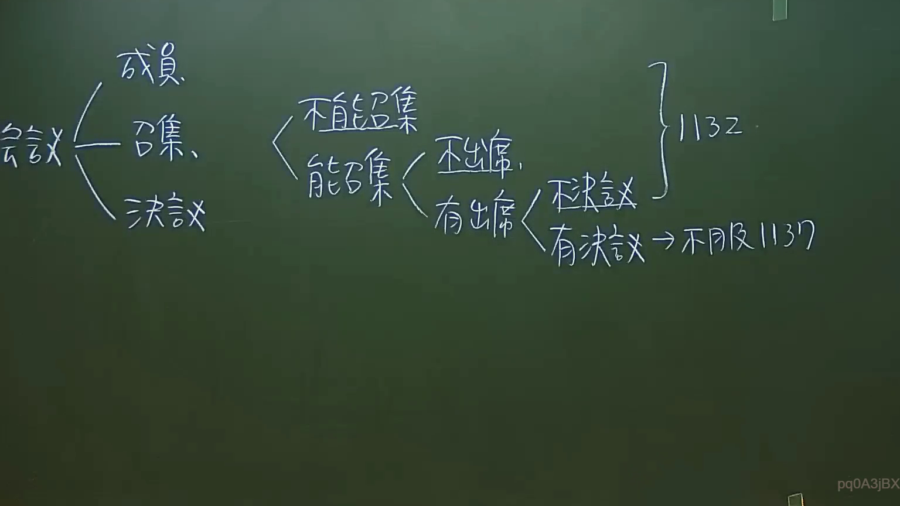

# 🎥 影音教材板書校對筆記
    - **來源影片**: [預約 6 2024-09-21 20-54-56-625](file:///J:/身分法/ch6/預約 6 2024-09-21 20-54-56-625.mp4)
    - **課程分類**: `[身分法`
    - **課堂章節**: `ch6]`
    - **影片時間戳記**: `01:35:00` (5700 秒)
    - **板書類型**: `影音板書`
    - **偵測時間**: 2026-07-19 19:04:50
    
    ## 🔍 擷取黑板板書對照圖
    
    
    ## 🧠 AI 智慧理解與知識庫演化註記
    ：
板書內容辨識：
1. 會議構成：成員、召集、決議。
2. 召集狀態分類：
   - 不能召集：對應民法第1132條（親屬會議召集困難）。
   - 能召集：分為「不出席」與「有出席」。
3. 出席後狀態分類：
   - 無決議：對應民法第1132條（親屬會議召集後無決議之處理）。
   - 有決議：對應民法第1137條（親屬會議決議不服之救濟）。

法律學理分析：
本板書探討的是我國民法親屬編中「親屬會議」之運作邏輯。
- 民法第1132條：規範當親屬會議不能召集，或召集後不能決議時，得由有召集權人聲請法院處理。
- 民法第1137條：規範對於親屬會議之決議有異議時，相關利害關係人（如未成年人、監護人等）得聲請法院處理。
該板書以「會議」為核心，梳理了從召集到決議的程序障礙排除機制，展現了法律程序在欠缺自治合意（無法召集或無法決議）時，介入司法裁決的過渡路徑。
    
    ## 📊 可編輯之 Mermaid 關係流程圖
    ```mermaid
    ：
graph LR
    A["會議"] --> B["成員"]
    A --> C["召集"]
    A --> D["決議"]
    C --> E{"能召集"}
    C --> F["不能召集"]
    F --> H["民法第1132條"]
    E --> I["不出席"]
    E --> J["有出席"]
    J --> K["無決議"]
    K --> H
    J --> L["有決議"]
    L --> M["不服"]
    M --> N["民法第1137條"]
    ```
    
    ## ✍️ 操作者手動校對修改區
    <!-- 您可以直接修改上方的文字或調整 Mermaid 區塊中的節點，Obsidian 會即時重新渲染 -->
    - [ ] 欄位結構與法律邏輯已校對無誤。
    - **校對筆記**: 
    