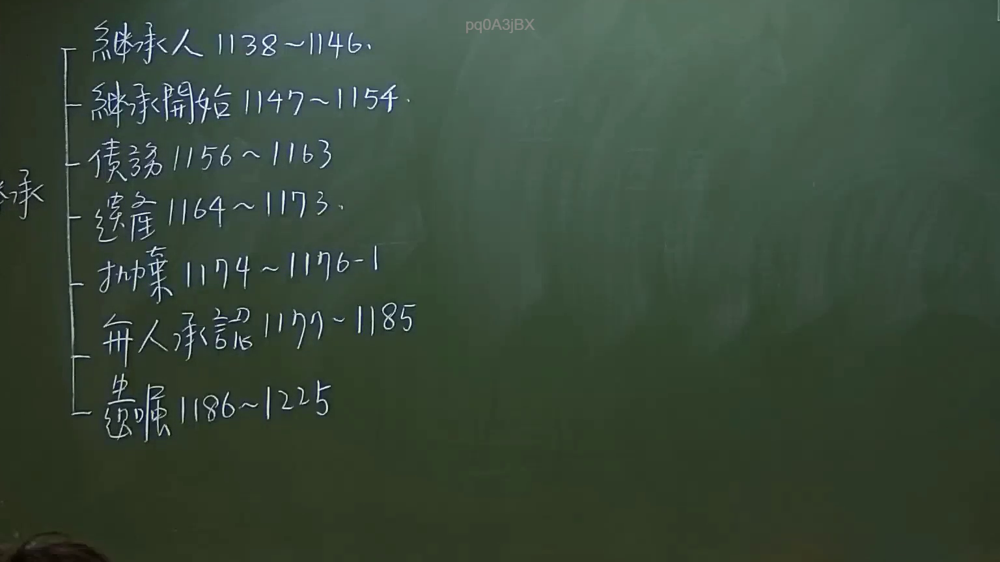

# 🎥 影音教材板書校對筆記
    - **來源影片**: [預約 6 2024-09-21 20-54-56-625](file:///J:/身分法/ch6/預約 6 2024-09-21 20-54-56-625.mp4)
    - **課程分類**: `[身分法`
    - **課堂章節**: `ch6]`
    - **影片時間戳記**: `01:38:45` (5925 秒)
    - **板書類型**: `影音板書`
    - **偵測時間**: 2026-07-19 19:05:01
    
    ## 🔍 擷取黑板板書對照圖
    
    
    ## 🧠 AI 智慧理解與知識庫演化註記
    ：
本板書清晰整理了《民法》第五編「繼承」之核心架構，將繼承章節依照法律條文（第1138條至第1225條）的邏輯順序進行了模組化分類。以下為對應解讀：

1. 繼承人 (1138-1146)：界定誰有資格成為繼承人，包含法定繼承人順序及應繼分。
2. 繼承開始 (1147-1154)：繼承發生的時點（被繼承人死亡時）及其效力範圍。
3. 債務 (1156-1163)：規範繼承人對被繼承人債務之責任（如概括繼承、有限責任制度）。
4. 遺產 (1164-1173)：遺產分割之方法及歸扣（歸扣為重要考點，涉及特留分與應繼分之平衡）。
5. 拋棄 (1174-1176-1)：繼承人拋棄繼承之程序與效力。
6. 無人承認 (1177-1185)：無繼承人時之遺產處理程序（包含遺產管理人之選任與賸餘遺產歸屬國庫）。
7. 遺囑 (1186-1225)：規範遺囑之要式性、種類及特留分制度（限制遺囑自由，保障近親基本權益）。

此架構為民法繼承編的體系索引，在法律實務中，對於繼承糾紛處理具有關鍵的定位功能。
    
    ## 📊 可編輯之 Mermaid 關係流程圖
    ```mermaid
    ：
graph TD
    A["繼承 (民法第1138條起)"] --> B["繼承人 (1138-1146)"]
    A --> C["繼承開始 (1147-1154)"]
    A --> D["債務 (1156-1163)"]
    A --> E["遺產 (1164-1173)"]
    A --> F["拋棄 (1174-1176-1)"]
    A --> G["無人承認 (1177-1185)"]
    A --> H["遺囑 (1186-1225)"]
    ```
    
    ## ✍️ 操作者手動校對修改區
    <!-- 您可以直接修改上方的文字或調整 Mermaid 區塊中的節點，Obsidian 會即時重新渲染 -->
    - [ ] 欄位結構與法律邏輯已校對無誤。
    - **校對筆記**: 
    