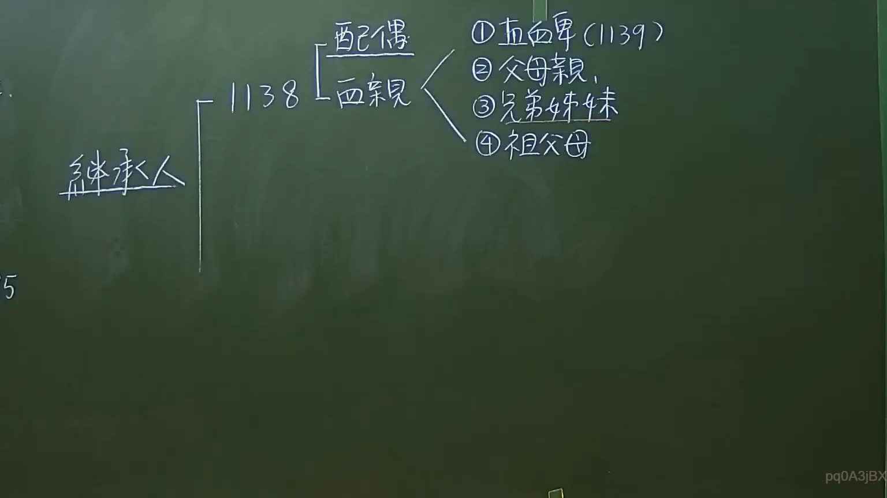

# 🎥 影音教材板書校對筆記
    - **來源影片**: [預約 6 2024-09-21 20-54-56-625](file:///J:/身分法/ch6/預約 6 2024-09-21 20-54-56-625.mp4)
    - **課程分類**: `[身分法`
    - **課堂章節**: `ch6]`
    - **影片時間戳記**: `01:42:45` (6165 秒)
    - **板書類型**: `影音板書`
    - **偵測時間**: 2026-07-19 19:05:10
    
    ## 🔍 擷取黑板板書對照圖
    
    
    ## 🧠 AI 智慧理解與知識庫演化註記
    ：
此板書解析臺灣民法中有關「遺產繼承人」的順位架構，是繼承編的核心概念。

1. **辨識內容**：
   - 繼承人：分為配偶與血親。
   - 1138條（法定繼承人順位）：
     - 配偶（當然繼承人）。
     - 血親繼承人順位：
       ① 直系血親卑親屬（民法第1139條定義：以親等近者為先）。
       ② 父母。
       ③ 兄弟姊妹。
       ④ 祖父母。

2. **法條對照與註記**：
   - **民法第1138條**：明定遺產繼承人除配偶外，依順序定之。配偶與各順位繼承人均得共同繼承。
   - **民法第1139條**：規範直系血親卑親屬之繼承順序，以親等近者為先，解決了子女、孫子女間的繼承優先性問題。
   - **邏輯演化**：此結構體現了「血親繼承順位制」。配偶在民法上具備特殊的「當然繼承權」，不論與哪一順位血親皆可共同繼承。而血親順位則採「排他性」原則（前順位有人繼承時，後順位即無繼承權）。
    
    ## 📊 可編輯之 Mermaid 關係流程圖
    ```mermaid
    ：
graph LR
    A["繼承人"] --> B["配偶"]
    A --> C["血親繼承人 - 民法1138條"]
    C --> D1["① 直系血親卑親屬 (民法1139條)"]
    C --> D2["② 父母"]
    C --> D3["③ 兄弟姊妹"]
    C --> D4["④ 祖父母"]
    ```
    
    ## ✍️ 操作者手動校對修改區
    <!-- 您可以直接修改上方的文字或調整 Mermaid 區塊中的節點，Obsidian 會即時重新渲染 -->
    - [ ] 欄位結構與法律邏輯已校對無誤。
    - **校對筆記**: 
    