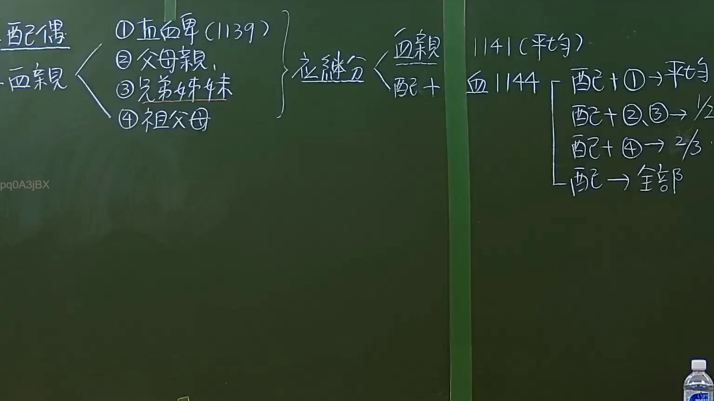

# 🎥 影音教材板書校對筆記
    - **來源影片**: [預約 6 2024-09-21 20-54-56-625](file:///J:/身分法/ch6/預約 6 2024-09-21 20-54-56-625.mp4)
    - **課程分類**: `[身分法`
    - **課堂章節**: `ch6]`
    - **影片時間戳記**: `01:44:30` (6270 秒)
    - **板書類型**: `影音板書`
    - **偵測時間**: 2026-07-19 19:05:21
    
    ## 🔍 擷取黑板板書對照圖
    
    
    ## 🧠 AI 智慧理解與知識庫演化註記
    ：
本板書主要闡述我國《民法》繼承編中，關於「法定繼承人順序」與「應繼分」的法律規範。

1. **繼承順序（民法第 1138 條）**：
   - 配偶為當然繼承人，與除配偶外之繼承人共同繼承。
   - 血親繼承順序依序為：(1) 直系血親卑親屬（民法第 1139 條）、(2) 父母、(3) 兄弟姊妹、(4) 祖父母。

2. **應繼分計算（民法第 1141 條、第 1144 條）**：
   - 民法第 1141 條規定同一順序繼承人有數人時，按人數平均繼承。
   - 民法第 1144 條規定配偶之應繼分：
     - 與第 1 順序（卑親屬）同為繼承時：平均分配。
     - 與第 2 順序（父母）或第 3 順序（兄弟姊妹）同為繼承時：配偶得 1/2。
     - 與第 4 順序（祖父母）同為繼承時：配偶得 2/3。
     - 無前四順序繼承人時：配偶得全部。
    
    ## 📊 可編輯之 Mermaid 關係流程圖
    ```mermaid
    ：
graph LR
    A["繼承人"] --> B["配偶"]
    A --> C["血親繼承人 (民法1138條)"]
    C --> C1["(1) 直系血親卑親屬 (1139條)"]
    C --> C2["(2) 父母"]
    C --> C3["(3) 兄弟姊妹"]
    C --> C4["(4) 祖父母"]
    D["應繼分計算 (1141, 1144條)"]
    D --> E["配偶 + (1) --> 平均分配"]
    D --> F["配偶 + (2)或(3) --> 配偶1/2"]
    D --> G["配偶 + (4) --> 配偶2/3"]
    D --> H["無血親繼承人 --> 配偶全部"]
    ```
    
    ## ✍️ 操作者手動校對修改區
    <!-- 您可以直接修改上方的文字或調整 Mermaid 區塊中的節點，Obsidian 會即時重新渲染 -->
    - [ ] 欄位結構與法律邏輯已校對無誤。
    - **校對筆記**: 
    