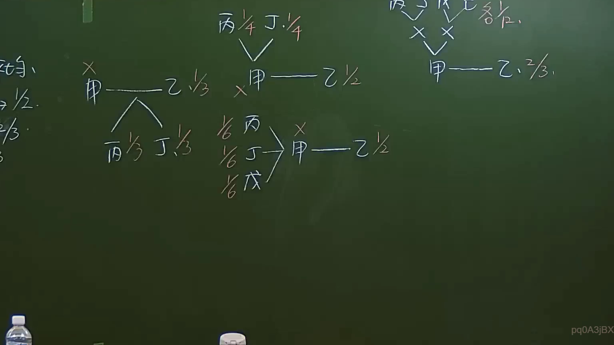

# 🎥 影音教材板書校對筆記
    - **來源影片**: [預約 6 2024-09-21 20-54-56-625](file:///J:/身分法/ch6/預約 6 2024-09-21 20-54-56-625.mp4)
    - **課程分類**: `[身分法`
    - **課堂章節**: `ch6]`
    - **影片時間戳記**: `01:47:00` (6420 秒)
    - **板書類型**: `影音板書`
    - **偵測時間**: 2026-07-19 19:05:30
    
    ## 🔍 擷取黑板板書對照圖
    
    
    ## 🧠 AI 智慧理解與知識庫演化註記
    ：
本板書主要呈現臺灣民法「繼承編」中，關於代位繼承與應繼分計算的數理邏輯。

1. **板書內容辨識**：
   - 左側：顯示甲死亡，其繼承人丙、丁各分得 1/3（推測為代位繼承或特定分配比例）。
   - 中間上側：丙 1/4、丁 1/4 為繼承份額。
   - 中間下側：顯示三名繼承人（丙、丁、戊）各分得 1/6，共同繼承甲之份額（1/2）。
   - 右側：顯示複數繼承結構，甲繼承 2/3。

2. **法律學理與法條對照**：
   - **代位繼承（民法第1140條）**：若被繼承人的子女先於被繼承人死亡，由其直系血親卑親屬代位繼承其應繼分。
   - **應繼分（民法第1141條、第1144條）**：配偶與子女之應繼分規定。
   - **邏輯分析**：板書展示了當被繼承人（甲）死亡，繼承份額如何透過比例拆解分配給下一代。例如中間下側顯示「1/6 丙、1/6 丁、1/6 戊」共同繼承甲所擁有的「1/2」，其數學總和為 1/2，符合繼承法公平原則。
    
    ## 📊 可編輯之 Mermaid 關係流程圖
    ```mermaid
    ：
graph TD
    A["甲 (被繼承人)"] --> B1["丙 (繼承份額 1/3)"]
    A --> B2["丁 (繼承份額 1/3)"]
    C["甲 (被繼承人)"] --> D1["丙 (繼承份額 1/6)"]
    C --> D2["丁 (繼承份額 1/6)"]
    C --> D3["戊 (繼承份額 1/6)"]
    E["甲 (被繼承人)"] --> F["乙 (繼承份額 2/3)"]
    ```
    
    ## ✍️ 操作者手動校對修改區
    <!-- 您可以直接修改上方的文字或調整 Mermaid 區塊中的節點，Obsidian 會即時重新渲染 -->
    - [ ] 欄位結構與法律邏輯已校對無誤。
    - **校對筆記**: 
    