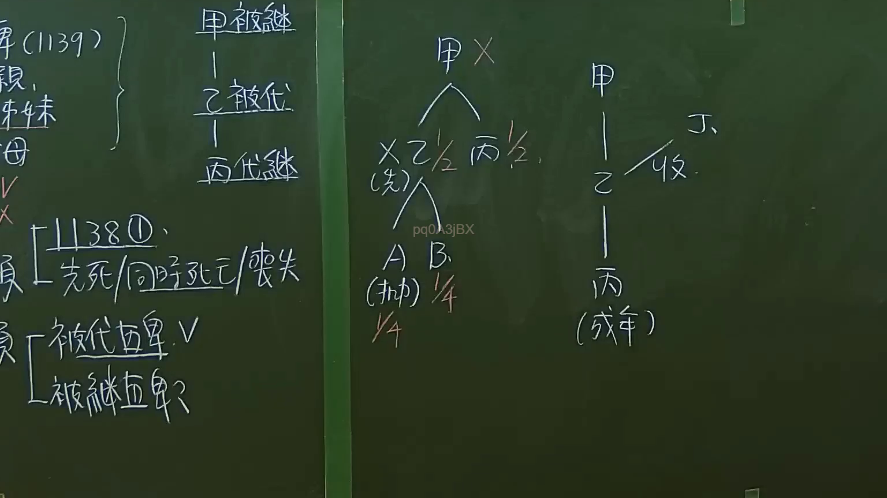

# 🎥 影音教材板書校對筆記
    - **來源影片**: [預約 6 2024-09-21 20-54-56-625](file:///J:/身分法/ch6/預約 6 2024-09-21 20-54-56-625.mp4)
    - **課程分類**: `[身分法`
    - **課堂章節**: `ch6]`
    - **影片時間戳記**: `02:07:00` (7620 秒)
    - **板書類型**: `影音板書`
    - **偵測時間**: 2026-07-19 19:05:51
    
    ## 🔍 擷取黑板板書對照圖
    
    
    ## 🧠 AI 智慧理解與知識庫演化註記
    ：
本板書主要討論臺灣民法「繼承編」中關於代位繼承與收養之法律關係。

1. **辨識內容**：
   - 左側：提及民法第1139條（直系血親卑親屬），並解析繼承權發生的核心：若繼承人符合「先死」、「同時死亡」、「喪失繼承權」等情況，發生「代位繼承」（民法第1140條）。
   - 中間結構：被繼承人甲死亡（X），遺產由子女乙、丙各繼承1/2。其中乙先於甲死亡，乙之子女（孫輩）A、B發生代位繼承，各繼承1/4。
   - 右側結構：甲與乙有收養關係（收），而乙有子女丙。此處強調收養後之親屬關係。

2. **法條對照**：
   - **代位繼承（民法第1140條）**：直系血親卑親屬若在繼承開始前死亡或喪失繼承權，由其直系血親卑親屬代位繼承其應繼分。板書中「先死」、「同時死亡」、「喪失」即為法定要件。
   - **收養關係（民法第1077條）**：養子女與養父母及其親屬間之關係，除法律另有規定外，與婚生子女同。
   - **繼承順位（民法第1138條）**：遺產繼承人，除配偶外，直系血親卑親屬為第一順位。

3. **法律邏輯**：
   - 此圖展示了「繼承權之代位」與「收養關係之延伸」。特別注意，代位繼承僅適用於「直系血親卑親屬」，若被繼承人無直系血親卑親屬，則依照第1138條順位由配偶、父母、兄弟姊妹或祖父母繼承。
    
    ## 📊 可編輯之 Mermaid 關係流程圖
    ```mermaid
    ：
graph TD
    A["甲 (被繼承人)"]
    A --> B["乙 (子女 - 先死)"]
    A --> C["丙 (子女 - 1/2)"]
    B --> D["A (代位繼承 - 1/4)"]
    B --> E["B (代位繼承 - 1/4)"]
    F["甲 (養父)"] -- "收養" --> G["乙 (養子)"]
    G --> H["丙 (孫輩 - 成年)"]
    subgraph "民法第1140條代位繼承"
    B
    D
    E
    end
    ```
    
    ## ✍️ 操作者手動校對修改區
    <!-- 您可以直接修改上方的文字或調整 Mermaid 區塊中的節點，Obsidian 會即時重新渲染 -->
    - [ ] 欄位結構與法律邏輯已校對無誤。
    - **校對筆記**: 
    