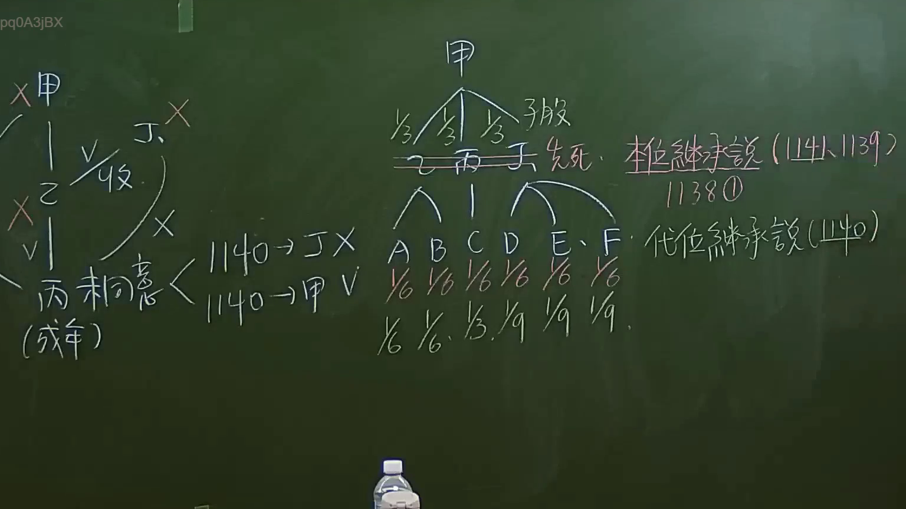

# 🎥 影音教材板書校對筆記
    - **來源影片**: [預約 6 2024-09-21 20-54-56-625](file:///J:/身分法/ch6/預約 6 2024-09-21 20-54-56-625.mp4)
    - **課程分類**: `[身分法`
    - **課堂章節**: `ch6]`
    - **影片時間戳記**: `02:14:30` (8070 秒)
    - **板書類型**: `影音板書`
    - **偵測時間**: 2026-07-19 19:06:01
    
    ## 🔍 擷取黑板板書對照圖
    
    
    ## 🧠 AI 智慧理解與知識庫演化註記
    ：
1. **板書內容辨識**：
   - 左側：討論「丙（成年）」與「甲」及「乙」之關係，涉及「收養」與相關法律適用（打叉或打勾表示法律要件之檢驗，如 1140 條）。
   - 右側：處理繼承權分配問題。被繼承人為「甲」，其子女為「乙、丙、丁」。
   - 關鍵法理：板書探討「推定繼承說 (1141、1139、1138條)」與「代位繼承說 (1140條)」之差異，並透過乙、丙、丁先死之案例，展示應繼分之計算（1/6 或 1/9 等數值變化）。

2. **法律學理與法條對照**：
   - **代位繼承（民法第1140條）**：被繼承人之子女，於繼承開始前死亡或喪失繼承權者，由其直系血親卑親屬代位繼承其應繼分。板書中針對乙、丙、丁先死的情況，探討其後代（A、B、C、D、E、F）如何繼承。
   - **應繼分計算**：若乙、丙、丁均死亡，其子女依代位繼承規定，各自繼承原屬父母之應繼分（各 1/3，再平分給子女）。
   - **學理爭點**：板書區分「推定繼承說」與「代位繼承說」，主要在於探討繼承權之性質為「固有權」還是「代位權」，這影響到當繼承人喪失繼承權或死亡時，其後代繼承範圍之認定。
    
    ## 📊 可編輯之 Mermaid 關係流程圖
    ```mermaid
    ：
graph TD
    甲["被繼承人：甲"] --> 乙["子女：乙 (先死)"]
    甲 --> 丙["子女：丙 (先死)"]
    甲 --> 丁["子女：丁 (先死)"]
    乙 --> A["孫輩：A"]
    乙 --> B["孫輩：B"]
    丙 --> C["孫輩：C"]
    丁 --> D["孫輩：D"]
    丁 --> E["孫輩：E"]
    丁 --> F["孫輩：F"]
    subgraph 法律依據
    L1["民法第1140條：代位繼承"]
    L2["民法第1138條：遺產繼承人"]
    end
    ```
    
    ## ✍️ 操作者手動校對修改區
    <!-- 您可以直接修改上方的文字或調整 Mermaid 區塊中的節點，Obsidian 會即時重新渲染 -->
    - [ ] 欄位結構與法律邏輯已校對無誤。
    - **校對筆記**: 
    