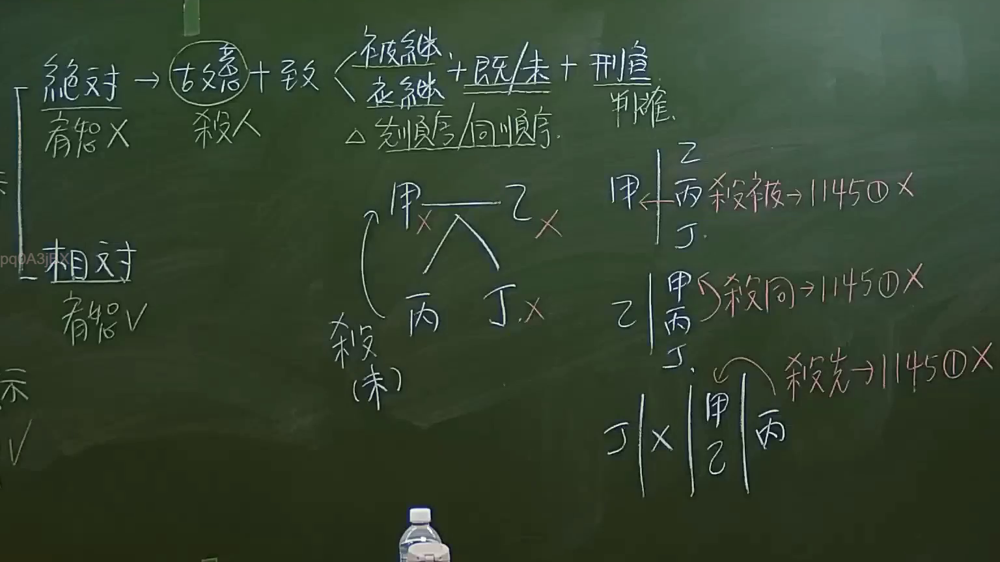

# 🎥 影音教材板書校對筆記
    - **來源影片**: [預約 6 2024-09-21 20-54-56-625](file:///J:/身分法/ch6/預約 6 2024-09-21 20-54-56-625.mp4)
    - **課程分類**: `[身分法`
    - **課堂章節**: `ch6]`
    - **影片時間戳記**: `02:31:00` (9060 秒)
    - **板書類型**: `影音板書`
    - **偵測時間**: 2026-07-19 19:06:20
    
    ## 🔍 擷取黑板板書對照圖
    
    
    ## 🧠 AI 智慧理解與知識庫演化註記
    ：
本板書核心探討的是《民法》第 1145 條第 1 項第 1 款之「繼承權喪失」事由，即「故意致被繼承人或應繼承人於死或雖未致死因而受刑之宣告者」。

一、 OCR 文字辨識：
1. 階層架構：左側分「絕對（宥恕 ×）」與「相對（宥恕 V）」。
2. 構成要件：故意致被繼承人/應繼承人於死（既/未遂 + 刑之宣告）。
3. 繼承順序：強調「同順序」之適用。
4. 案例邏輯：
   - 圖一：甲、乙（被繼承人/繼承人）生丙、丁，丙殺丁（未遂），討論繼承權影響。
   - 圖二：甲殺被（被繼承人）→ 1145 ① ×。
   - 圖三：乙殺同（同順序繼承人）→ 1145 ① ×。
   - 圖四：丁 ×（死亡或其他原因），甲、乙、丙（存活），討論「殺先」之繼承權喪失問題。

二、 法律解析：
- **民法第 1145 條第 1 項第 1 款**：規定喪失繼承權之要件為「故意」致死（既遂）或「故意致死未遂但受刑之宣告」。
- **絕對與相對**：此處指被繼承人是否能透過「宥恕」（民法第 1145 條第 2 項）來回復其繼承權。第 1 款（殺害行為）通常被視為「絕對」喪失（雖然法條設有宥恕條款，但實務上針對殺害被繼承人者，宥恕之認定極為嚴格）。
- **邏輯演化**：
  - 「殺被」：侵害被繼承人之生命，必喪失。
  - 「殺同」：侵害同順序繼承人之生命，目的在於排除他人以獨占遺產，亦構成喪失事由。
  - 「殺先/殺後」：強調繼承權喪失之發生時點與繼承人身分地位之關聯。
    
    ## 📊 可編輯之 Mermaid 關係流程圖
    ```mermaid
    ：
graph TD
    A["絕對喪失(宥恕X)"] --> B["故意致被繼承人/應繼承人於死"]
    C["相對喪失(宥恕V)"]
    B --> D["構成要件 既遂/未遂 + 刑之宣告"]
    E["案例 殺被繼承人"] --> F["民法1145條第1項第1款 喪失繼承權"]
    G["案例 殺同順序繼承人"] --> F
    H["案例 殺先"] --> F
    I["繼承人甲乙丙丁"] --> J{"丙殺丁(未遂)"}
    J --> K["受刑之宣告即喪失繼承權"]
    ```
    
    ## ✍️ 操作者手動校對修改區
    <!-- 您可以直接修改上方的文字或調整 Mermaid 區塊中的節點，Obsidian 會即時重新渲染 -->
    - [ ] 欄位結構與法律邏輯已校對無誤。
    - **校對筆記**: 
    