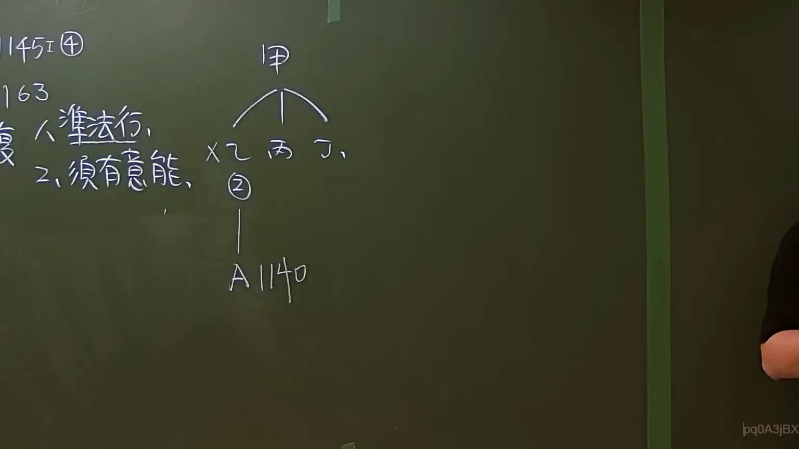

# 🎥 影音教材板書校對筆記
    - **來源影片**: [預約 7 2024-09-22 10-15-06-597](file:///J:/身分法/ch7/預約 7 2024-09-22 10-15-06-597.mp4)
    - **課程分類**: `[身分法`
    - **課堂章節**: `ch7]`
    - **影片時間戳記**: `00:14:00` (840 秒)
    - **板書類型**: `影音板書`
    - **偵測時間**: 2026-07-19 23:51:55
    
    ## 🔍 擷取黑板板書對照圖
    
    
    ## 🧠 AI 智慧理解與知識庫演化註記
    ：
這張板書呈現的是臺灣民法「繼承編」關於「繼承權之喪失」與「代位繼承」的法律邏輯關係。

1. **板書 OCR 文字辨識**：
   - 左側：`1145 Ⅰ ④`、`163`（推測為講義頁碼）、`準法行`（底部加底線，意指準法律行為）、`2. 須有意能`。
   - 右側圖示：`甲`（被繼承人）分支至 `X`（劃除）、`乙`、`丙`、`丁`（第一順序繼承人）。其中 `乙` 下方標註 `②` 符號並連結至 `A`，旁邊註記 `1140`。

2. **法律學理與爭點解讀**：
   - **繼承權喪失（民法第1145條第1項第4款）**：板書左上角的 `1145 Ⅰ ④` 指的是繼承人若有「偽造、變造、湮滅或隱匿被繼承人關於繼承之遺囑」之行為，將喪失其繼承權。
   - **宥恕之性質（準法律行為）**：依民法第1145條第2項，若被繼承人對於上述行為表示「宥恕」（原諒），繼承權可以恢復。老師特別標註「準法行」（準法律行為），意指「宥恕」在法律性質上屬於「意思通知」或類似行為，不完全等同於法律行為，但產生法律效果。
   - **意思能力（意能）**：老師強調「2. 須有意能」，表示被繼承人在做出宥恕意思表示時，雖然不一定要具備完全行為能力，但至少必須具備「意思能力」（能辨識其行為後果的能力），該宥恕方為有效。
   - **代位繼承（民法第1140條）**：右側圖示中，`乙` 可能是因為上述 1145 條的事由喪失繼承權。依據民法第1140條規定，第一順序之繼承人（乙）於繼承開始前死亡或「喪失繼承權」者，由其直系血親卑親屬（A）代位繼承其應繼分。這解釋了為什麼 `乙` 的下方會連結到 `A` 並標註 `1140`。

3. **總結邏輯**：
   此板書在說明當繼承人乙觸犯民法 1145 條喪失權利時，若被繼承人甲要原諒他（宥恕），甲必須具備意思能力（準法律行為之要件）；若未獲原諒而喪失權利，則由乙的子女 A 依 1140 條代位繼承。
    
    ## 📊 可編輯之 Mermaid 關係流程圖
    ```mermaid
    ：
graph TD
    Jia["被繼承人 甲 (須具備意思能力)"]
    
    subgraph "第一順序繼承人"
    Yi["乙 (喪失繼承權人)"]
    Bing["丙"]
    Ding["丁"]
    end
    
    Jia --- Yi
    Jia --- Bing
    Jia --- Ding
    
    Yi -- "民法第1140條 代位繼承" --> A["代位繼承人 A"]
    
    Note1["民法第1145條第1項第4款<br/>(喪失繼承權事由)"] -.-> Yi
    Note2["宥恕之法律性質：<br/>1. 準法律行為<br/>2. 須具備意思能力"] -.-> Jia
    
    style Yi fill#f9f,stroke#333,stroke-width2px
    style A fill#bbf,stroke#333,stroke-width2px
    ```
    
    ## ✍️ 操作者手動校對修改區
    <!-- 您可以直接修改上方的文字或調整 Mermaid 區塊中的節點，Obsidian 會即時重新渲染 -->
    - [ ] 欄位結構與法律邏輯已校對無誤。
    - **校對筆記**: 
    