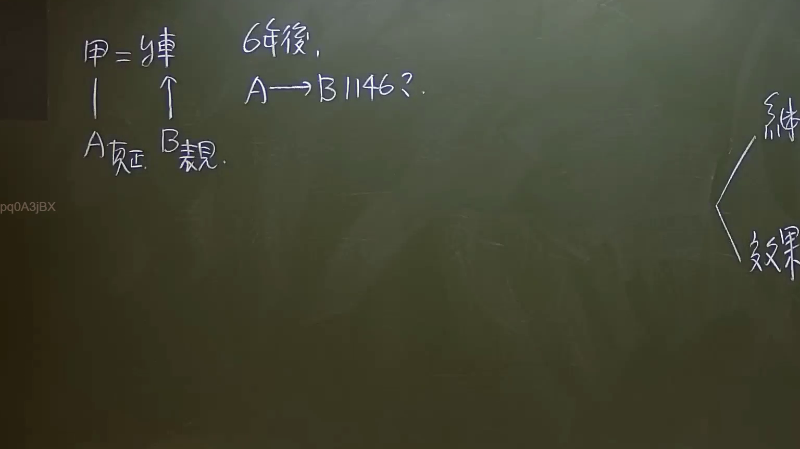

# 🎥 影音教材板書校對筆記
    - **來源影片**: [預約 7 2024-09-22 10-15-06-597](file:///J:/身分法/ch7/預約 7 2024-09-22 10-15-06-597.mp4)
    - **課程分類**: `[身分法`
    - **課堂章節**: `ch7]`
    - **影片時間戳記**: `00:42:30` (2550 秒)
    - **板書類型**: `影音板書`
    - **偵測時間**: 2026-07-19 23:52:19
    
    ## 🔍 擷取黑板板書對照圖
    
    
    ## 🧠 AI 智慧理解與知識庫演化註記
    ：

一、 板書文字辨識 (OCR)：
1. 左側關係：
   - 甲 = y車 (代表被繼承人甲與其遺產 y車之關係)
   - A 真正 (代表 A 為「真正繼承人」)
   - B 表見 (代表 B 為「表見繼承人」)
   - A 與 甲 之間有垂直連結線（繼承關係）；B 則有箭頭指向遺產方向（表示侵害或主張繼承）。
2. 中間爭點：
   - 6年後，
   - A → B 1146? (探討真正繼承人 A 對表見繼承人 B 主張民法第 1146 條繼承回復請求權之可能性)
3. 右側架構：
   - 繼 (大括號上端)
   - 效果 (大括號下端)

二、 法律學理與法條對照：
1. 核心法條：民法第 1146 條（繼承回復請求權）
   - 條文內容：繼承權被侵害人或其法定代理人，得請求回復之。前項回復請求權，自知悉被侵害之時起，二年間不行使而消滅；自繼承開始時起，逾十年者亦同。
2. 案件邏輯分析：
   - 身份界定：本案涉及「真正繼承人（A）」與「表見繼承人（B）」之爭。表見繼承人係指無繼承權，但就其外表有足以使人信其為繼承人之事實，並以此資格行使遺產上權利之人。
   - 時效爭議：板書特別標註「6年後」。依民法第 1146 條第 2 項，該權利有「2年」與「10年」的時效限制。若 A 在繼承開始 6 年後才起訴，可能已逾 2 年的短期消滅時效（若 A 早已察覺），但尚未逾 10 年的長期時效。
3. 法律效果與演化（重要爭點）：
   - 請求權競合：當 1146 條的時效完成後，真正繼承人 A 是否仍得主張民法第 767 條的物上請求權？
   - 傳統實務見解：認為 1146 條是特別法，若該時效消滅，表見繼承人即取得原始取得之抗辯，真正繼承人不得再依 767 條請求（此為保護法律關係之安定）。
   - 司法院大法官釋字第 437 號及近期實務：雖有討論時效限制，但強調若繼承權之侵害係在繼承開始後發生，且與繼承地位之確認無涉者，仍有適用一般時效之空間。然而在「表見繼承」典型案例中，通常優先適用 1146 條之短時效。
    
    ## 📊 可編輯之 Mermaid 關係流程圖
    ```mermaid
    ：
graph TD
    Jia["被繼承人甲 (遺產y車)"]
    A["真正繼承人 A"]
    B["表見繼承人 B"]
    
    Jia --- A
    B -.->|"主張繼承/占有y車"| Jia
    
    A --"6年後行使 1146 請求權?"--> B
    
    subgraph 時效與法律效果
    T1["2年短時效 (知悉)"]
    T2["10年長時效 (繼承開始)"]
    Effect["繼承回復之效果/時效抗辯"]
    end
    
    A -.-> T2
    B -.-> T1
    Effect --- A
    Effect --- B
    ```
    
    ## ✍️ 操作者手動校對修改區
    <!-- 您可以直接修改上方的文字或調整 Mermaid 區塊中的節點，Obsidian 會即時重新渲染 -->
    - [ ] 欄位結構與法律邏輯已校對無誤。
    - **校對筆記**: 
    