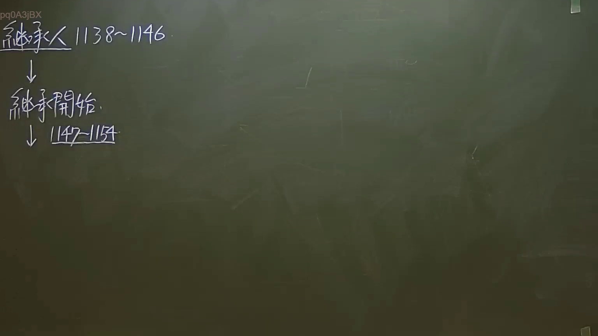

# 🎥 影音教材板書校對筆記
    - **來源影片**: [預約 7 2024-09-22 10-15-06-597](file:///J:/身分法/ch7/預約 7 2024-09-22 10-15-06-597.mp4)
    - **課程分類**: `[身分法`
    - **課堂章節**: `ch7]`
    - **影片時間戳記**: `00:54:00` (3240 秒)
    - **板書類型**: `影音板書`
    - **偵測時間**: 2026-07-19 23:52:34
    
    ## 🔍 擷取黑板板書對照圖
    
    
    ## 🧠 AI 智慧理解與知識庫演化註記
    ：
這張板書內容聚焦於臺灣《民法》繼承編的核心架構，將繼承法律關係拆解為「主體辨識」與「發生效力」兩個階段：

1. 繼承人（第 1138～1146 條）：
此部分規範「誰有資格繼承」。老師標註的條文區間涵蓋了繼承制度的核心：
- 第 1138 條：規定法定繼承人及其順序（配偶為當然繼承人，其餘依序為直系血親卑親屬、父母、兄弟姊妹、祖父母）。
- 第 1140 條：代位繼承之規定。
- 第 1144 條：配偶之應繼分。
- 第 1145 條：喪失繼承權之事由（如故意致被繼承人於死、偽造遺囑等）。
- 第 1146 條：繼承回復請求權，當繼承權受侵害時的救濟手段。

2. 繼承開始：
這是一個重要的法律事實時點。根據民法第 1147 條規定：「繼承，因被繼承人死亡而開始。」這代表權利義務的移轉是在死亡那一刻自動發生，不論繼承人是否知悉。

3. 繼承之效力（第 1147～1154 條）：
此部分規範「繼承開始後的法律後果」：
- 第 1148 條：概括繼承之原則與有限責任之例外（現行法已改採「全面限定繼承」，即繼承人僅以遺產為限度，對被繼承人之債務負清償責任）。
- 第 1148-1 條：被繼承人死亡前兩年內贈與財產之視為遺產。
- 第 1153 條：繼承人對於被繼承人之債務，負連帶責任。

總結來說，板書邏輯是先確定「人的資格」（1138-1146），再進入「繼承事實發生」（繼承開始），最後探討「法律責任與權利分配」（1147-1154）。
    
    ## 📊 可編輯之 Mermaid 關係流程圖
    ```mermaid
    ：
graph TD
    A["繼承人主體 (第1138-1146條)"] -- "確定繼承順位與資格" --> B("繼承開始 (第1147條)")
    B -- "法律事實觸發" --> C["繼承之效力 (第1147-1154條)"]
    C --> D["概括繼承有限責任 (第1148條)"]
    C --> E["遺產債務清償 (第1153-1154條)"]
    subgraph "法律制度架構"
    A
    B
    C
    end
    ```
    
    ## ✍️ 操作者手動校對修改區
    <!-- 您可以直接修改上方的文字或調整 Mermaid 區塊中的節點，Obsidian 會即時重新渲染 -->
    - [ ] 欄位結構與法律邏輯已校對無誤。
    - **校對筆記**: 
    