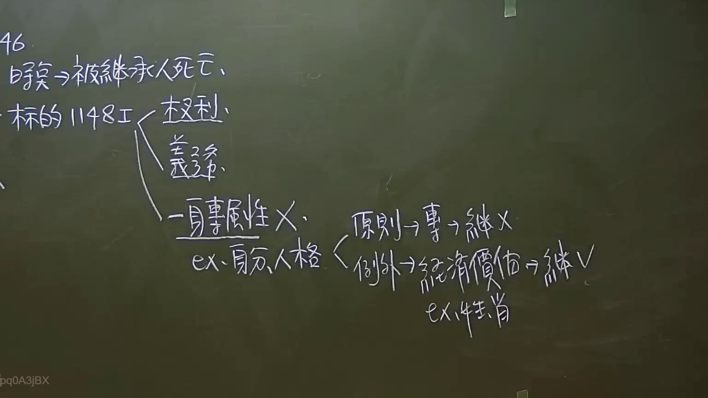

# 🎥 影音教材板書校對筆記
    - **來源影片**: [預約 7 2024-09-22 10-15-06-597](file:///J:/身分法/ch7/預約 7 2024-09-22 10-15-06-597.mp4)
    - **課程分類**: `[身分法`
    - **課堂章節**: `ch7]`
    - **影片時間戳記**: `00:56:45` (3405 秒)
    - **板書類型**: `影音板書`
    - **偵測時間**: 2026-07-19 23:52:49
    
    ## 🔍 擷取黑板板書對照圖
    
    
    ## 🧠 AI 智慧理解與知識庫演化註記
    ：
1. 板書 OCR 文字辨識：
   - 46.
   - 時點 → 被繼承人死亡
   - 標的 1148 I ─┬─ 權利
   - 　　　　　　  └─ 義務
   - 一身專屬性 X
   - ex. 身分、人格 ─┬─ 原則 → 專 → 繼 X
   - 　　　　　　　  └─ 例外 → 經濟價值 → 繼 V (ex. 慰撫金)

2. 法律學理與爭點解說：
   - 本板書核心在於說明臺灣民法繼承編關於「繼承標的」之範圍。
   - 【時點】：依民法第 1147 條規定，繼承因被繼承人死亡而開始。
   - 【概括繼承原則】：根據民法第 1148 條第 1 項前段，繼承人自繼承開始時，除本法另有規定外，承受被繼承人財產上之一切權利（如債權、物權）與義務（如債務）。
   - 【一身專屬性之例外】：民法第 1148 條第 1 項但書規定，「專屬於被繼承人本身者」，不在此限（即不發生繼承）。這類權利或義務被稱為「一身專屬權」。
   - 【身分權與人格權之辯證】：
     - 原則：身分權（如配偶權）或人格權（如生命、身體、自由、名譽等）具有高度個人色彩，原則上不得繼承（繼 X）。
     - 例外：若該權利已轉化為「經濟價值」，則可繼承。最典型的案例為民法第 195 條之「慰撫金（非財產上損害賠償）」。
     - 條文對照：依民法第 195 條第 2 項規定，慰撫金請求權不得讓與或繼承。但「以金額賠償之請求權已依契約承諾，或已起訴者」，則不在此限。這就是板書中所指「經濟價值 → 繼 V」的法律依據，因為此時該請求權已具備具體的財產權性質。
    
    ## 📊 可編輯之 Mermaid 關係流程圖
    ```mermaid
    ：
graph TD
    A["繼承開始 (時點：被繼承人死亡)"] --> B["繼承標的 (民法 1148 I)"]
    B --> C["權利"]
    B --> D["義務"]
    C --> E{"是否具一身專屬性?"}
    D --> E
    E --"是 (X)"--> F["不列入繼承範圍"]
    E --"否 (V)"--> G["由繼承人承受"]
    
    F --> H["常見例子：身分權、人格權"]
    H --> I["原則：專屬不繼承"]
    H --> J["例外：具經濟價值 (可繼承)"]
    
    J --> K["實務代表：慰撫金請求權"]
    K --> L["民法 195 II：已契約承諾或起訴者"]
    ```
    
    ## ✍️ 操作者手動校對修改區
    <!-- 您可以直接修改上方的文字或調整 Mermaid 區塊中的節點，Obsidian 會即時重新渲染 -->
    - [ ] 欄位結構與法律邏輯已校對無誤。
    - **校對筆記**: 
    