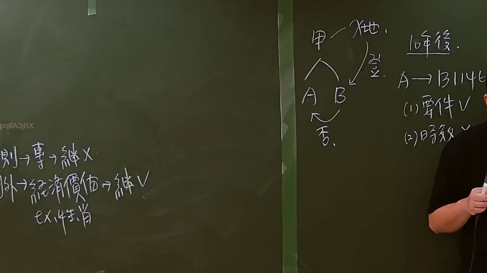

# 🎥 影音教材板書校對筆記
    - **來源影片**: [預約 7 2024-09-22 10-15-06-597](file:///J:/身分法/ch7/預約 7 2024-09-22 10-15-06-597.mp4)
    - **課程分類**: `[身分法`
    - **課堂章節**: `ch7]`
    - **影片時間戳記**: `00:59:00` (3540 秒)
    - **板書類型**: `影音板書`
    - **偵測時間**: 2026-07-19 23:53:04
    
    ## 🔍 擷取黑板板書對照圖
    
    
    ## 🧠 AI 智慧理解與知識庫演化註記
    ：
本板書主要探討臺灣民法中「繼承權的性質」以及「繼承回復請求權（民法第1146條）」的法律實務爭點。

1. 權利之繼承性（板書左側）：
   - 原則（則）：專屬性權利（如人格權）不可繼承（繼 X）。
   - 例外（外）：若該權利具備「經濟價值」，則可作為遺產由繼承人繼承（繼 V）。
   - 範例：板書標註「ex 損賠」，指損害賠償請求權若已轉化為具體財產上請求權，則可繼承。

2. 繼承回復請求權案例分析（板書右側）：
   - 案情：被繼承人「甲」死亡後留有「地」（土地），其繼承人為「A」與「B」。
   - 侵權行為：B 獨自將該土地辦理「登」（登記）在自己名下，侵害了 A 的繼承權。
   - 法律主張：A 於「10年後」欲對 B 主張「民法第1146條」繼承回復請求權（A → B 1146）。
   - 爭點分析：
     (1) 要件 V：A 確實為真正繼承人，B 為侵害繼承權之人，符合請求權要件。
     (2) 時效 X：依據民法第1146條第2項規定，繼承回復請求權自繼承開始起，逾「十年」不行使而消滅。因板書標註為10年後，故時效已屆滿，A 喪失此項請求權。

3. 延伸法律對照：
   - 民法第1146條：繼承權被侵害者，被害人或其法定代理人得請求回復之。前項回復請求權，自知悉被侵害之時起，二年間不行使而消滅；自繼承開始時起，逾十年者亦同。
   - 實務補充：當第1146條時效消滅後，真正繼承人 A 是否仍得主張「民法第767條」物上請求權？根據司法院釋字第437號解釋與現行實務，即便繼承回復請求權罹於時效，真正繼承人仍可針對個別財產主張物權請求權，惟需注意第767條之消滅時效（已登記不動產無時效問題，未登記則為15年）。
    
    ## 📊 可編輯之 Mermaid 關係流程圖
    ```mermaid
    ：
graph TD
    SubA["被繼承人 甲"] -- "死亡" --> SubB["遺產：土地"]
    SubA -- "法律繼承" --> A["真正繼承人 A"]
    SubA -- "法律繼承" --> B["繼承人/侵害人 B"]
    B -- "獨自辦理登記" --> SubB
    A -- "10年後行使 §1146" --> B
    
    subgraph "法律效果分析"
    Node1["(1) 要件：符合 (V)"]
    Node2["(2) 時效：已逾10年 (X)"]
    end
    
    B -.-> Node1
    B -.-> Node2
    
    subgraph "權利性質"
    Rule1["原則：專屬性權利 (不可繼承)"]
    Rule2["例外：經濟價值權利 (可繼承)"]
    Rule2 --- Ex["例如：損害賠償請求權"]
    end
    ```
    
    ## ✍️ 操作者手動校對修改區
    <!-- 您可以直接修改上方的文字或調整 Mermaid 區塊中的節點，Obsidian 會即時重新渲染 -->
    - [ ] 欄位結構與法律邏輯已校對無誤。
    - **校對筆記**: 
    