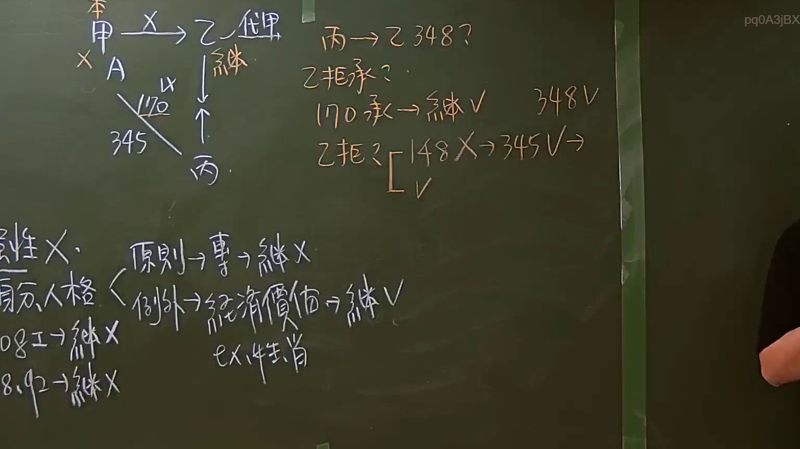

# 🎥 影音教材板書校對筆記
    - **來源影片**: [預約 7 2024-09-22 10-15-06-597](file:///J:/身分法/ch7/預約 7 2024-09-22 10-15-06-597.mp4)
    - **課程分類**: `[身分法`
    - **課堂章節**: `ch7]`
    - **影片時間戳記**: `01:05:15` (3915 秒)
    - **板書類型**: `影音板書`
    - **偵測時間**: 2026-07-19 23:53:22
    
    ## 🔍 擷取黑板板書對照圖
    
    
    ## 🧠 AI 智慧理解與知識庫演化註記
    ：

1. **板書 OCR 辨識文字**：
   - 左上角：本 甲 (標記 X) → 乙 (代理/標記 X)；甲 ─(A/170 X/345)─ 丙；乙 ─(繼)→ 丙。
   - 右上角：丙 → 乙 348?；乙 拒承?；170 承 → 繼 V (348 V)；乙 拒? [ 148 X → 345 V → V。
   - 左下角：性質 X；身分、人格 (原則 → 專 → 繼 X；例外 → 經濟價值 → 繼 V，ex: 姓名、肖像)；108 I → 繼 X；8、92 → 繼 X。

2. **法律學理與爭點解說**：
   - **核心爭點：無權代理人繼承本人案（民法第170條與1148條之衝突）**。
   - **法律關係**：
     - **甲（本人）**：已死亡（板書標記 X），原本與丙之間存在一個由乙無權代理簽署的買賣契約（民法第345條）。
     - **乙（無權代理人）**：乙未經授權代理甲與丙簽約，依據**民法第170條**，該法律行為效力未定。
     - **丙（相對人）**：契約相對人，在甲死亡後，向繼承人乙主張**民法第348條**之物之交付義務。
   - **爭議點邏輯**：當無權代理人「乙」繼承了本人「甲」的地位時，乙能否以「無權代理」為由拒絕承認該契約？
     - 板書指出，若乙拒絕承認，將涉及**民法第148條（誠實信用原則/權利濫用禁止）**。因為乙當初自行做出無權代理行為，事後又以本人繼承人身分否定該行為，屬於「禁反言」之行為。
     - 結論：乙不得拒絕，契約應視為有效（345 V），乙須負擔交付義務（348 V）。
   - **權利繼承之專屬性**：
     - 下方板書探討權利是否可繼承。**原則上**具有身分或人格專屬性的權利（如代理權之授與、受任人地位）不可繼承。
     - **例外**：若涉及經濟價值（如肖像權的商譽部分），則可繼承。
     - **條文對照**：提到**民法第108條第1項**（代理權消滅事由，本人死亡原則上代理權消滅）。
    
    ## 📊 可編輯之 Mermaid 關係流程圖
    ```mermaid
    ：
graph TD
    subgraph "法律關係主體"
    A["本人 甲 (已死亡)"] 
    B["無權代理人 乙 (繼承人)"]
    C["相對人 丙 (買受人)"]
    end

    A -- "1148 繼承關係" --> B
    B -- "170 無權代理契約 (345)" --> C
    C -- "請求履行 (348)" --> B

    subgraph "法律邏輯判斷"
    Node1["乙 拒絕承認?"]
    Node2["民法 148 誠信原則"]
    Node3["契約有效 (345 V)"]
    Node4["須交付標的物 (348 V)"]

    Node1 -->|權利濫用| Node2
    Node2 --> Node3
    Node3 --> Node4
    end

    subgraph "權利專屬性討論"
    P1["身分人格權"]
    P2["原則 專屬不得繼承"]
    P3["例外 具經濟價值可繼承"]
    P1 --> P2
    P1 --> P3
    end
    ```
    
    ## ✍️ 操作者手動校對修改區
    <!-- 您可以直接修改上方的文字或調整 Mermaid 區塊中的節點，Obsidian 會即時重新渲染 -->
    - [ ] 欄位結構與法律邏輯已校對無誤。
    - **校對筆記**: 
    