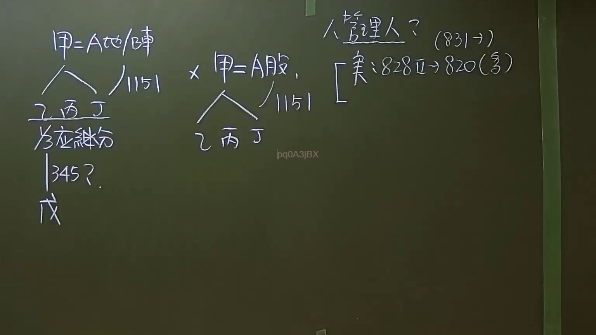

# 🎥 影音教材板書校對筆記
    - **來源影片**: [預約 7 2024-09-22 10-15-06-597](file:///J:/身分法/ch7/預約 7 2024-09-22 10-15-06-597.mp4)
    - **課程分類**: `[身分法`
    - **課堂章節**: `ch7]`
    - **影片時間戳記**: `01:38:15` (5895 秒)
    - **板書類型**: `影音板書`
    - **偵測時間**: 2026-07-19 23:53:58
    
    ## 🔍 擷取黑板板書對照圖
    
    
    ## 🧠 AI 智慧理解與知識庫演化註記
    ：
1. **板書高精度 OCR 識別**：
   * **左側區塊**：
     * `甲 = A地/B車`
     * `／ 1151` （斜線指向下方繼承人，代表民法第1151條之公同共有關係）
     * `乙 丙 丁`
     * `乙` 的下方延伸出 `／ 各應繼分` $\rightarrow$ `│ 345?` $\rightarrow$ `戊` （代表乙欲將其應繼分依民法第345條買賣給第三人戊之爭議）
   * **中間區塊**：
     * `×` （對比左側「物權」與右側「所有權以外之財產權」之不同處理邏輯）
     * `甲 = A股，` 
     * `／ 1151`
     * `乙 丙 丁`
   * **右側區塊**：
     * `／ 管理人？ (831 →)` （代表準公同共有股份之權利行使或管理人選定，依民法第831條準用）
     * `［ 實：828 Ⅱ → 820 (多)` （代表實務見解認為應依民法第828條第2項，準用第820條之「多數決」規定）

2. **詳細法律解讀與法條對照**：
   * **核心爭點一：遺產公同共有與「應繼分」之處分（左側）**
     * **法條對照**：民法第1151條、民法第345條。
     * **解析**：
       當被繼承人「甲」死亡遺有「A地」或「B車」時，在分割遺產前，繼承人「乙、丙、丁」對遺產全部呈現「公同共有」狀態（民法第1151條）。
       此時，繼承人之一「乙」若私自與第三人「戊」簽訂買賣契約（民法第345條），欲轉讓其「應繼分」：
       * **債權行為（買賣契約）**：基於契約自由原則，乙與戊之間的買賣契約原則上有效。
       * **物權/處分行為（應繼分讓與）**：由於「應繼分」並非具體共有物的「應有部分」（公同共有並無顯在的應有部分），實務與通說多數認為，為維持公同共有關係內部的人格合一性與和諧，共同繼承人不得未經全體同意，逕將其應繼分讓與給公同共有人以外之第三人。因此，該處分行為（讓與應繼分予戊）應屬無效。
   * **核心爭點二：所有權以外財產權（股份）之準公同共有與管理人選定（右側）**
     * **法條對照**：民法第831條、民法第828條第2項、民法第820條（多數決）。
     * **解析**：
       若甲遺留之遺產為「A公司股份（A股）」，因股份屬於「所有權以外之財產權」，依**民法第831條**規定，應「準用」公同共有之規定，即乙、丙、丁對該股份呈現「準公同共有」狀態。
       關於該股份之股東權行使（如出席股東會、行使表決權，即「選定管理人」之爭議）：
       * **實務見解（實）**認為，準公同共有權利之管理，應依**民法第828條第2項**規定，準用**民法第820條第1項**（共有物之管理）。
       * 依民法第820條第1項規定，除契約另有約定外，管理行為應以「共有人過半數及應有部分合計過半數之同意行之」（即「多數決」，板書標記為「多」）。
       * 結論：乙、丙、丁得以過半數之同意，推選其中一人或他人擔任股份管理人來行使股東權，無須全體一致同意。
    
    ## 📊 可編輯之 Mermaid 關係流程圖
    ```mermaid
    ：
graph TD
    classDef highlight fill#f9f,stroke#333,stroke-width2px;
    classDef blueNode fill#e1f5fe,stroke#01579b,stroke-width2px;

    subgraph 物權遺產公同共有["【左側：物權公同共有】"]
        A["被繼承人 甲<br>(遺產：A地 / B車)"] -->|"民法第1151條"| B["繼承人 乙、丙、丁<br>(公同共有)"]
        B -->|"乙欲處分其抽象「應繼分」"| C["乙"]
        C -->|"民法第345條<br>(買賣契約/債權有效)"| D["第三人 戊"]
        D -->|"處分行為(讓與應繼分)"| E{"效力？<br>(實務原則上否定)"}
    end

    subgraph 權利準公同共有["【右側：準公同共有】"]
        F["被繼承人 甲<br>(遺產：A公司股份)"] -->|"民法第1151條"| G["繼承人 乙、丙、丁<br>(準公同共有)"]
        G -->|"民法第831條 準用"| H{"如何選定「管理人」<br>以行使股東權利？"}
        H -->|"實務見解"| I["民法第828條第2項"]
        I -->|"準用"| J["民法第820條"]
        J -->|"採「多數決」同意"| K["選出管理人行使權利"]
    end

    A -.->|"相異遺產客體對比"| F

    class B,G,K highlight;
    class E,H blueNode;
    ```
    
    ## ✍️ 操作者手動校對修改區
    <!-- 您可以直接修改上方的文字或調整 Mermaid 區塊中的節點，Obsidian 會即時重新渲染 -->
    - [ ] 欄位結構與法律邏輯已校對無誤。
    - **校對筆記**: 
    