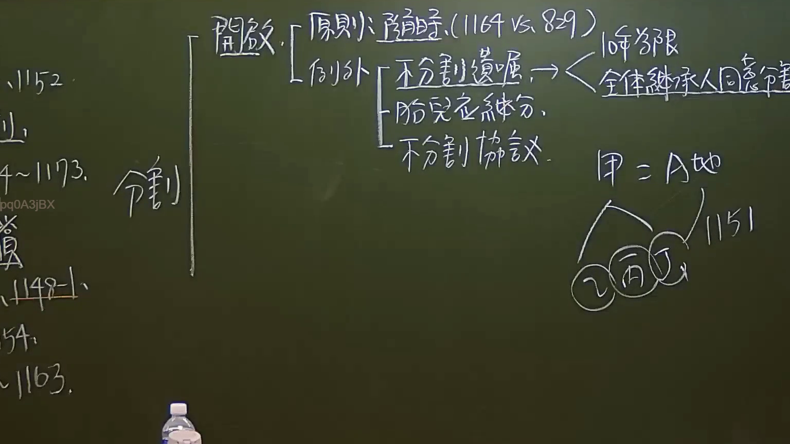

# 🎥 影音教材板書校對筆記
    - **來源影片**: [預約 7 2024-09-22 10-15-06-597](file:///J:/身分法/ch7/預約 7 2024-09-22 10-15-06-597.mp4)
    - **課程分類**: `[身分法`
    - **課堂章節**: `ch7]`
    - **影片時間戳記**: `01:56:00` (6960 秒)
    - **板書類型**: `影音板書`
    - **偵測時間**: 2026-07-19 23:54:28
    
    ## 🔍 擷取黑板板書對照圖
    
    
    ## 🧠 AI 智慧理解與知識庫演化註記
    ：

### 一、 板書高精度 OCR 辨識結果
1. **左側法條落款與架構索引**：
   * 垂直標記：`分割`
   * 法條群：`1152`、`1148-1`（底線）、`1154~1163`（或 `1154`）、`1173`（或 `1174~1176`之關聯）。
2. **中間核心法學邏輯（遺產分割之開啟）**：
   * `開啟` 
     * `原則：隨時（1164 vs. 829）`
     * `例外`
       * `不分割遺囑` $\rightarrow$ 分支：`10年為限`、`全體繼承人同意得分割`
       * `胎兒之繼承分`（板書書寫「胎兒在繼承分」，實務指民法第1166條胎兒應繼分之保留）
       * `不分割協議`
3. **右側案例圖示與法律關係**：
   * 關係式：`甲 = A地`（代表被繼承人甲留下遺產A地）
   * 分支人際關係：`乙`、`丙`、`丁`（皆以圓圈標示，代表共同繼承人）
   * 法律效果對照：圓圈指向 `1151`（民法第1151條共同繼承人公同共有之規定）

---

### 二、 法律詳細解讀與臺灣現行法條對照

本板書核心在於論述臺灣民法繼承編中**「遺產分割之開啟、限制與例外」**之法律邏輯與實務爭點：

#### 1. 遺產分割之原則：隨時請求分割（民法第1164條 vs. 第829條）
* **【法條對照】**：
  * **民法第1151條**：「繼承人有數人時，在分割遺產前，各繼承人對於遺產全部為公同共有。」
  * **民法第829條**（物權編）：「公同關係存續中，各公同共有人，不得請求分割公同共有物。但法律另有規定者，不在此限。」
  * **民法第1164條**（繼承編）：「繼承人得隨時請求分割遺產。但法律另有規定或契約另有訂定者，不在此限。」
* **【學理與爭點解析】**：
  * 遺產在分割前，性質上屬於繼承人全體「公同共有」（第1151條）。
  * 依物權編第829條規定，公同共有物原則上在關係存續中是不允許請求分割的。然而，**民法第1164條即為第829條但書所稱之「法律另有規定」**。
  * 為了促進消滅公同共有關係、落實私法自治與財產流轉，繼承編特別創設了「得隨時請求分割」之權利，此為特別法優先於普通法之適用。

#### 2. 遺產分割之例外（限制分割之三種情形）
板書精準歸納了排除「隨時分割」原則的三大例外情形：
* **(1) 不分割遺囑（民法第1165條第2項）**：
  * 被繼承人得於遺囑內禁止分割遺產，但**其禁止效力以10年為限**（避免財產永久無法流轉，有害經濟效能）。
  * **延伸爭點【全體繼承人同意得分割】**：縱使被繼承人於遺囑中明文禁止分割，若「全體繼承人」一致同意，仍得打破遺囑限制而進行分割。此係因繼承人全體之意思自治已達共識，法律無強制維持不分割狀態之必要。
* **(2) 胎兒之繼承分（民法第1166條）**：
  * **【法條對照】**：民法第1166條：「胎兒為繼承人時，非保留其應繼分，他繼承人不得分割遺產。胎兒關於遺產之分割，以其母為代理人。」
  * 此為保護胎兒之生存及財產權益。若有胎兒存在，在他繼承人「未保留」胎兒應繼分之前，依法不得進行分割，否則該分割行為不生效力。
* **(3) 不分割協議**：
  * 即繼承人之間自行約定在一定期限內不分割遺產（契約另有訂定），依私法自治原則，此種協議具有拘束力。學說與實務認為，此協議之期限可類推適用民法第823條第2項規定，最長不得逾30年。

#### 3. 案例關係圖解（甲、乙、丙、丁之關係）
* 右下角之案例中，**甲**為被繼承人，留下一筆遺產**A地**。
* **乙、丙、丁**三人為共同繼承人。
* 依**民法第1151條**之規定，在完成遺產分割登記程序之前，乙、丙、丁三人對於A地之關係為**「公同共有」**。若欲將A地變更為分別共有或單獨所有，必須踐行「遺產分割」程序（即開啟民法第1164條之程序）。
    
    ## 📊 可編輯之 Mermaid 關係流程圖
    ```mermaid
    ：
graph TD
    A["遺產分割之開啟"] --> B["原則：隨時得請求分割<br>(民法 §1164)"]
    A --> C["例外：限制分割之情形"]

    B -.->|特別法優先適用| B_vs["公同關係存續中不得請求分割<br>(民法 §829)"]

    C --> C1["1. 不分割遺囑<br>(民法 §1165 II)"]
    C1 --> C1_1["限制：以 10 年為限"]
    C1 --> C1_2["例外：全體繼承人同意仍得分割"]

    C --> C2["2. 胎兒為繼承人<br>(民法 §1166)"]
    C2 --> C2_1["效果：非保留其應繼分，不得分割"]

    C --> C3["3. 不分割協議<br>(繼承人契約約定)"]

    subgraph 實例法律關係 (民法 §1151)
        Case_Papa["被繼承人 甲"] -->|留有遺產| Case_Land["A地"]
        Case_Papa -->|繼承關係| Child1["(乙)"]
        Case_Papa -->|繼承關係| Child2["(丙)"]
        Case_Papa -->|繼承關係| Child3["(丁)"]
        Child1 & Child2 & Child3 -->|分割遺產前| Relation["公同共有關係<br>(民法 §1151)"]
    end
    ```
    
    ## ✍️ 操作者手動校對修改區
    <!-- 您可以直接修改上方的文字或調整 Mermaid 區塊中的節點，Obsidian 會即時重新渲染 -->
    - [ ] 欄位結構與法律邏輯已校對無誤。
    - **校對筆記**: 
    