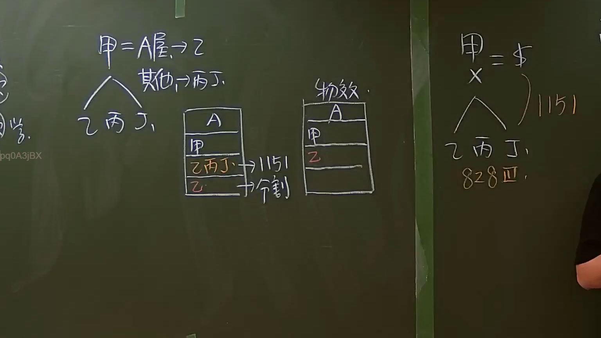

# 🎥 影音教材板書校對筆記
    - **來源影片**: [預約 7 2024-09-22 10-15-06-597](file:///J:/身分法/ch7/預約 7 2024-09-22 10-15-06-597.mp4)
    - **課程分類**: `[身分法`
    - **課堂章節**: `ch7]`
    - **影片時間戳記**: `02:10:00` (7800 秒)
    - **板書類型**: `影音板書`
    - **偵測時間**: 2026-07-19 23:54:53
    
    ## 🔍 擷取黑板板書對照圖
    
    
    ## 🧠 AI 智慧理解與知識庫演化註記
    ：
本板書旨在說明臺灣民法中關於「遺產繼承」與「公同共有」之法律關係演變，特別是從被繼承人死亡到遺產分割完成間的權利狀態。

1. 辨識板書文字：
   - 左側：甲 = A屋 → 乙；其他 → 丙、丁。下方繪製繼承體系圖，由甲分支至乙、丙、丁。
   - 中間（登記簿示意圖）：呈現 A 屋權利變動，第一階段由「甲」變更為「乙丙丁（公同共有）」，標註「1151」（民法第1151條）；第二階段標註「分割」，由「乙」單獨取得。
   - 中間上方：標註「物效」（物權效力）。
   - 右側：甲 = $（現金/遺產總額）；下方 X（可能是指處分限制）；繼承人分支為乙、丙、丁；標註「1151」與「828 Ⅲ」（民法第828條第3項）。

2. 法律學理與法條對照：
   - 【繼承之公同共有】：根據「民法第1151條」，繼承人有數人時，在分割遺產前，各繼承人對於遺產全部為「公同共有」。板書中顯示 A 屋在甲死亡後，先由乙丙丁三人公同共有，這是法律規定的強制狀態。
   - 【遺產分割】：板書中的「分割」箭頭指向「乙」，代表經過遺產分割程序（協議分割或裁判分割）後，乙取得 A 屋的單獨所有權。依據民法第1164條，繼承人得隨時請求分割遺產。
   - 【物權效力】：板書提及「物效」，係指分割遺產後，產生所有權移轉的物權變動效力，使登記簿上的權利人由公同共有人全體變更為單獨一人。
   - 【公同共有之處分限制】：右側標註「828 Ⅲ」，即「民法第828條第3項」。該條規定公同共有物之處分及其他權利之行使，除法律另有規定外，應得公同共有人全體之同意。這解釋了為何在「1151」狀態下，單一繼承人不能擅自處分（如變賣 A 屋或領取現金 $）。
    
    ## 📊 可編輯之 Mermaid 關係流程圖
    ```mermaid
    ：
graph TD
    A["被繼承人 甲 (擁有A屋與財產$)"] --> B["繼承開始 (死亡)"]
    B --> C["繼承人 乙、丙、丁"]
    C --> D{"公同共有狀態 (民法 1151)"}
    D --> E["登記簿狀態：乙丙丁公同共有"]
    D --> F["權利行使限制 (民法 828 III)"]
    E --> G["遺產分割程序"]
    G --> H["物權效力 (物效)"]
    H --> I["乙單獨取得 A屋"]
    H --> J["丙、丁取得其他遺產"]
    ```
    
    ## ✍️ 操作者手動校對修改區
    <!-- 您可以直接修改上方的文字或調整 Mermaid 區塊中的節點，Obsidian 會即時重新渲染 -->
    - [ ] 欄位結構與法律邏輯已校對無誤。
    - **校對筆記**: 
    