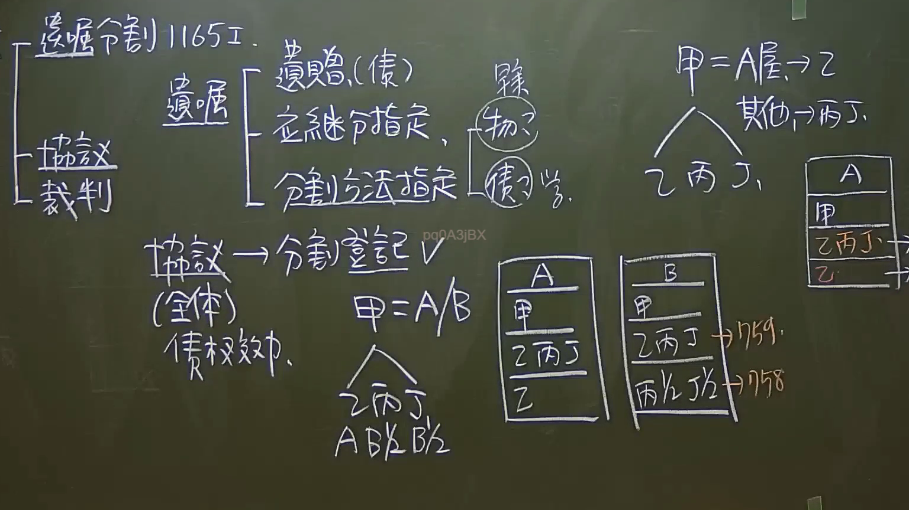

# 🎥 影音教材板書校對筆記
    - **來源影片**: [預約 7 2024-09-22 10-15-06-597](file:///J:/身分法/ch7/預約 7 2024-09-22 10-15-06-597.mp4)
    - **課程分類**: `[身分法`
    - **課堂章節**: `ch7]`
    - **影片時間戳記**: `02:15:30` (8130 秒)
    - **板書類型**: `影音板書`
    - **偵測時間**: 2026-07-19 23:55:11
    
    ## 🔍 擷取黑板板書對照圖
    
    
    ## 🧠 AI 智慧理解與知識庫演化註記
    ：
這張板書主要探討臺灣民法中關於「遺產分割」的學理分類、法律效力與登記實務，核心條文圍繞在民法第1165條第1項。

1. 板書文字OCR辨識：
- 遺囑分割 1165 I：指民法第1165條第1項，被繼承人可以用遺囑指定分割遺產之方法。
- 遺囑之類型：
    - 遺贈（性質屬債權）。
    - 應繼分指定。
    - 分割方法指定：此處老師標註了「物？債？學」，代表學說爭議，即遺囑指定分割方法究竟是直接發生「物權效力」（指定後即取得物權）還是僅具「債權效力」（繼承人仍須踐行分割行為）。
- 分割方式之階層：遺囑分割 > 協議分割 > 裁判分割。
- 協議（全體）：指協議分割需經全體繼承人同意，具有「債權效力」。
- 分割登記：協議後須辦理登記方生物權移轉效力。
- 案例架構：
    - 甲（被繼承人）有子女乙、丙、丁。
    - 遺囑指定：A屋給乙，其他財產給丙、丁。
    - 物權登記流程：甲（死亡）→ 乙丙丁（公同共有，民法759條，不待登記取得）→ 辦理分割登記（民法758條，登記生效）→ 乙取得A屋所有權。
    - 案例B：若甲將B財產指定給丙1/2、丁1/2，同樣須經從759條（繼承取得）到758條（分割登記）的過程。

2. 法律學理與法條對照：
- 民法第1165條第1項：被繼承人可以用遺囑指定分割遺產之方法，或委託他人指定。這具有優先於協議分割的效力。
- 民法第759條：因繼承於登記前已取得不動產物權者，非經登記，不得處分其物權。板書中寫到「759」，意指甲死後，乙丙丁是依法取得公同共有，不需登記即取得。
- 民法第758條：不動產物權依法律行為而取得、設定、喪失及變更者，非經登記，不生效力。板書中「758」對應到最後的分割登記，屬於法律行為（協議分割之履行），故需登記。
- 債權效力與物權效力之辯：老師特別圈出「物？」與「債？」，反映了臺灣實務與學說對於「遺囑指定分割方法」的看法。目前通說與實務多認為遺囑指定僅生債權效力，繼承人仍需依遺囑內容辦理分割登記，方取得單獨所有權。
    
    ## 📊 可編輯之 Mermaid 關係流程圖
    ```mermaid
    ：
graph TD
    A["被繼承人 甲 (死亡)"] --> B{"遺產分割方式"}
    
    B --> C["遺囑分割 (民1165 I)"]
    B --> D["協議分割 (全體同意)"]
    B --> E["裁判分割"]
    
    C --> C1["遺贈 (債權性質)"]
    C --> C2["指定應繼分"]
    C --> C3["指定分割方法"]
    
    C3 --> C3a["學說爭議 物權效力 vs 債權效力"]
    
    A --> F["遺產內容 A屋、B財產"]
    F --> G["繼承人 乙、丙、丁"]
    
    G --"民法 759"--> H["公同共有 (不待登記取得)"]
    H --"民法 758 (協議/遺囑執行)"--> I["辦理分割登記"]
    
    I --> J1["乙單獨取得 A屋"]
    I --> J2["丙、丁 取得 B財產 (各 1/2)"]
    
    style C stroke-width4px
    style I fill#f9f,stroke#333,stroke-width2px
    ```
    
    ## ✍️ 操作者手動校對修改區
    <!-- 您可以直接修改上方的文字或調整 Mermaid 區塊中的節點，Obsidian 會即時重新渲染 -->
    - [ ] 欄位結構與法律邏輯已校對無誤。
    - **校對筆記**: 
    