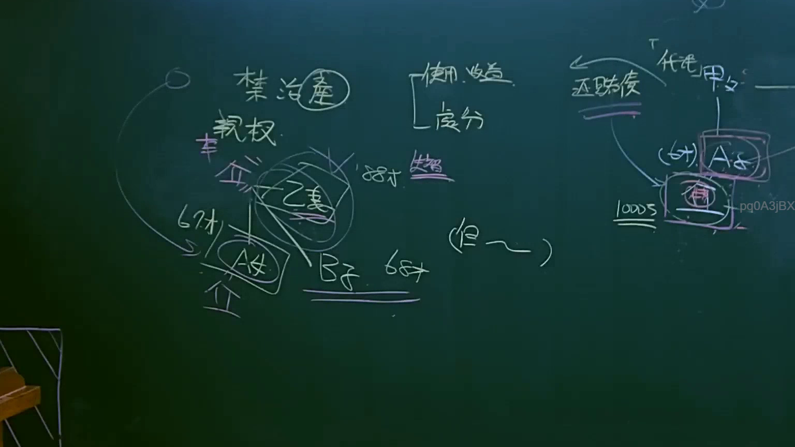

# 🎥 影音教材板書校對筆記
    - **來源影片**: [預約 7 2025-04-13 07-01-16-136](file:///J:/民法B/ch7/預約 7 2025-04-13 07-01-16-136.mp4)
    - **課程分類**: `[民法B`
    - **課堂章節**: `ch7]`
    - **影片時間戳記**: `01:01:30` (3690 秒)
    - **板書類型**: `影音板書`
    - **偵測時間**: 2026-07-21 10:23:04
    
    ## 🔍 擷取黑板板書對照圖
    
    
    ## 🧠 AI 智慧理解與知識庫演化註記
    ：

**1. 板書 OCR 文字辨識：**
*   **人物與特徵**：甲（父，88才）、乙（妻）、A（女，67才）、B（子，68才）。
*   **法律行為與關係**：禁治產（現行法稱為「監護宣告」）、親權、代表（或代理）甲父。
*   **財產權管理**：使用、收益、處分、1000萬。
*   **具體事由與限制**：還賭債、「但～」（指法律之但書規定）、結婚。

**2. 法律學理與爭點解讀：**
*   **監護宣告（禁治產）與限制**：
    老師板書上寫著「禁治產」，這在台灣法律演進中，於民國 98 年後已改稱為「監護宣告」。甲為 88 歲長者，若因精神障礙或其他心智缺陷不能為意思表示，則會受監護宣告。
*   **財產管理權限（民法第 1088 條與 1101 條）**：
    板書區分了「使用、收益」與「處分」。
    - 在親權關係中（民法第 1088 條），父母對於子女之特有財產有使用、收益之權。但對於「處分」，法律規定：「非為子女之利益，不得處分之」。
    - 在監護關係中（民法第 1101 條），監護人代理受監護人處分不動產或重大財產時，亦受法律嚴格限制，必須是為受監護人之利益。
*   **案例邏輯（還賭債案）**：
    板書中提到「代表甲父」去「還賭債」並動用了「1000萬」。在法律爭點上，賭債在台灣實務上被視為「違反公共秩序善良風俗」（民法第 72 條），屬於自然債務（無請求權）。若監護人或代理人以受監護人（甲）的財產去償還賭債，明顯「非為受監護人之利益」，該處分行為在法律上會被認定為無權處分或違反法規限制，對受監護人不生效力。
*   **家庭關係演化**：
    甲（88才）與子女 A（67才）、B（68才）的年齡顯示這是一個高齡化社會下的監護與財產爭議。即便子女已成年，若甲受監護宣告，其財產的「處分」仍須嚴格符合「為甲之利益」之原則。
    
    ## 📊 可編輯之 Mermaid 關係流程圖
    ```mermaid
    ：
graph TD
    Node1["甲 (父, 88歲)"] --- Node2["乙 (妻)"]
    Node1 --- Node3["A (女, 67歲)"]
    Node1 --- Node4["B (子, 68歲)"]
    
    Node1 -.-> Node5["監護宣告 (禁治產)"]
    
    subgraph "財產管理權限"
        Node6["使用、收益"]
        Node7["處分 (如 1000萬)"]
    end
    
    Node1 --- Node6
    Node1 --- Node7
    
    Node8["還賭債"] -- "行為屬性" --> Node9["非為受監護人利益"]
    Node7 -- "限制" --> Node10["民法第1088條/1101條但書"]
    Node9 -- "法律結果" --> Node11["處分無效/不得處分"]
    
    Node12["代理/代表行為"] --> Node8
    Node10 -.-> Node11
    ```
    
    ## ✍️ 操作者手動校對修改區
    <!-- 您可以直接修改上方的文字或調整 Mermaid 區塊中的節點，Obsidian 會即時重新渲染 -->
    - [ ] 欄位結構與法律邏輯已校對無誤。
    - **校對筆記**: 
    