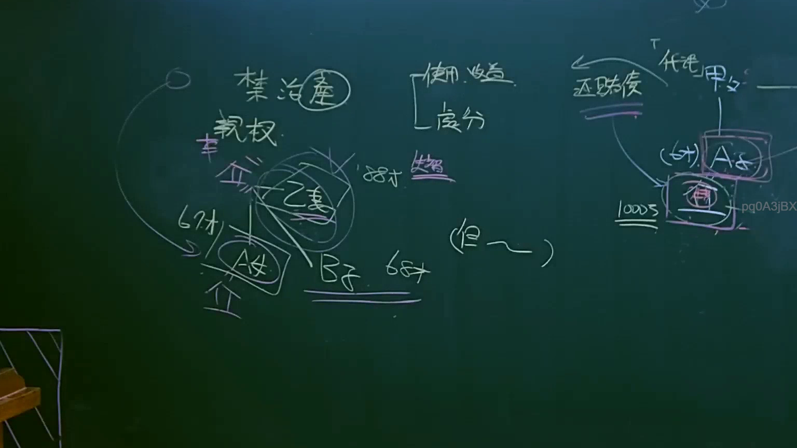

# 🎥 影音教材板書校對筆記
    - **來源影片**: [預約 7 2025-04-13 07-01-16-136](file:///J:/民法B/ch7/預約 7 2025-04-13 07-01-16-136.mp4)
    - **課程分類**: `[民法B`
    - **課堂章節**: `ch7]`
    - **影片時間戳記**: `01:03:15` (3795 秒)
    - **板書類型**: `影音板書`
    - **偵測時間**: 2026-07-21 10:23:40
    
    ## 🔍 擷取黑板板書對照圖
    
    
    ## 🧠 AI 智慧理解與知識庫演化註記
    ：

1. 板書高精度 OCR 識別：
   - 核心關鍵詞：禁治產（註：現行法已改為監護宣告）、親權。
   - 權能區分：使用、收益、處分。
   - 人物關係：
     - 甲父（疑似已歿或資產來源）。
     - 乙妻（88才、失智、受禁治產宣告之主體，與甲為夫妻關係）。
     - A女（67才，甲乙之女）。
     - B子（68才，甲乙之子）。
   - 事件/爭點：1000萬、還賭債、代理（甲父/乙妻之資產被代理使用）、(但~~)（表示法律例外或限制條件）。

2. 法律學理與爭點解讀：
   - 本案板書呈現的是一個典型的「高齡者監護與財產管理」法律案例。
   - 【監護宣告制度】：板書雖寫「禁治產」，但在臺灣現行法下應對應《民法》第14條的「監護宣告」。針對 88 歲且「失智」的乙妻，其精神狀態已達不能為意思表示或受意思表示，應由法院裁定監護宣告。
   - 【財產處分權限】：老師區分了「使用、收益」與「處分」。依據《民法》第1113條準用第1101條，監護人對於受監護人（乙妻）之財產，雖有管理權，但若要進行「處分」（如變賣房產、贈與、處分重大資產），必須符合受監護人之利益。
   - 【無權代理與利益衝突】：板書中提到「還賭債」與「1000萬」。法律爭點在於：若子（B子）利用代理權或監護人地位，將受監護人（乙妻）的 1000 萬元用來償還其個人或他人之賭債，這屬於「利益相反行為」（民法第1106條之1、第106條）。此種代理行為因違反受監護人利益，在法律上可能構成無權代理，或需透過特別代理人來處理。
   - 【法律演化】：早期法律著重於「禁治產」後的處分權限制；現行法更重視「受監護人的最佳利益」，且細分為監護宣告與輔助宣告，並強化了法院對重大資產處分的監督（如處分不動產需經法院許可）。
    
    ## 📊 可編輯之 Mermaid 關係流程圖
    ```mermaid
    ：
graph TD
    Jia["甲父"] --- Yi["乙妻 (88歲/失智)"]
    Yi --- A["A 女 (67歲)"]
    Yi --- B["B 子 (68歲)"]
    
    subgraph "法律狀態"
    Yi --"聲請"--> Interdiction["監護宣告 (原板書 禁治產)"]
    end
    
    subgraph "財產權能"
    Right["財產管理權"] --> Use["使用、收益"]
    Right --> Disposal["處分 (須受法律限制)"]
    end
    
    B --"代理行為?"--> Debt["1000萬 (還賭債)"]
    Debt --"爭點"--> Conflict["利益相反/違反受監護人利益"]
    
    style Yi fill#f9f,stroke#333,stroke-width2px
    style Debt fill#f96,stroke#333,stroke-width2px
    style Interdiction fill#fff,stroke#f00,stroke-dasharray 5 5
    ```
    
    ## ✍️ 操作者手動校對修改區
    <!-- 您可以直接修改上方的文字或調整 Mermaid 區塊中的節點，Obsidian 會即時重新渲染 -->
    - [ ] 欄位結構與法律邏輯已校對無誤。
    - **校對筆記**: 
    