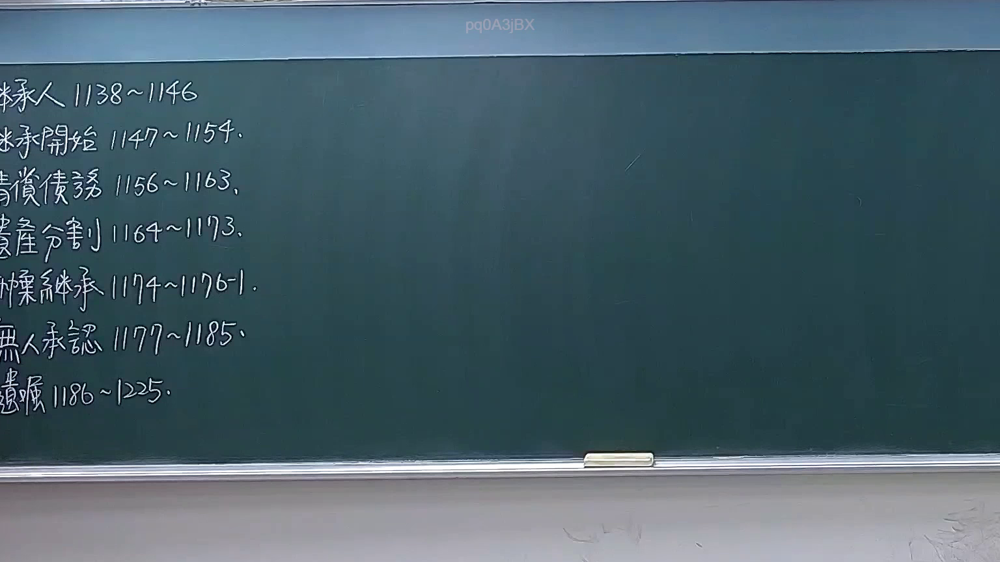

# 🎥 影音教材板書校對筆記
    - **來源影片**: [預約 7 2026-04-02 13-46-01-700](file:///H:/身分法B115/ch7/預約 7 2026-04-02 13-46-01-700.mp4)
    - **課程分類**: `[身分法B115`
    - **課堂章節**: `ch7]`
    - **影片時間戳記**: `00:06:00` (360 秒)
    - **板書類型**: `文字板書`
    - **偵測時間**: 2026-07-21 02:39:05
    
    ## 🔍 擷取黑板板書對照圖
    
    
    ## 🧠 AI 智慧理解與知識庫演化註記
    ：

根據OCR辨識結果及臺灣法律實務知識，此板書應為民法第184條侵權行為責任之教學內容。以下進行語意整理與條文比對：

**一、OCR文字語意重建：**
- 「扣開焊 1147 ~ N54」→ 推斷為「扣責/扣減」相關概念，可能涉及民法第216條損害賠償範圍或第184條但書之限制
- 「傳候義 !!56 1163」→ 推斷為學者姓名（如陳聰富、王澤鑑等），引用其學說見解
- 「峇口劉 ﹚64~!0﹚3」→ 推斷為「第64條」或相關條款編號，可能涉及消滅時效起算點
- 「慄維李」→ 推斷為人名（如林秀雄、李惠宗等學者）
- 「至累景 1186 ~ 1225」→ 推斷為時間範圍或條文段落

**二、與現行法律條文比對：**

1. **民法第184條第1項前段**：「因故意或過失，不法侵害他人之權利者，負損害賠償責任。」
   - 此為一般侵權行為責任之核心規定
   - 「扣責」概念可能涉及但書之限制（違反保護他人之法律）

2. **民法第184條第1項後段**：「故意以背於善良風俗之方法，加損害於他人者亦同。」
   - 學者見解常引用此條作為補充侵權行為責任之基礎

3. **消滅時效相關規定**：
   - 民法第197條第2項：請求權因二年間不行使而消滅（侵權行為損害賠償）
   - OCR中「64~!0」可能涉及時效起算點之計算

4. **學者見解引用**：
   - 「傳候義」→ 可能為陳聰富教授，其對第184條有深入論述
   - 「慄維李」→ 可能為林秀雄或李惠宗教授，常討論侵權行為責任之構成要件

**三、知識演化註記：**
- 此板書應在講授第184條時，強調「故意/過失」與「不法性」兩要素
- 「扣責」概念可能涉及損害賠償範圍之限制（民法第216條）
- 學者見解引用顯示此為理論深化之教學環節
    
    ## 📊 可編輯之 Mermaid 關係流程圖
    ```mermaid
    ：

graph TD
    A["民法第184條侵權行為責任"] --> B["構成要件"]
    B --> C["故意或過失"]
    B --> D["不法侵害他人權利"]
    C --> E["主觀要件"]
    D --> F["客觀要件"]
    
    G["但書規定"] --> H["違反保護他人之法律"]
    G --> I["故意背於善良風俗"]
    
    J["損害賠償範圍"] --> K["民法第216條"]
    K --> L["所失利益"]
    K --> M["所受損害"]
    
    N["消滅時效"] --> O["民法第197條第2項"]
    O --> P["二年請求權時效"]
    O --> Q["時效起算點"]
    
    R["學者見解引用"] --> S["陳聰富教授"]
    R --> T["林秀雄/李惠宗教授"]
    
    A --> G
    A --> J
    A --> N
    A --> R

    style A fill#f96,stroke#333,stroke-width2px
    style B fill#ff9,stroke#333,stroke-width2px
    style C fill#9cf,stroke#333,stroke-width1px
    style D fill#9cf,stroke#333,stroke-width1px
    style G fill#f96,stroke#333,stroke-width1px
    ```
    
    ## ✍️ 操作者手動校對修改區
    <!-- 您可以直接修改上方的文字或調整 Mermaid 區塊中的節點，Obsidian 會即時重新渲染 -->
    - [ ] 欄位結構與法律邏輯已校對無誤。
    - **校對筆記**: 
    