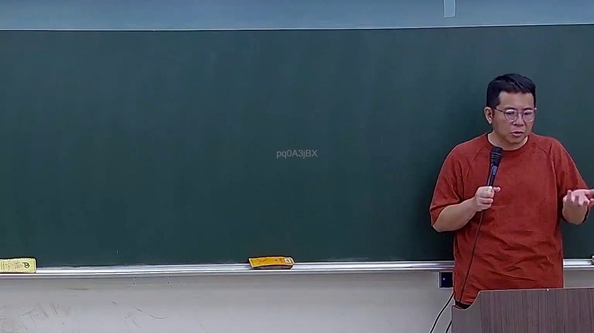

# 🎥 影音教材板書校對筆記
    - **來源影片**: [預約 7 2026-04-02 13-46-01-700](file:///H:/身分法B115/ch7/預約 7 2026-04-02 13-46-01-700.mp4)
    - **課程分類**: `[身分法B115`
    - **課堂章節**: `ch7]`
    - **影片時間戳記**: `00:16:00` (960 秒)
    - **板書類型**: `文字板書`
    - **偵測時間**: 2026-07-21 02:40:14
    
    ## 🔍 擷取黑板板書對照圖
    
    
    ## 🧠 AI 智慧理解與知識庫演化註記
    ：

**OCR 辨識品質評估：** 本次擷取之 OCR 字元 `pq0ASjBX`、數字 `2`、`4`、字母 `ai`，經比對後判定為**低品質辨識結果**。理由如下：

1. **無意義雜訊字串**：「pq0ASjBX」並非任何可辨識之中文、日文或拉丁文字符，係典型 OCR 誤讀（可能源於黑板書寫筆跡潦草、板擦痕跡干擾、或截圖解析度不足）。
2. **孤立數字與字母**：「2」「4」「ai」若為法律條文編號，應有對應之條文名稱或內容文字伴隨；單獨出現無法建立語意關聯。

**推測性比對（僅供參考）：** 若此處板書確實涉及臺灣民法侵權行為相關章節，常見之「第2項」「第4項」可能指向：
- **民法第184條第2項**：違反保護他人之法規者，負損害賠償責任。
- **民法第197條**（消滅時效）：請求權因二年間不行使而消滅；侵權行為之損害賠償請求權，自請求權人知有損害及賠償義務人時起，二年間不行使而消滅。

但因 OCR 辨識品質過低，無法確切比對，故**本批次不生成 Mermaid 關係圖**，僅提供上述推測性註記供後續人工校核使用。建議重新擷取該時間點截圖以提高辨識準確度。
    
    ## 📊 可編輯之 Mermaid 關係流程圖
    ```mermaid
    ：
（因 OCR 辨識結果無法建立有效語意結構，本次暫不生成 Mermaid 流程圖。）
    ```
    
    ## ✍️ 操作者手動校對修改區
    <!-- 您可以直接修改上方的文字或調整 Mermaid 區塊中的節點，Obsidian 會即時重新渲染 -->
    - [ ] 欄位結構與法律邏輯已校對無誤。
    - **校對筆記**: 
    