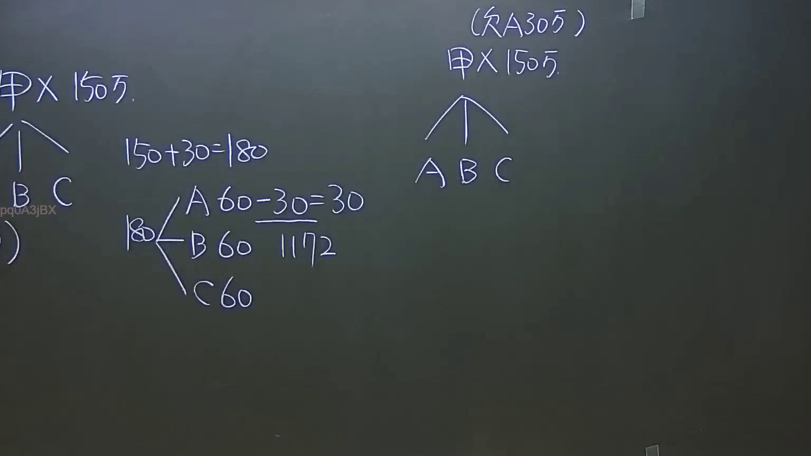

# 🎥 影音教材板書校對筆記
    - **來源影片**: [預約 8 2024-09-22 12-50-17-359](file:///J:/身分法/ch8/預約 8 2024-09-22 12-50-17-359.mp4)
    - **課程分類**: `[身分法`
    - **課堂章節**: `ch8]`
    - **影片時間戳記**: `00:04:30` (270 秒)
    - **板書類型**: `影音板書`
    - **偵測時間**: 2026-07-19 23:19:56
    
    ## 🔍 擷取黑板板書對照圖
    
    
    ## 🧠 AI 智慧理解與知識庫演化註記
    ：
板書內容辨識：
1. 左側：甲 150萬 分配給 A、B、C。
2. 中間：150+30=180，180分配給A、B、C，A分得60，並標示「60-30=30」、「1172」。
3. 右側：（欠30萬），甲 150萬 分配給 A、B、C。

法律解讀：
本案涉及「遺產分割」或「債務清償」後的分配法律關係。
- 核心邏輯：板書展示了在有債務（欠30萬）與資產（150萬）的情境下，應如何進行遺產或財產的分配計算。
- 條文對照：
  1. 民法第1172條：「繼承人中如對於被繼承人有債務者，於遺產分割時，應按其債務數額，由該繼承人之應繼分內扣還。」
  2. 板書中出現的「1172」明確指向民法第1172條之扣還規定。
  3. 邏輯說明：若遺產為150萬，另有債務30萬（由繼承人A積欠被繼承人），總遺產價值視為180萬（150+30）。若由A、B、C三人均分，每人應分得60萬。但因A積欠30萬，故在遺產分割時，A的應繼分（60萬）須扣除其對被繼承人之債務（30萬），最終A實拿30萬，符合民法第1172條之「扣還」法理。
    
    ## 📊 可編輯之 Mermaid 關係流程圖
    ```mermaid
    ：
graph TD
    A["總遺產 150萬"] --> B["繼承人 A"]
    A --> C["繼承人 B"]
    A --> D["繼承人 C"]
    E["債務 30萬"] -.-> |民法第1172條扣還| B
    F["總價值計算 150萬 + 30萬 = 180萬"]
    F --> G["A 60萬 - 30萬 = 30萬"]
    F --> H["B 60萬"]
    F --> I["C 60萬"]
    ```
    
    ## ✍️ 操作者手動校對修改區
    <!-- 您可以直接修改上方的文字或調整 Mermaid 區塊中的節點，Obsidian 會即時重新渲染 -->
    - [ ] 欄位結構與法律邏輯已校對無誤。
    - **校對筆記**: 
    