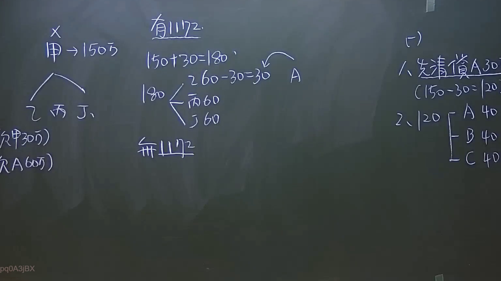

# 🎥 影音教材板書校對筆記
    - **來源影片**: [預約 8 2024-09-22 12-50-17-359](file:///J:/身分法/ch8/預約 8 2024-09-22 12-50-17-359.mp4)
    - **課程分類**: `[身分法`
    - **課堂章節**: `ch8]`
    - **影片時間戳記**: `00:24:15` (1455 秒)
    - **板書類型**: `影音板書`
    - **偵測時間**: 2026-07-19 23:20:13
    
    ## 🔍 擷取黑板板書對照圖
    
    
    ## 🧠 AI 智慧理解與知識庫演化註記
    ：
1. 板書OCR內容：
   - 左側：甲→150萬，分支為乙、丙、丁（註記：欠甲30萬、欠A60萬）。甲上方標記一個「X」。
   - 中間：有1172（條）、150+30=180、180分支為（60-30=30 A、丙60、丁60）。下方標記：無1172（條）。
   - 右側：（一）1. 先清償A 30（150-30=120），2. 120分支為A 40、B 40、C 40。

2. 法律學理與法條對照：
   - 此板書討論的是「遺產分割與債務清償」之相關法律問題，核心在於民法第1172條（遺產酌給債務）。
   - 民法第1172條規定：「繼承人中如對於被繼承人負有債務者，於遺產分割時，應按其債務數額，由該繼承人之應繼分內扣還。」
   - 邏輯演繹：
     - 左側與中間區域：甲為被繼承人（上方打X代表死亡），遺產總額與繼承人（乙、丙、丁）間的債務抵銷關係。討論在「有遺產債務抵銷」與「無遺產債務抵銷」情況下，各繼承人實際可分配額之變化。
     - 180萬基礎可能是遺產總額加上繼承人欠被繼承人的債務。
     - 右側區域：處理繼承人對外負債（A、B、C）的情境，進行清償順序的推演，這涉及民法繼承編對於遺產債務優先清償之原則（民法第1159條至1161條關於遺產債務清償之程序）。
    
    ## 📊 可編輯之 Mermaid 關係流程圖
    ```mermaid
    ：
graph TD
    A["被繼承人 甲(死亡)"] --> B["遺產總額 150萬"]
    B --> C{"繼承人"}
    C --> D["乙"]
    C --> E["丙"]
    C --> F["丁"]
    D -.-> G["債務抵銷計算"]
    E -.-> G
    F -.-> G
    G --> H{"有1172條適用"}
    H --> I["遺產+債務=180萬"]
    I --> J["分配方案"]
    J --> K["A獲得30萬"]
    J --> L["丙獲得60萬"]
    J --> M["丁獲得60萬"]
    H --> N{"無1172條適用"}
    O["外部債權人清償"] --> P["先清償A 30萬"]
    P --> Q["剩餘120萬"]
    Q --> R["分配給 A 40萬"]
    Q --> S["分配給 B 40萬"]
    Q --> T["分配給 C 40萬"]
    ```
    
    ## ✍️ 操作者手動校對修改區
    <!-- 您可以直接修改上方的文字或調整 Mermaid 區塊中的節點，Obsidian 會即時重新渲染 -->
    - [ ] 欄位結構與法律邏輯已校對無誤。
    - **校對筆記**: 
    