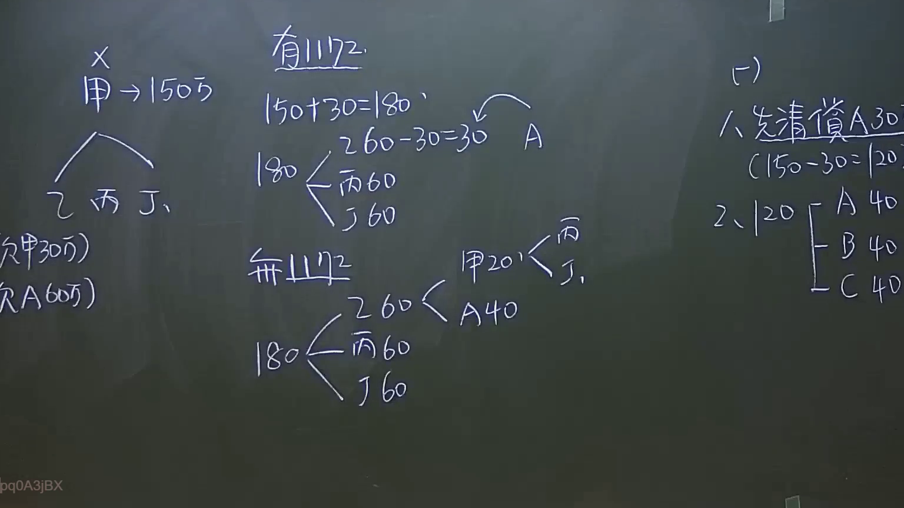

# 🎥 影音教材板書校對筆記
    - **來源影片**: [預約 8 2024-09-22 12-50-17-359](file:///J:/身分法/ch8/預約 8 2024-09-22 12-50-17-359.mp4)
    - **課程分類**: `[身分法`
    - **課堂章節**: `ch8]`
    - **影片時間戳記**: `00:25:15` (1515 秒)
    - **板書類型**: `影音板書`
    - **偵測時間**: 2026-07-19 23:20:22
    
    ## 🔍 擷取黑板板書對照圖
    
    
    ## 🧠 AI 智慧理解與知識庫演化註記
    ：
本板書討論的是「遺產分割」中關於「遺產債務」與「繼承人扣還（歸扣）」的計算邏輯。核心爭點在於遺產總額的釐清、債務扣除順序，以及繼承人間的分配差異（包含是否有遺囑或生前贈與扣還）。

1. **辨識內容**：
   - 左側：繼承人甲（被繼承人，死後遺產150萬），法定繼承人為乙、丙、丁。註記有「欠甲30萬」、「欠A60萬」（此處A應指外部債權人或代位者）。
   - 中間：比較「有遺囑」與「無遺囑」的情況下，遺產額150萬加上債權回收（30萬）後，共180萬之分配。
   - 右側：具體清算順序，先清償債務（A），剩餘額度再由各繼承人平分。

2. **法律對照**：
   - **民法第1148條**：繼承人自繼承開始時，承受被繼承人財產上之一切權利、義務。
   - **民法第1153條**：繼承人對於被繼承人之債務，負連帶責任。本板書反映了在分配遺產前，必須先清償債務的法理（原則上應先扣除遺產債務，剩餘財產方為遺產分割對象）。
   - **民法第1173條（歸扣）**：繼承人中有於繼承開始前因結婚、分居或營業，已從被繼承人受有財產之贈與者，應將該贈與價額加入繼承開始時被繼承人所有之財產中，為應繼遺產。板書中的計算邏輯即在演示此類「將生前贈與納入遺產總額計算」的操作。
    
    ## 📊 可編輯之 Mermaid 關係流程圖
    ```mermaid
    ：
graph TD
    A["遺產總額計算"] --> B["基礎遺產 150萬"]
    A --> C["債權回收 30萬"]
    B --> D["遺產總額 180萬"]
    C --> D
    
    D --> E{"是否有遺囑"}
    
    E -- "有" --> F["先清償A債務 30萬"]
    F --> G["剩餘 150萬分配"]
    G --> H["丙 60萬"]
    G --> I["丁 60萬"]
    G --> J["A 30萬"]
    
    E -- "無" --> K["遺產平分"]
    K --> L["甲 60萬"]
    K --> M["丙 60萬"]
    K --> N["丁 60萬"]
    
    L --> O["甲分得後依歸扣原則調整"]
    O --> P["丙 調整"]
    O --> Q["丁 調整"]
    ```
    
    ## ✍️ 操作者手動校對修改區
    <!-- 您可以直接修改上方的文字或調整 Mermaid 區塊中的節點，Obsidian 會即時重新渲染 -->
    - [ ] 欄位結構與法律邏輯已校對無誤。
    - **校對筆記**: 
    