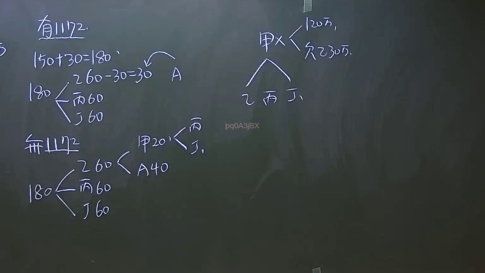

# 🎥 影音教材板書校對筆記
    - **來源影片**: [預約 8 2024-09-22 12-50-17-359](file:///J:/身分法/ch8/預約 8 2024-09-22 12-50-17-359.mp4)
    - **課程分類**: `[身分法`
    - **課堂章節**: `ch8]`
    - **影片時間戳記**: `00:27:00` (1620 秒)
    - **板書類型**: `影音板書`
    - **偵測時間**: 2026-07-19 23:20:31
    
    ## 🔍 擷取黑板板書對照圖
    
    
    ## 🧠 AI 智慧理解與知識庫演化註記
    ：
此板書涉及臺灣民法「繼承編」中關於遺產分割、應繼分以及遺贈或特種贈與（歸扣）的計算邏輯。

1. **辨識內容**：
   - 「有1172」：指民法第1172條之歸扣（遺產分割前之贈與歸扣）。
   - 「無1172」：指未適用歸扣規定之情形。
   - 案例邏輯：板書展示了被繼承人（甲）死亡後的遺產分配，包含「應繼分」與「歸扣」後的計算差異。
   - 計算邏輯：180（遺產總額）分配予繼承人（乙、丙、丁），其中涉及A（可能是特定受遺贈人或另一關係人）的份額計算。

2. **法條對照**：
   - **民法第1172條（遺產分割前之扣還）**：繼承人中如於繼承開始前因結婚、分居或營業，已從被繼承人受有財產之贈與者，應將該贈與價額加入繼承開始時被繼承人所有之財產中，為應繼遺產。
   - **民法第1173條（歸扣）**：與第1172條共同構成遺產歸扣制度，目的是為了維持繼承人間的公平，避免特定繼承人提前分得家產導致遺產分割不公。
   - **民法第1144條**：配偶及直系血親卑親屬之應繼分規定，板書中乙、丙、丁應為被繼承人之子女，若無配偶，則平均分配。

3. **邏輯解讀**：
   - 「有1172」路徑：將生前贈與（如30萬）計入遺產總額（150+30=180），計算出每人應得份額後，再扣除該繼承人已受領之數額。
   - 「無1172」路徑：直接將遺產180平均分配，不考慮生前贈與的歸扣效力。
   - 右側「甲×」部分展示了被繼承人甲對子女乙、丙、丁的財產分配構想，包含其債務狀況（欠30萬）及遺產（120萬）的處理關係。
    
    ## 📊 可編輯之 Mermaid 關係流程圖
    ```mermaid
    ：
graph TD
    A1["被繼承人 甲"]
    A1 --> A2["遺產 120萬"]
    A1 --> A3["債務 30萬"]
    A1 --> B["繼承人 乙"]
    A1 --> C["繼承人 丙"]
    A1 --> D["繼承人 丁"]
    
    subgraph "歸扣計算邏輯"
    E1["有1172 (歸扣)"] --> E2["總額 180 (150+30)"]
    E2 --> E3["各得 60"]
    E1 --> E4["A受贈 30"]
    
    F1["無1172 (無歸扣)"] --> F2["總額 180"]
    F2 --> F3["乙丙丁各 60"]
    F2 --> F4["甲 20"]
    F2 --> F5["A 40"]
    end
    ```
    
    ## ✍️ 操作者手動校對修改區
    <!-- 您可以直接修改上方的文字或調整 Mermaid 區塊中的節點，Obsidian 會即時重新渲染 -->
    - [ ] 欄位結構與法律邏輯已校對無誤。
    - **校對筆記**: 
    