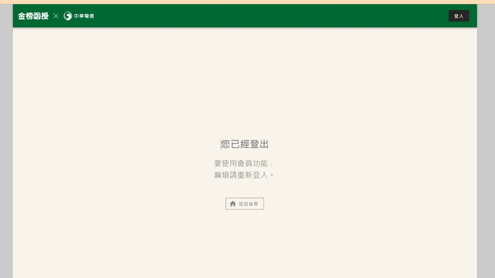

# 🎥 影音教材板書校對筆記
    - **來源影片**: [預約 8 2024-09-22 12-50-17-359](file:///J:/身分法/ch8/預約 8 2024-09-22 12-50-17-359.mp4)
    - **課程分類**: `[身分法`
    - **課堂章節**: `ch8]`
    - **影片時間戳記**: `00:29:45` (1785 秒)
    - **板書類型**: `影音板書`
    - **偵測時間**: 2026-07-19 23:20:41
    
    ## 🔍 擷取黑板板書對照圖
    
    
    ## 🧠 AI 智慧理解與知識庫演化註記
    ：
您提供的圖片並非法律課程的板書，而是「金榜函授」學習平台的系統提示頁面，顯示內容為：「您已經登出，要使用會員功能，麻煩請重新登入。」

由於此圖片不包含任何法律學理、爭點或板書邏輯，因此無法針對法律條文進行對位分析。此頁面僅代表該學習網站的連線階段已逾時或被登出，不涉及任何法律行為或請求權基礎。
    
    ## 📊 可編輯之 Mermaid 關係流程圖
    ```mermaid
    ：
graph TD
A["使用者"] -->|操作| B{"金榜函授系統"}
B -->|狀態顯示| C["您已經登出"]
C -->|引導| D["重新登入"]
D -->|返回| E["會員功能首頁"]
    ```
    
    ## ✍️ 操作者手動校對修改區
    <!-- 您可以直接修改上方的文字或調整 Mermaid 區塊中的節點，Obsidian 會即時重新渲染 -->
    - [ ] 欄位結構與法律邏輯已校對無誤。
    - **校對筆記**: 
    