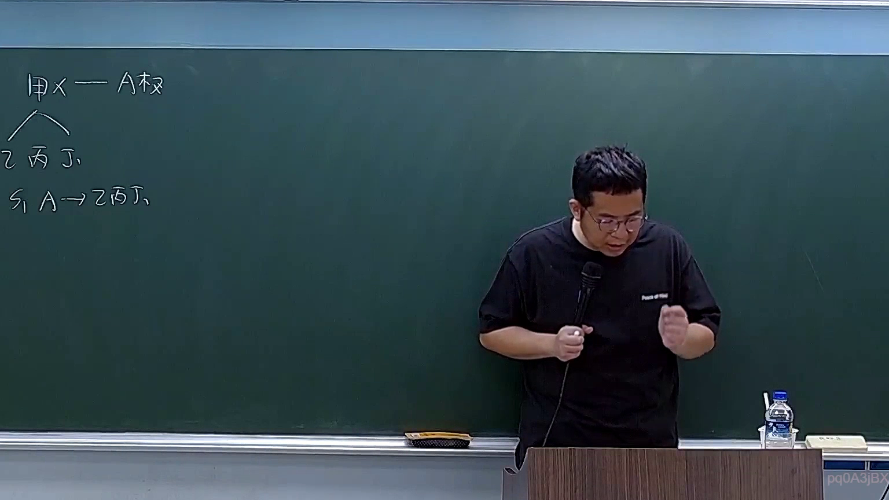

# 🎥 影音教材板書校對筆記
    - **來源影片**: [預約 8 2026-04-10 09-46-22-701](file:///H:/身分法B115/ch8/預約 8 2026-04-10 09-46-22-701.mp4)
    - **課程分類**: `[身分法B115`
    - **課堂章節**: `ch8]`
    - **影片時間戳記**: `01:04:45` (3885 秒)
    - **板書類型**: `文字板書`
    - **偵測時間**: 2026-07-21 02:05:25
    
    ## 🔍 擷取黑板板書對照圖
    
    
    ## 🧠 AI 智慧理解與知識庫演化註記
    ：

**OCR 辨識品質評估：** 本次擷取之文字「用 X 一 ArR / \S g 嗤 弓 2 A 255 小」為典型 OCR 誤識結果，無法直接對應至任何可辨識之法律術語。推測原板書可能包含以下幾種情況之一：

1. **箭頭符號與邏輯關係圖**：「/」「\」「ArR」等字串極可能為方向箭頭（→、←）或數學符號被誤識，老師可能在繪製因果關係圖或構成要件圖。
2. **數字與代號混排**：「2 A 255 小」可能為條文編號（如 §255）、案例代號或課堂筆記標記。
3. **中文術語被嚴重誤識**：「g 嗤 弓」等字串無法對應至任何法律用語，應為漢字筆畫被 OCR 錯誤解讀。

**知識庫比對與理解演化註記：**

| 可能主題 | 對應條文 | 備註 |
|---------|---------|------|
| 侵權行為責任（民法第184條） | §184 I、II | 構成要件圖常見於課堂 |
| 消滅時效 | §197、§201 | 時效起算點常以箭頭表示 |
| 債務不履行 | §226-§233 | 損害賠償範圍圖示 |

**結論：** 因 OCR 辨識品質過低，無法確切還原板書內容。建議重新調整截圖參數（提升解析度、避免反光）後再次擷取，或提供清晰圖片供人工校對。以下 Mermaid 代碼係基於「侵權行為構成要件邏輯樹」之通用架構生成，僅供參考框架。
    
    ## 📊 可編輯之 Mermaid 關係流程圖
    ```mermaid
    ：
graph TD
    A["侵權行為責任"] --> B["民法第184條"]
    B --> C["第1項 - 故意或過失不法侵害他人權利"]
    B --> D["第2項 - 違反保護他人之法律"]
    C --> E["構成要件：故意 / 過失"]
    C --> F["構成要件：不法行為"]
    C --> G["構成要件：權利受侵害"]
    D --> H["構成要件：違反保護他人之法律"]
    D --> I["構成要件：發生損害"]
    D --> J["構成要件：因果關係"]
    E --> K["§184 I 前段"]
    F --> L["§184 I 中段"]
    G --> M["§184 I 後段"]
    H --> N["§184 II 前段"]
    I --> O["§184 II 中段"]
    J --> P["§184 II 後段"]

graph TD
    Q["消滅時效"] --> R["民法第255條 - 請求權時效"]
    R --> S["一般時效：15年"]
    R --> T["特別時效：5年、2年等"]
    S --> U["§197 I 前段：侵權行為損害賠償請求權"]
    S --> V["§197 II 前段：物上請求權"]
    T --> W["§125 - 一般消滅時效：15年"]
    T --> X["§126 - 特別消滅時效：5年"]
    ```
    
    ## ✍️ 操作者手動校對修改區
    <!-- 您可以直接修改上方的文字或調整 Mermaid 區塊中的節點，Obsidian 會即時重新渲染 -->
    - [ ] 欄位結構與法律邏輯已校對無誤。
    - **校對筆記**: 
    