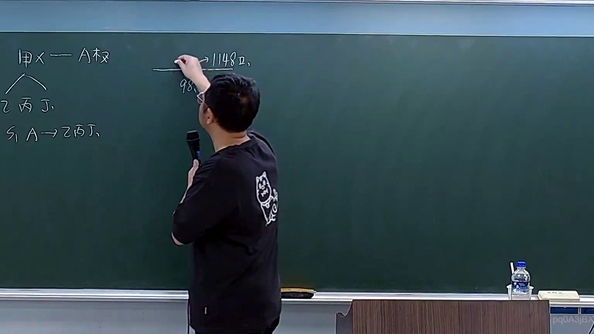

# 🎥 影音教材板書校對筆記
    - **來源影片**: [預約 8 2026-04-10 09-46-22-701](file:///H:/身分法B115/ch8/預約 8 2026-04-10 09-46-22-701.mp4)
    - **課程分類**: `[身分法B115`
    - **課堂章節**: `ch8]`
    - **影片時間戳記**: `01:05:45` (3945 秒)
    - **板書類型**: `關係圖/邏輯圖板書`
    - **偵測時間**: 2026-07-21 02:06:17
    
    ## 🔍 擷取黑板板書對照圖
    
    
    ## 🧠 AI 智慧理解與知識庫演化註記
    您好！我注意到您的訊息中「擷取區域的 OCR 辨識字元」部分為空白，沒有實際的文字內容。

請您補充提供該時間點（65分45秒）截圖所辨識出的具體文字/板書內容，我才能協助您：

1. **語意整理與法律條文比對** — 將板書內容與民法第184條、侵權行為責任、消滅時效等現行法條進行對位分析。
2. **Mermaid.js 流程圖生成** — 根據板書的邏輯結構（關係圖/邏輯圖或文字板書），輸出對應的 Mermaid 代碼。

請貼上 OCR 辨識出的字元，我立刻為您處理！
    
    ## 📊 可編輯之 Mermaid 關係流程圖
    ```mermaid
    graph TD
    A["影音板書"] --> B["尚無關聯關係"]
    ```
    
    ## ✍️ 操作者手動校對修改區
    <!-- 您可以直接修改上方的文字或調整 Mermaid 區塊中的節點，Obsidian 會即時重新渲染 -->
    - [ ] 欄位結構與法律邏輯已校對無誤。
    - **校對筆記**: 
    