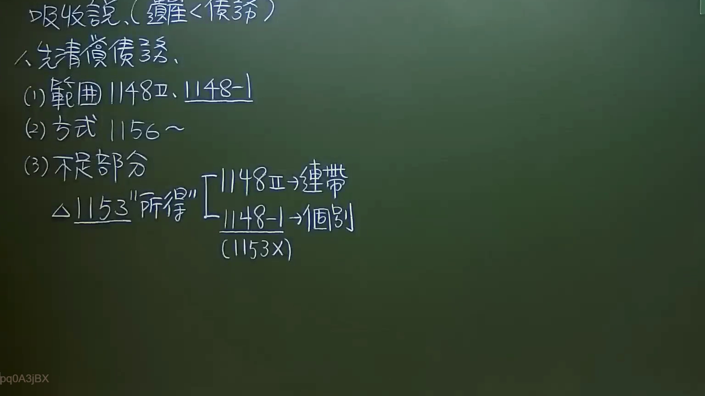

# 🎥 影音教材板書校對筆記
    - **來源影片**: [預約 9 2024-09-22 18-59-15-394](file:///J:/身分法/ch9/預約 9 2024-09-22 18-59-15-394.mp4)
    - **課程分類**: `[身分法`
    - **課堂章節**: `ch9]`
    - **影片時間戳記**: `00:07:30` (450 秒)
    - **板書類型**: `影音板書`
    - **偵測時間**: 2026-07-20 00:51:20
    
    ## 🔍 擷取黑板板書對照圖
    
    
    ## 🧠 AI 智慧理解與知識庫演化註記
    ：
這張板書呈現的是臺灣民法繼承編關於「概括繼承有限責任制」的核心邏輯，特別是針對遺產不足以清償債務（遺產 < 債務）時，繼承人法律責任的範圍與性質分析。以下是詳細辨識與法律學理對照：

1. 吸收說（遺產 < 債務）：
老師指出在「吸收說」的理論架構下，繼承人雖然繼承被繼承人的一切權利義務，但其清償責任被「吸收」限制在遺產範圍內。當債務大於遺產時，繼承人僅以所得遺產為限負清償責任。

2. 先清償債務之程序與範圍：
- (1) 範圍：包含民法第 1148 條第 2 項（繼承人對於被繼承人之債務，以因繼承所得遺產為限，負清償責任）以及第 1148-1 條（視為遺產之贈與）。後者規定繼承人在繼承開始前二年內，從被繼承人受領之財產贈與，在面對債權人時，視為其所得遺產。
- (2) 方式：指民法第 1156 條及其後續條文規定的「開具遺產清冊」陳報法院之程序。

3. 不足部分之責任類型分析（關鍵爭點）：
此處探討當遺產不足以清償債務時，繼承人對「所得遺產」負擔責任的性質：
- 民法第 1153 條：原則上繼承人對於被繼承人之債務，負「連帶責任」。
- 1148 條第 2 項（一般遺產）：對應到「連帶責任」。即多位繼承人對於在其繼承所得範圍內的債務，仍需負連帶清償之責。
- 1148-1 條（生前兩年內贈與）：此處老師特別標註「個別」與「(1153 X)」。這代表學說與實務上的重要見解：對於依 1148-1 條被「視為遺產」而需吐出來還債的受贈財產，各繼承人僅就「自己所得」的部分負擔責任，並不適用第 1153 條的連帶責任規定。換言之，繼承人 A 不必為繼承人 B 在生前受贈的部分負連帶清償責任。
    
    ## 📊 可編輯之 Mermaid 關係流程圖
    ```mermaid
    ：
graph TD
    Start["吸收說 遺產 < 債務"] --> Process["先清償債務"]
    Process --> Scope["(1) 責任範圍"]
    Process --> Method["(2) 方式 1156~ (陳報遺產清冊)"]
    Process --> Insufficient["(3) 不足部分之清償責任"]

    Scope --> 1148_2["1148 II 現存遺產"]
    Scope --> 1148_1["1148-1 生前2年內贈與視為遺產"]

    Insufficient --> 1153_Relation["民法 1153 責任性質"]
    1153_Relation --> Solidary["1148 II 範圍 --> 連帶責任"]
    1153_Relation --> Individual["1148-1 範圍 --> 個別責任 (不適用 1153)"]

    style Start fill#f9f,stroke#333,stroke-width2px
    style Insufficient fill#bbf,stroke#333,stroke-width2px
    ```
    
    ## ✍️ 操作者手動校對修改區
    <!-- 您可以直接修改上方的文字或調整 Mermaid 區塊中的節點，Obsidian 會即時重新渲染 -->
    - [ ] 欄位結構與法律邏輯已校對無誤。
    - **校對筆記**: 
    