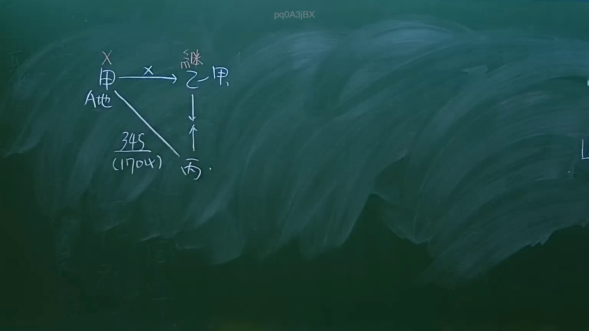

# 🎥 影音教材板書校對筆記
- **來源影片**: [預約 9 2024-10-19 05-23-13-002](file:///J:/民法/ch9/預約 9 2024-10-19 05-23-13-002.mp4)
- **課程分類**: `[民法`
- **課堂章節**: `ch9]`
- **影片時間戳記**: `01:44:00` (6240 秒)
- **板書類型**: `影音板書`
- **偵測時間**: 2026-07-19 18:31:31

## 🔍 擷取黑板板書對照圖


## 🧠 AI 智慧理解與知識庫演化註記
：
1. **板書文字辨識**：
   - 包含角色：甲（上方有X記號，代表死亡）、乙（繼承甲）、丙。
   - 標的物：A地。
   - 法律行為：345（民法第345條買賣契約）、170（民法第170條無權代理/處分）。
   - 關係箭頭：甲對A地、甲與乙之間有繼承關係（繼）、丙指向乙、甲與丙之間有買賣契約（345）。

2. **法律學理與爭點**：
   - 此板書呈現的是民法上典型的「無權處分與繼承人責任」爭點。
   - **爭點邏輯**：甲將A地出售予丙（民法第345條），但甲死亡，由乙繼承。若甲對A地無處分權（或買賣契約發生時效等問題），則涉及繼承人乙是否應受甲與丙間契約之拘束，以及乙作為繼承人是否須負擔瑕疵擔保或債務不履行責任。
   - **對照法條**：
     - **民法第345條**：買賣契約之成立要件。
     - **民法第1148條**：繼承人對於被繼承人之債務，負無限責任（原則上採限定責任，但此處涉及繼承法律地位之繼受）。
     - **民法第170條**：若甲處分他人之物（A地），則該買賣行為效力未定，需待有權利人承認。
     - 板書中的「繼」字強調「繼承人乙」繼受了被繼承人「甲」的法律地位，包含契約義務。

## 📊 可編輯之 Mermaid 關係流程圖
```mermaid
：
graph TD
    "甲(死亡)" -- "繼承" --> "乙"
    "甲(死亡)" -- "345買賣契約" --> "丙"
    "丙" -- "請求履行/爭議" --> "乙"
    "甲(死亡)" -- "所有權人" --> "A地"
```

## ✍️ 操作者手動校對修改區
<!-- 您可以直接修改上方的文字或調整 Mermaid 區塊中的節點，Obsidian 會即時重新渲染 -->
- [ ] 欄位結構與法律邏輯已校對無誤。
- **校對筆記**: 
