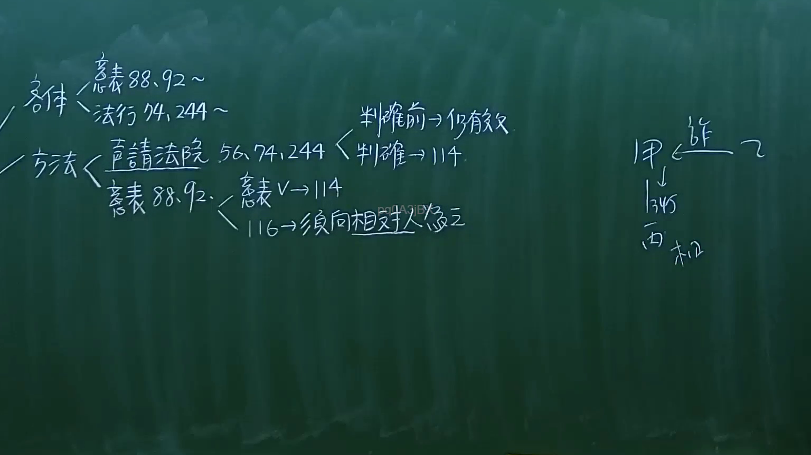

# 🎥 影音教材板書校對筆記
- **來源影片**: [預約 9 2024-10-19 05-23-13-002](file:///J:/民法/ch9/預約 9 2024-10-19 05-23-13-002.mp4)
- **課程分類**: `[民法`
- **課堂章節**: `ch9]`
- **影片時間戳記**: `02:13:30` (8010 秒)
- **板書類型**: `影音板書`
- **偵測時間**: 2026-07-19 18:31:50

## 🔍 擷取黑板板書對照圖


## 🧠 AI 智慧理解與知識庫演化註記
：
此板書解析了法律行為「撤銷權」的行使主體與方法，並探討撤銷後的法律效力，對應《民法》總則編關於意思表示不自由及法律行為效力之規定。

1. **撤銷權之客體（標的）**：
   - 「意表88、92」：對應民法第88條（錯誤之意思表示）與第92條（詐欺、脅迫），屬於得撤銷之意思表示。
   - 「法行74、244」：對應民法第74條（暴利行為）及第244條（詐害債權），屬於法律行為之撤銷。

2. **撤銷之方法與程序**：
   - 一般撤銷須依民法第116條規定，向相對人為之（須向相對人為之）。
   - 特定法律行為（如74、244）需聲請法院裁定或判決撤銷。
   - **效力溯及性**：板書中「判確前 → 仍有效」、「判確 → 114」指的是法律行為經撤銷後，視為自始無效（民法第114條）。

3. **右側案例結構**：
   - 描述「甲」受「乙」詐欺（詐），而與「丙」訂立契約（345為買賣契約之代號，亦可能指民法第345條），並由丙取得標的物（取）。此為典型的詐欺情境下，表意人如何透過撤銷保護自己權益的邏輯。

## 📊 可編輯之 Mermaid 關係流程圖
```mermaid
：
graph TD
    A["撤銷權之行使"] --> B["客體"]
    A --> C["方法"]
    B --> D["意思表示(88, 92)"]
    B --> E["法律行為(74, 244)"]
    C --> F["須向相對人為之 (116)"]
    C --> G["聲請法院 (56, 74, 244)"]
    G --> H["判確前：仍有效"]
    G --> I["判確後：視為自始無效 (114)"]
    D --> I
    
    subgraph "案例關係"
    J["乙 (詐欺者)"] -- "詐欺" --> K["甲 (受害人)"]
    K -- "訂立契約 (345)" --> L["丙 (第三人)"]
    L -- "取得標的" --> M["物"]
    end
```

## ✍️ 操作者手動校對修改區
<!-- 您可以直接修改上方的文字或調整 Mermaid 區塊中的節點，Obsidian 會即時重新渲染 -->
- [ ] 欄位結構與法律邏輯已校對無誤。
- **校對筆記**: 
