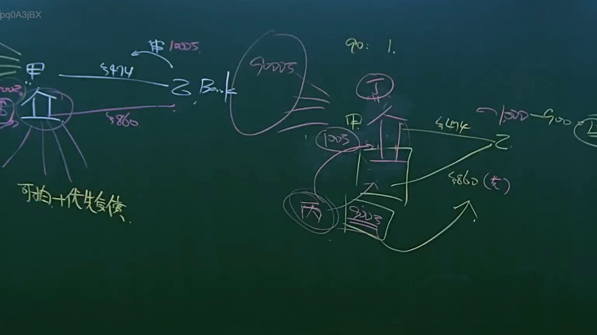

# 🎥 影音教材板書校對筆記
    - **來源影片**: [預約 9 2025-04-13 16-38-25-994](file:///J:/民法B/ch9/預約 9 2025-04-13 16-38-25-994.mp4)
    - **課程分類**: `[民法B`
    - **課堂章節**: `ch9]`
    - **影片時間戳記**: `02:08:15` (7695 秒)
    - **板書類型**: `影音板書`
    - **偵測時間**: 2026-07-21 11:02:30
    
    ## 🔍 擷取黑板板書對照圖
    
    
    ## 🧠 AI 智慧理解與知識庫演化註記
    ：
本板書呈現的是「抵押權執行與債權分配」的法律實務邏輯，特別聚焦於不動產拍賣後的價金分配（分配表）以及優先受償權的行使。

1. 板書文字辨識（OCR）：
    - 實體人物：甲（債務人/所有人）、乙 Bank（抵押權人/銀行）、丙（另一債權人）、丁（可能是承租人或利害關係人）。
    - 關鍵標的：房屋圖示（不動產）。
    - 金額：$1000萬（原始債權或價值）、$474（分配額或特定債權）、$860（債權額）、$900萬（拍定價格/現值）。
    - 法律關鍵字：可拍、優先受償、90: 1.（可能指年度案號或受償順位）。
    - 運算邏輯：1000 - 900 = 100（不足清償之差額）。

2. 法律學理與法條對照：
    - 普通抵押權之效力（民法第 860 條）：乙 Bank 作為抵押權人，對於甲提供擔保之不動產，具有「優先受償權」。板書中的「可拍 + 優先受償」即指抵押權人於債權屆清償期而未受清償時，得聲請法院拍賣抵押物（民法第 873 條）。
    - 拍賣與價金分配：圖中顯示標的價值約 1000 萬，但最終拍定價格可能為 900 萬。此時 900 萬將依受償順位分配。若乙 Bank 之債權為 $860，且具有第一順位抵押權，則其可優先獲得清償。
    - 餘額與普通債權：若拍賣所得（900 萬）不足清償所有債務（如總債務 1000 萬，差額 100 萬），剩餘部分則轉為普通債權，由債務人甲之其他財產清償，丙等普通債權人僅能就剩餘價金受償。
    - 除去租賃關係：圖中「丁」被圈起並與房屋結構關聯，實務上常涉及「強制執行法第 98 條」，若丁之租賃權影響抵押權之實行（導致無人應買或出價過低），執行法院可裁定除去租賃後拍賣。
    
    ## 📊 可編輯之 Mermaid 關係流程圖
    ```mermaid
    ：
graph TD
    A["債務人甲 (所有權人)"] -- "提供擔保 (民法 860)" --> B["不動產 (房屋標的)"]
    C["乙 Bank (抵押權人)"] -- "設定抵押權 $860" --> B
    B -- "強制執行拍賣" --> D["拍定價金 $900萬"]
    D -- "1. 優先受償" --> C
    D -- "2. 剩餘分配" --> E["普通債權人丙"]
    F["丁 (承租人/佔有人)"] -. "可能被除去租賃" .-> B
    G["不足額 $100萬"] -- "轉為普通債權" --> A
    style B fill#f9f,stroke#333,stroke-width2px
    style D fill#bbf,stroke#333,stroke-width2px
    ```
    
    ## ✍️ 操作者手動校對修改區
    <!-- 您可以直接修改上方的文字或調整 Mermaid 區塊中的節點，Obsidian 會即時重新渲染 -->
    - [ ] 欄位結構與法律邏輯已校對無誤。
    - **校對筆記**: 
    