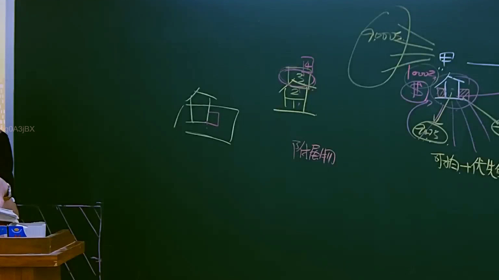

# 🎥 影音教材板書校對筆記
    - **來源影片**: [預約 9 2025-04-13 16-38-25-994](file:///J:/民法B/ch9/預約 9 2025-04-13 16-38-25-994.mp4)
    - **課程分類**: `[民法B`
    - **課堂章節**: `ch9]`
    - **影片時間戳記**: `02:22:45` (8565 秒)
    - **板書類型**: `影音板書`
    - **偵測時間**: 2026-07-21 11:02:54
    
    ## 🔍 擷取黑板板書對照圖
    
    
    ## 🧠 AI 智慧理解與知識庫演化註記
    ：
這張板書呈現的是臺灣民法關於「抵押權效力所及範圍」與「增建部分（附屬物）」的法律邏輯。

1. **板書文字辨識 (OCR)**：
    - 人物與主體：`甲`（抵押人/債務人）、`1、2、3、4`（代表樓層，其中 3、4 樓為增建）。
    - 關鍵法律術語：`附屬物`、`可拍 + 優先受償`。
    - 數額標示：`7000萬`（代表原建物價值）、`1000萬`（代表增建部分價值）、`$`（金錢/價金）。
    - 法律條文關聯：圖中標記與箭頭指向民法第 811 條（動產與不動產之附合）及第 862 條（抵押權效力之範圍）。

2. **詳細法律解讀與條文對照**：
    - **核心爭點（增建部分之歸屬）**：老師正在解說當抵押物（如房屋）在設定抵押權後，又額外增建（如頂樓加蓋 3、4 樓）時，抵押權的效力是否及於該增建部分？
    - **附屬物與附合物之判斷（民法第 811 條）**：
        - 若增建部分（3、4樓）**不具構造上與功能上之獨立性**（例如必須經過 1、2 樓出入，無獨立水電或出口），則該增建部分會因「附合」而成為原建物的成分或「附屬物」。
    - **抵押權效力之擴張（民法第 862 條第 2 項）**：
        - 根據民法第 862 條第 2 項：「抵押權之效力，及於抵押物之附加物及從物。」因此，若 3、4 樓被認定為不具獨立性的附屬物，則即便設定抵押時它還不存在，抵押權效力仍會擴張及於該部分。
    - **拍賣與受償邏輯（可拍 + 優先受償）**：
        - 由於增建部分已成為抵押物的一部分，當法院強制執行拍賣時，法院會將全棟（1至4樓）合併拍賣。
        - 抵押權人（銀行或債權人）對於原 1、2 樓（7000萬）以及增建 3、4 樓（1000萬）的拍賣所得，皆享有「優先受償權」。這就是板書右下角寫「可拍（併付拍賣）+ 優先受償」的原因。
    - **與民法第 877 條之區別**：
        - 若增建部分具有「構造上及功能上之獨立性」，則屬於「獨立建物」。此時僅能依民法第 877 條第 2 項「併付拍賣」，但抵押權人對該增建部分之價金（1000萬）則無優先受償權，僅能就原抵押部分優先受償。
    
    ## 📊 可編輯之 Mermaid 關係流程圖
    ```mermaid
    ：
graph TD
    A["甲 (所有權人)"] --- B["抵押權設定"]
    B --- C["原建物 (1-2樓 7000萬)"]
    C -.-> D["增建部分 (3-4樓 1000萬)"]
    
    subgraph "法律判斷：附屬物性質"
    D -- "無獨立性 (附合)" --> E["認定為『附屬物』"]
    D -- "具獨立性" --> F["認定為『獨立建物』"]
    end
    
    E --> G["民法第 862 條第 2 項"]
    G --> H["抵押權效力及於增建"]
    H --> I["結果：可拍賣 + 優先受償 (共8000萬範圍)"]
    
    F --> J["民法第 877 條第 2 項"]
    J --> K["結果：可併付拍賣 (但對1000萬無優先受償權)"]
    
    style E fill#f9f,stroke#333,stroke-width2px
    style I fill#dfd,stroke#333,stroke-width2px
    ```
    
    ## ✍️ 操作者手動校對修改區
    <!-- 您可以直接修改上方的文字或調整 Mermaid 區塊中的節點，Obsidian 會即時重新渲染 -->
    - [ ] 欄位結構與法律邏輯已校對無誤。
    - **校對筆記**: 
    