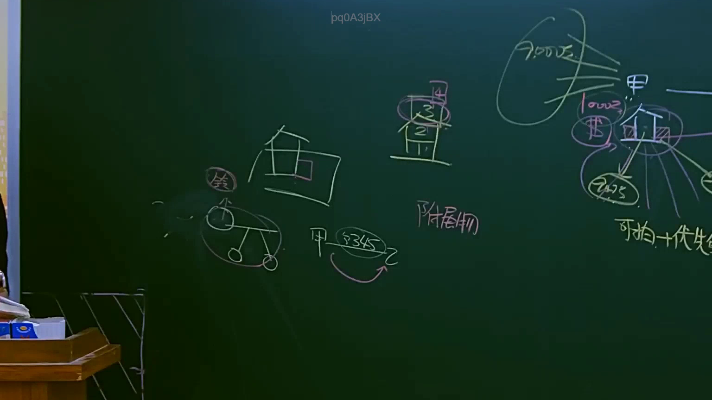

# 🎥 影音教材板書校對筆記
    - **來源影片**: [預約 9 2025-04-13 16-38-25-994](file:///J:/民法B/ch9/預約 9 2025-04-13 16-38-25-994.mp4)
    - **課程分類**: `[民法B`
    - **課堂章節**: `ch9]`
    - **影片時間戳記**: `02:35:00` (9300 秒)
    - **板書類型**: `影音板書`
    - **偵測時間**: 2026-07-21 11:03:17
    
    ## 🔍 擷取黑板板書對照圖
    
    
    ## 🧠 AI 智慧理解與知識庫演化註記
    ：
本板書主要在探討「抵押權效力之範圍」以及「增建建物（附屬物）」在強制執行程序中的受償邏輯。以下是針對板書內容的高精度 OCR 辨識與法律解讀：

1. **板書文字辨識 (OCR)**：
   - 角色：甲（通常代表抵押權人/債權人）、乙（通常代表債務人/所有人）。
   - 法律條文：§345（民法第345條，買賣契約）。
   - 標的結構：圖示一棟房子，標註 1、2、3、4 樓。其中 3、4 樓被圈起並註記為「附屬物」。
   - 關鍵概念：可拍＋優先（指併付拍賣與優先受償權）。
   - 金額/債權：7000萬、1000萬。
   - 其他圖示：一台車輛（動產/從物之意象）及「等」字。

2. **法律學理與爭點解讀**：
   - **抵押權效力範圍（民法§862）**：抵押權之效力，及於抵押物之從物與從權利。圖中 3、4 樓如果是 1、2 樓的「附屬物」（無獨立門牌、無獨立出入口、結構上與功能上與主建物合一），則依民法第 811 條（動產與不動產附合）或第 862 條，抵押權效力擴張至該增建部分。
   - **併付拍賣（民法§877）**：若增建部分（3、4樓）具有獨立性，不屬於抵押權效力所及，但為了發揮土地與建築物之經濟效用，抵押權人得請求「併付拍賣」。
   - **可拍＋優先**：這是本板書的核心結論。若 3、4 樓被認定為「附屬物」（構成部分），則抵押權人不僅可以將其「併拍」（可拍），且對於拍賣所得價金有「優先受償權」（優先）。反之，若僅是依 §877 併付拍賣的獨立建物，則僅能「併拍」但「無優先受償權」。
   - **買賣與處分（§345）**：甲、乙間的買賣契約與移轉行為（§345），涉及標的物範圍的界定，即買賣契約之效力是否包含該附屬物。
   - **債權分配**：右側 7000 萬與 1000 萬的數字，代表拍賣所得後的受償分配邏輯，強調抵押權人在優先效力下能拿到的金額區塊。
    
    ## 📊 可編輯之 Mermaid 關係流程圖
    ```mermaid
    ：
graph TD
    A["抵押權人/債權人 甲"] -- "借款及設定抵押" --> B["主建物 (1、2樓)"]
    B -- "§862 效力擴張" --> C["附屬物 (3、4樓)"]
    D["債務人/所有人 乙"] -- "§345 買賣關係" --> A
    
    subgraph "拍賣範圍與效力"
    C -- "構成部分 (無獨立性)" --> E["可併付拍賣"]
    E --> F["具有優先受償權"]
    end
    
    G["金流分配"] --- H["7000萬 (主債權)"]
    G --- I["1000萬 (增建價值)"]
    
    style C fill#f9f,stroke#333,stroke-width2px
    style F fill#dfd,stroke#333,stroke-width2px
    ```
    
    ## ✍️ 操作者手動校對修改區
    <!-- 您可以直接修改上方的文字或調整 Mermaid 區塊中的節點，Obsidian 會即時重新渲染 -->
    - [ ] 欄位結構與法律邏輯已校對無誤。
    - **校對筆記**: 
    