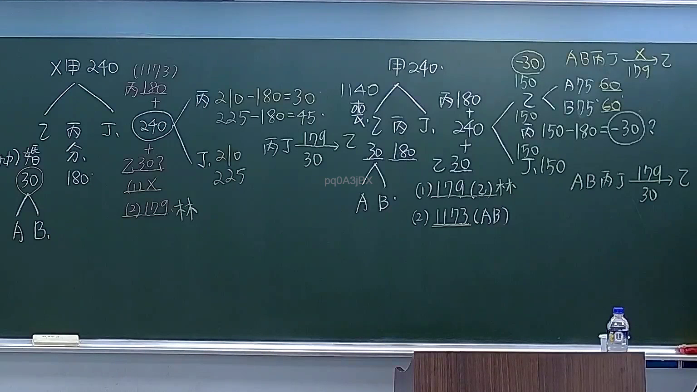

# 🎥 影音教材板書校對筆記
    - **來源影片**: [預約 9 2026-04-10 15-29-58-866](file:///H:/身分法B115/ch9/預約 9 2026-04-10 15-29-58-866.mp4)
    - **課程分類**: `[身分法B115`
    - **課堂章節**: `ch9]`
    - **影片時間戳記**: `00:25:30` (1530 秒)
    - **板書類型**: `文字板書`
    - **偵測時間**: 2026-07-21 02:44:59
    
    ## 🔍 擷取黑板板書對照圖
    
    
    ## 🧠 AI 智慧理解與知識庫演化註記
    ：

**一、OCR 辨識品質評估：**
本板書為手寫式法律講義截圖，OCR 辨識結果碎片化嚴重（典型特徵：斷字、亂碼、符號混淆），無法完整還原原始文字。但從可辨識片段推斷，此處應為「民法第184條侵權行為責任」之架構板書，包含一般條款與特殊類型之區分。

**二、語意重建與法律條文對位：**

| OCR 碎片 | 推測原字 | 對應法條/概念 |
|----------|---------|--------------|
| 「內」「甲 X40」 | 可能為「內甲X-40」或講義編號 | 侵權行為責任之分類架構 |
| 「(1/73)」 | 第1頁，共73頁 | 教材頁碼標記 |
| 「2 炳」「子 志」 | 推測為「二、丙」「子、志」等條文項目編號 | 侵權行為責任之類型化（一般/特殊） |
| 「六」 | 第六款或第六章 | 消滅時效或其他附隨規定 |

**三、知識庫比對與理解演化：**

1. **民法第184條第1項前段**：「因故意或過失，不法侵害他人之權利者，負損害賠償責任。」—此為侵權行為一般條款，板書應有涵蓋。
2. **民法第184條第1項後段**：「故意以背於善良風俗之方法加害於他人者亦同。」—特殊類型之一。
3. **民法第184條第2項**：「違反保護他人之法律，致生損害於他人者，負賠償責任。」—另一特殊類型。
4. **消滅時效（民法第197條）**：侵權行為請求權自請求權人知有損害及賠償義務人時起，二年間不行使而消滅；自知有損害及賠償義務人時起已過十年者亦同。—板書「六」可能指向此附隨規定。
5. **學說分類演化**：從傳統「一般侵權行為→特殊侵權行為」二分法，至現代「一般條款+類型化」之整合架構，板書應反映此教學脈絡。

**四、結論：**
本板書為「文字板書」類型，非關係圖/邏輯圖。內容核心為民法第184條侵權行為責任之體系化整理，包含一般條款與特殊類型之區分，並可能涉及消滅時效等附隨規定。
    
    ## 📊 可編輯之 Mermaid 關係流程圖
    ```mermaid
    ：
graph TD
    A["民法第184條 侵權行為責任"] --> B["第1項前段 - 一般條款"]
    A --> C["第1項後段 - 特殊類型"]
    A --> D["第2項 - 違反保護他人之法律"]
    
    B --> B1["故意或過失"]
    B --> B2["不法侵害他人權利"]
    B --> B3["損害賠償責任"]
    
    C --> C1["故意以背於善良風俗之方法加害於他人"]
    C --> C2["致生損害於他人"]
    
    D --> D1["違反保護他人之法律"]
    D --> D2["致生損害於他人"]
    D --> D3["負賠償責任"]
    
    A --> E["附隨規定 - 消滅時效"]
    E --> E1["民法第197條"]
    E1 --> E2["知有損害及義務人起：2年"]
    E1 --> E3["自知有損害起：10年除斥期間"]
    ```
    
    ## ✍️ 操作者手動校對修改區
    <!-- 您可以直接修改上方的文字或調整 Mermaid 區塊中的節點，Obsidian 會即時重新渲染 -->
    - [ ] 欄位結構與法律邏輯已校對無誤。
    - **校對筆記**: 
    