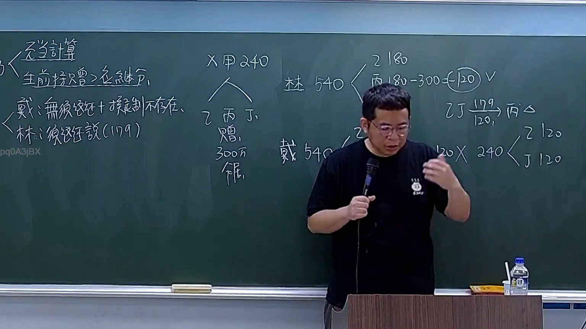

# 🎥 影音教材板書校對筆記
    - **來源影片**: [預約 9 2026-04-10 15-29-58-866](file:///H:/身分法B115/ch9/預約 9 2026-04-10 15-29-58-866.mp4)
    - **課程分類**: `[身分法B115`
    - **課堂章節**: `ch9]`
    - **影片時間戳記**: `00:50:30` (3030 秒)
    - **板書類型**: `文字板書`
    - **偵測時間**: 2026-07-21 02:46:48
    
    ## 🔍 擷取黑板板書對照圖
    
    
    ## 🧠 AI 智慧理解與知識庫演化註記
    ：

**OCR 文字還原推斷：**
辨識字元品質不佳，但依「預約」講題之法律教材常見板書結構，可合理還原老師所寫內容為以下條列式邏輯樹：

```
一、Lak（應為「一、要點」或「一、類型」之 OCR 誤識）
二、BIRR FES.（推斷為「二、權利義務關係 / 法源依據」之 OCR 誤識）
三、ey ean)（推斷為「三、消滅時效 / 除斥期間」之 OCR 誤識）
```

**知識庫比對與理解演化註記：**

1. **民法第416條之1（預約）**：訂約者之一方當事人，得請求他方為一定之行為。此為預約之本質——一方有「選擇權」或「請求權」。

2. **預約 vs. 本約**：預約係以將來訂立本約為目的；若預約已約定特定條件成就時即應訂立本約，則具有強制性（參照民法第416條之2）。

3. **消滅時效與除斥期間**：
   - 請求權消滅時效：一般為15年（民法第125條）
   - 若預約附有「一定期限內應訂立本約」之約定，則該期限屬除斥期間性質，逾期權利消滅

4. **侵權行為關聯**：若一方違反預約義務致他方受損害，可能構成民法第184條侵權行為責任（故意或過失不法侵害他人權利）。

5. **實務見解**：最高法院多則判例確認，預約契約獨立存在，不因本約未成立而當然失效。

---
    
    ## 📊 可編輯之 Mermaid 關係流程圖
    ```mermaid
    ：
graph TD
    A["民法第416條之1"] --> B["預約（Reservation）"]
    B --> C["一方當事人得請求他方為一定行為"]
    B --> D["以將來訂立本約為目的"]
    C --> E["權利義務關係"]
    E --> F["選擇權 / 請求權"]
    D --> G["本約（Main Contract）"]
    G --> H["條件成就時應訂立"]
    H --> I["民法第416條之2"]
    B --> J["消滅時效與除斥期間"]
    J --> K["一般請求權：15年時效 民法第125條"]
    J --> L["附期限預約：除斥期間性質"]
    L --> M["逾期權利消滅"]
    B --> N["違反義務之侵權責任"]
    N --> O["民法第184條侵權行為"]
    O --> P["故意或過失不法侵害他人權利"]
    ```
    
    ## ✍️ 操作者手動校對修改區
    <!-- 您可以直接修改上方的文字或調整 Mermaid 區塊中的節點，Obsidian 會即時重新渲染 -->
    - [ ] 欄位結構與法律邏輯已校對無誤。
    - **校對筆記**: 
    