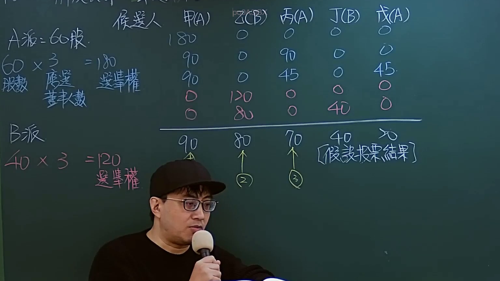

# 🎥 影音教材板書校對筆記
    - **來源影片**: [預約 Sandbox 11-1](file:///J:/test_ingest/公司法/ch11/預約 Sandbox 11-1.mp4)
    - **課程分類**: `[公司法`
    - **課堂章節**: `ch11]`
    - **影片時間戳記**: `00:02:00` (120 秒)
    - **板書類型**: `影音板書`
    - **偵測時間**: 2026-07-26 04:07:06
    
    ## 🔍 擷取黑板板書對照圖
    
    
    ## 🧠 AI 智慧理解與知識庫演化註記
    ：
本板書詳細闡述了臺灣公司法中「累積投票制」(Cumulative Voting System) 於董事選舉的應用。

**1. 板書文字辨識與結構解析：**

*   **頂部標題**: 候選人 甲(A) 乙(B) 丙(A) 丁(B) 戊(A) (列出所有候選人及其所屬派別，A為A派，B為B派)
*   **左側投票權計算區**:
    *   **A派**: 60股 (持有股數)
        *   60 x 3 = 180 (選舉權)
        *   下方有註記說明計算邏輯：「股數 應選 董事人數」用於計算「選舉權」。(此處「3」代表應選董事人數)
    *   **B派**: 40股 (持有股數)
        *   40 x 3 = 120 (選舉權)
*   **中間投票分配表格 (假設情境)**:
    *   此表格展示了不同投票權者（或派別總投票權）如何將其總選舉權分配給各候選人。
    *   **甲(A)** | **乙(B)** | **丙(A)** | **丁(B)** | **戊(A)**
    *   180 | 0 | 0 | 0 | 0 (A派集中投甲)
    *   90 | 0 | 90 | 0 | 0 (A派分配投甲、丙)
    *   90 | 0 | 45 | 0 | 45 (A派分配投甲、丙、戊)
    *   0 | 120 | 0 | 0 | 0 (B派集中投乙)
    *   0 | 80 | 0 | 40 | 0 (B派分配投乙、丁)
*   **底部假設投票結果**:
    *   橫線下方總結了某種投票策略下的最終得票數。
    *   甲(A): 90 ↑ (1) (獲得90票，為第一名)
    *   乙(B): 80 ↑ (2) (獲得80票，為第二名)
    *   丙(A): 70 ↑ (3) (獲得70票，為第三名)
    *   丁(B): 40 (獲得40票)
    *   戊(A): >0 (獲得票數大於0，但未入選)
    *   方括號註記: [假設投票結果] (此為模擬的選舉結果)

**2. 法律學理與法條對照：**

*   **法律學理**:
    *   本板書的核心是**累積投票制**，這是公司法為保障少數股東權益而設計的一種董事選舉制度。
    *   其原理是股東所持有的每一股，均擁有與應選董事人數相同的選舉權，這些選舉權可以集中投給一人，或分散投給數人。得票數較多者當選為董事。
    *   目的：避免多數股東利用其股權優勢，使所有董事均由其推選之人擔任，導致少數股東在董事會中完全沒有代表。透過累積投票，即使是持股比例較低的股東，也有機會集中其投票權，將其屬意的人選送進董事會。
*   **法條對照**:
    *   **公司法 第198條** (董事之選任方式 — 累積投票制)：
        *   「股東會選任董事時，除公司章程另有規定外，每一股份有與應選出董事人數相同之選舉權，得集中選舉一人，或分配選舉數人，由所得選票代表選舉權較多者，當選為董事。」
        *   本條明確規定了累積投票制的計算方式：「每一股份有與應選出董事人數相同之選舉權」。板書中的「60股 x 3 = 180選舉權」與「40股 x 3 = 120選舉權」正是此條文的具體演算。
        *   板書中的投票分配表格，則形象地展示了「得集中選舉一人，或分配選舉數人」的原則。
        *   最終的「假設投票結果」及當選名單，則體現了「由所得選票代表選舉權較多者，當選為董事」的結果。
*   **案例邏輯與關係**:
    *   本例假設有兩個主要股東派別（A派與B派），A派持股60%，B派持股40%。應選董事人數為3人。
    *   若採傳統單記投票制，A派因持股過半，可能輕易選出所有3名董事，B派則無法選出任何董事。
    *   但在累積投票制下：
        *   A派有180票，B派有120票。
        *   依據板書的「假設投票結果」，A派成功選出甲(90票)和丙(70票)兩位董事。
        *   B派也成功選出乙(80票)一位董事。
    *   結果：3席董事中，A派取得2席，B派取得1席，這比單記投票更能公平反映股東持股比例，保障了B派少數股東的董事代表權。
*   **不相關法條**: 民法第184條 (侵權行為) 及消滅時效等與本次董事選舉制度無直接關聯。本板書內容專注於公司法之股東權利與公司治理範疇。
    
    ## 📊 可編輯之 Mermaid 關係流程圖
    ```mermaid
    ：
graph TD
    A["公司法 第198條 累積投票制 (保護少數股東權益)"]

    SUBGRAPH "股東與選舉權計算 (應選董事人數 3)"
        A_SHARE["A派 60股"] --> A_VOTES["A派選舉權 60 x 3 = 180"]
        B_SHARE["B派 40股"] --> B_VOTES["B派選舉權 40 x 3 = 120"]
    END

    SUBGRAPH "候選人與所屬派別"
        CAND_JIA["候選人 甲 (A)"]
        CAND_YI["候選人 乙 (B)"]
        CAND_BING["候選人 丙 (A)"]
        CAND_DING["候選人 丁 (B)"]
        CAND_WU["候選人 戊 (A)"]
    END

    SUBGRAPH "假設投票結果"
        VOTE_JIA["甲(A) 得票 90"]
        VOTE_YI["乙(B) 得票 80"]
        VOTE_BING["丙(A) 得票 70"]
        VOTE_DING["丁(B) 得票 40"]
        VOTE_WU["戊(A) 得票 >0"]
    END

    SUBGRAPH "董事當選名單 (依得票數高低)"
        ELECTED_1["當選董事 (1) 甲(A)"]
        ELECTED_2["當選董事 (2) 乙(B)"]
        ELECTED_3["當選董事 (3) 丙(A)"]
    END

    A -- "規定董事選舉方式" --> A_VOTES
    A -- "規定董事選舉方式" --> B_VOTES

    A_VOTES -- "策略性分配選票" --> VOTE_JIA
    A_VOTES -- "策略性分配選票" --> VOTE_BING
    A_VOTES -- "策略性分配選票" --> VOTE_WU

    B_VOTES -- "策略性分配選票" --> VOTE_YI
    B_VOTES -- "策略性分配選票" --> VOTE_DING

    VOTE_JIA -- "得票最高" --> ELECTED_1
    VOTE_YI -- "得票次高" --> ELECTED_2
    VOTE_BING -- "得票第三高" --> ELECTED_3
    VOTE_DING -- "未達當選門檻" --> NOT_ELECTED["未當選"]
    VOTE_WU -- "未達當選門檻" --> NOT_ELECTED

    ELECTED_1 --> ELECTION_END["選舉結果確定"]
    ELECTED_2 --> ELECTION_END
    ELECTED_3 --> ELECTION_END
    NOT_ELECTED --> ELECTION_END
    ```
    
    ## ✍️ 操作者手動校對修改區
    <!-- 您可以直接修改上方的文字或調整 Mermaid 區塊中的節點，Obsidian 會即時重新渲染 -->
    - [ ] 欄位結構與法律邏輯已校對無誤。
    - **校對筆記**: 
    