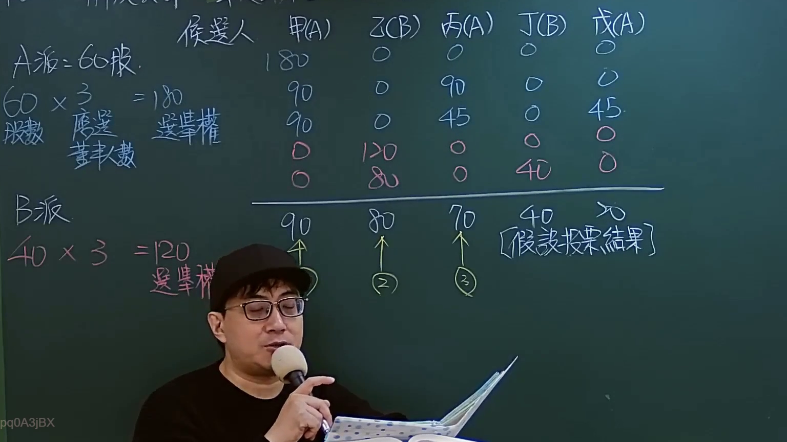

# 🎥 影音教材板書校對筆記
    - **來源影片**: [預約 Sandbox 11-1](file:///J:/test_ingest/公司法/ch11/預約 Sandbox 11-1.mp4)
    - **課程分類**: `[公司法`
    - **課堂章節**: `ch11]`
    - **影片時間戳記**: `00:05:45` (345 秒)
    - **板書類型**: `影音板書`
    - **偵測時間**: 2026-07-26 04:07:58
    
    ## 🔍 擷取黑板板書對照圖
    
    
    ## 🧠 AI 智慧理解與知識庫演化註記
    ：
本板書主要闡釋臺灣公司法中關於「累積投票制」下董事選舉的運作機制與策略。

**1. 板書高精度 OCR 內容：**
候選人
甲(A) 乙(B) 丙(A) 丁(B) 戊(A)
A派: 60股
60 × 3 = 180
股數 應選 董事人數
[投票分佈情況]
180 | 0 | 0 | 0 | 0
90 | 0 | 90 | 0 | 0
90 | 0 | 45 | 0 | 45
0 | 120 | 0 | 0 | 0
0 | 80 | 0 | 40 | 0
--------------------------------------
90 | 80 | 70 | 40 | 0
↑ (1) | ↑ (2) | ↑ (3)
[假設投票結果]
B派
40 × 3 = 120
選舉權

**2. 板書詳細解讀與法條對照：**

*   **主題：公司董事選舉之累積投票制**
    板書的核心內容是展示在「累積投票制」下，股東如何分配其投票權以選舉公司董事。這是臺灣《公司法》為保障少數股東權益所設的重要制度。

*   **應選董事人數設定：**
    從「60 × 3 = 180」和「40 × 3 = 120」的計算方式可以推斷出，本次董事選舉的「應選董事人數」為 **3 位**。這是累積投票制的基礎，每股享有與應選董事人數相同之投票權。

*   **股東派系與投票權：**
    *   **A派：** 持有「60股」。根據應選董事人數為3人，A派共擁有 60 股 × 3 票/股 = **180 票** 的總投票權。
    *   **B派：** 持有「40股」。同樣地，B派共擁有 40 股 × 3 票/股 = **120 票** 的總投票權。
    *   這兩個派系代表了公司中不同的股東利益團體。

*   **候選人及其派系：**
    *   候選人 甲(A)、丙(A)、戊(A) 屬於 A派。
    *   候選人 乙(B)、丁(B) 屬於 B派。

*   **投票分佈情況（策略示例）：**
    板書中上方的表格列出了一系列數字，這些數字代表了股東或不同股東群體在累積投票制下，如何將其總投票權分配給不同的候選人的策略範例。例如：
    *   第一行 `180 | 0 | 0 | 0 | 0` 可能表示某股東將其全部180票投給甲(A)。
    *   第三行 `90 | 0 | 45 | 0 | 45` 可能表示某股東將其180票拆分成90票給甲(A)，45票給丙(A)，45票給戊(A)。
    *   這體現了累積投票制中股東可以「集中選票」或「分散選票」的特性。

*   **假設投票結果與當選董事：**
    最下方一行「[假設投票結果]」顯示了所有票數統計後的最終結果：
    *   甲(A): 90 票 (獲選，標記為 (1))
    *   乙(B): 80 票 (獲選，標記為 (2))
    *   丙(A): 70 票 (獲選，標記為 (3))
    *   丁(B): 40 票 (未獲選)
    *   戊(A): 0 票 (未獲選)
    由於應選董事人數為3位，得票數最高的前三名候選人（甲、乙、丙）當選董事。

*   **法律學理與法條對照：**
    *   **《公司法》第198條 (Cumulative Voting System)**：
        臺灣《公司法》第198條規定：「股東會選任董事時，除章程另有規定外，每一股份有與應選出董事人數相同之選舉權，得集中選票選舉一人，或分配於數人，由所得選票代表選舉權較多者，當選為董事。」
        這條文明確定義了累積投票制，即股東會選舉董事時，每股有與應選董事人數相同的選舉權，可以集中投給一人，也可以分散投給數人，得票數較多者當選。
    *   **立法目的：保障少數股東權益**
        累積投票制的主要立法目的在於保障少數股東在董事會中擁有代表席次。在傳統的單記名制度下，多數股東可以憑藉其股權優勢完全掌握所有董事席次，使得少數股東的聲音無法進入董事會。累積投票制允許少數股東將其有限的票數集中投給特定候選人，從而增加其當選機會，確保董事會組成的多元性。
    *   **案例邏輯與策略性投票：**
        本案例展示了累積投票制如何讓擁有較少股份的B派（40股，120票）成功將乙(B)送入董事會（80票），即使A派（60股，180票）的總票數更多。這突顯了累積投票制下「策略性投票」的重要性，股東必須仔細計算和分配票數，才能有效實現其在董事會中的代表權。若B派不集中票數，乙(B)可能無法當選。A派也必須策略性分配票數，確保其能取得足夠的席次。

*   **演化註記：**
    《公司法》第198條在2018年修法後，仍然維持了累積投票制為原則，只有在公司章程明確排除的情況下才能採用其他方式。這顯示了累積投票制在臺灣公司治理中的重要地位，被視為提升公司透明度和股東權利保護的關鍵機制。
    
    ## 📊 可編輯之 Mermaid 關係流程圖
    ```mermaid
    ：
graph TD
    subgraph "選舉制度"
        Cumulative_Voting["累積投票制 (公司法第198條原則)"]
        Directors_To_Elect["應選董事人數 3"]
        Cumulative_Voting --> Directors_To_Elect
    end

    subgraph "股東派系與投票權"
        A_Faction["A派 (60股)"]
        B_Faction["B派 (40股)"]
        
        Total_Votes_A["A派總投票權 60股 x 3 = 180票"]
        Total_Votes_B["B派總投票權 40股 x 3 = 120票"]
        
        A_Faction -- "擁有" --> Total_Votes_A
        B_Faction -- "擁有" --> Total_Votes_B
    end

    subgraph "候選人"
        C_Jia["候選人 甲 (A派)"]
        C_Yi["候選人 乙 (B派)"]
        C_Bing["候選人 丙 (A派)"]
        C_Ding["候選人 丁 (B派)"]
        C_Wu["候選人 戊 (A派)"]
    end

    Total_Votes_A -- "策略性分配票數" --> Voting_Process["投票過程"]
    Total_Votes_B -- "策略性分配票數" --> Voting_Process

    Voting_Process --> Final_Results["假設投票結果 (得票數)"]

    Final_Results -- "甲 90票" --> C_Jia
    Final_Results -- "乙 80票" --> C_Yi
    Final_Results -- "丙 70票" --> C_Bing
    Final_Results -- "丁 40票" --> C_Ding
    Final_Results -- "戊 0票" --> C_Wu

    subgraph "當選結果"
        Elected_Directors["當選董事 (得票數前3名)"]
        
        C_Jia -- "當選 (1)" --> Elected_Directors
        C_Yi -- "當選 (2)" --> Elected_Directors
        C_Bing -- "當選 (3)" --> Elected_Directors
        C_Ding -- "未當選" --> Not_Elected["未當選"]
        C_Wu -- "未當選" --> Not_Elected
        
        Elected_Directors --> Director_Jia["董事 甲 (A派)"]
        Elected_Directors --> Director_Yi["董事 乙 (B派)"]
        Elected_Directors --> Director_Bing["董事 丙 (A派)"]

        Director_Jia -- "代表" --> A_Faction
        Director_Yi -- "代表" --> B_Faction
        Director_Bing -- "代表" --> A_Faction
    end

    Directors_To_Elect -- "決定席次" --> Elected_Directors
    ```
    
    ## ✍️ 操作者手動校對修改區
    <!-- 您可以直接修改上方的文字或調整 Mermaid 區塊中的節點，Obsidian 會即時重新渲染 -->
    - [ ] 欄位結構與法律邏輯已校對無誤。
    - **校對筆記**: 
    