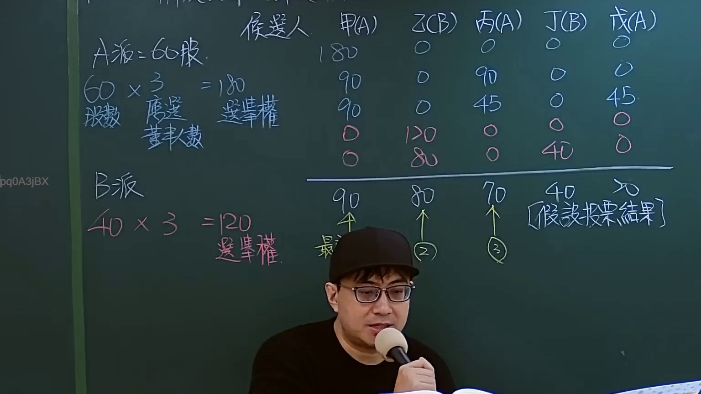

# 🎥 影音教材板書校對筆記
    - **來源影片**: [預約 Sandbox 11-1](file:///J:/test_ingest/公司法/ch11/預約 Sandbox 11-1.mp4)
    - **課程分類**: `[公司法`
    - **課堂章節**: `ch11]`
    - **影片時間戳記**: `00:10:45` (645 秒)
    - **板書類型**: `影音板書`
    - **偵測時間**: 2026-07-26 04:08:58
    
    ## 🔍 擷取黑板板書對照圖
    
    
    ## 🧠 AI 智慧理解與知識庫演化註記
    ：
這張板書清晰地展示了臺灣公司法中「累積投票制」（Cumulative Voting System）的運作方式及其在董事選舉中的應用。

1.  **【板書高精度 OCR】**：
    *   **標題列**：候選人 甲(A) 乙(B) 丙(A) 丁(B) 戊(A)
    *   **A派資訊**：
        *   A派: 60股.
        *   60 × 3 = 180
        *   股數
        *   應選
        *   董事人數
        *   選舉權
    *   **B派資訊**：
        *   B派
        *   40 × 3 = 120
        *   選舉權
    *   **投票分配表格（候選人 vs. 票數）**：
        | 候選人 | 甲(A) | 乙(B) | 丙(A) | 丁(B) | 戊(A) |
        | :----- | :---- | :---- | :---- | :---- | :---- |
        |        | 180   | 0     | 0     | 0     | 0     |
        |        | 90    | 0     | 90    | 0     | 0     |
        |        | 90    | 0     | 45    | 0     | 45    |
        |        | 0     | 120   | 0     | 0     | 0     |
        |        | 0     | 80    | 0     | 40    | 0     |
    *   **假說投票結果**：
        *   甲: 90
        *   乙: 80
        *   丙: 70
        *   丁: 40
        *   戊: 70
    *   **註記**：
        *   [假說投票結果]
        *   (1) (位於甲的90票下方，文字部分被遮擋，推斷為「最」高票)
        *   (2) (位於乙的80票下方)
        *   (3) (位於丙的70票下方)
        *   多個箭頭從假說投票結果指向表格中對應的票數，表示最終得票的來源。

2.  **【板書詳細解讀與法條對照】**：
    這塊板書是關於公司法中董事選舉制度的教學案例，主要演示了「累積投票制」的票數計算、分配策略以及當選結果的判斷。

    *   **核心學理：累積投票制**
        累積投票制是現代公司治理中保護少數股東權益的重要機制。其核心精神在於，每一股份擁有的投票權數，等於應選出的董事人數。股東可以將其全部票權集中投給一位候選人，或分散投給數人。相較於「單記投票制」（每股對每一董事席位投一票，且不得集中），累積投票制大大增加了少數股東選出其代表進入董事會的機會，實現董事會的多元化，防止多數股東壟斷。

    *   **法條對照：臺灣公司法 第198條**
        此案例完全符合臺灣《公司法》第198條的規定：
        *   **第1項**：「股東會選任董事時，除公司章程另有規定外，每一股份有與應選出董事人數相同之選舉權，得集中選舉一人，或分開選舉數人。」
            *   **【解讀】**：板書左側的計算即為此條款的具體應用。假設應選董事人數為3位，則A派股東持股60股，總投票權為 60 × 3 = 180票；B派股東持股40股，總投票權為 40 × 3 = 120票。表格中的各種票數分配方式，也演示了股東「得集中選舉一人，或分開選舉數人」的權利。例如，A派可將180票全投給甲，或分散投給甲、丙、戊。
        *   **第2項**：「前項董事之選任，依公司章程所定董事名額，以得票權數較多者為當選。」
            *   **【解讀】**：板書下方「假說投票結果」即依此原則判斷當選者。在應選3名董事的情況下：
                *   甲(A)得票90，為最高票(1)。
                *   乙(B)得票80，為次高票(2)。
                *   丙(A)得票70，為第三高票(3)。
                *   戊(A)得票70，與丙(A)並列第三高票，但板書上僅在丙(A)下方標示了(3)，這可能暗示在應選人數有限（如3名）時，公司章程可能有特殊的同票處理規定，或者此為教學上的一種簡化展示，表明「丙」是其中一個當選者。若僅能選出3名，則丙和戊之間需依公司章程（如抽籤）決定或視為該席次未選出。若板書暗示選出甲、乙、丙三位，則A派將獲得2席，B派1席。丁(B)得票40，未能當選。

    *   **爭點與案例邏輯**：
        這個案例清晰地展示了累積投票制如何讓少數股東有機會在董事會中擁有席次。B派雖然只擁有40股（佔總股數100股的40%），但在累積投票制下，其總投票權為120票。若B派將全部120票集中投給其候選人乙，則乙可得120票，極有可能當選。在板書所示的假說結果中，乙(B)獲得80票，仍高於丙(A)和戊(A)的70票，成功當選第二席董事。這印證了累積投票制保護少數股東，使其不被多數股東完全排除在董事會之外的目的。

3.  **【生成 Mermaid 邏輯圖】**：

```mermaid
graph TD
    %% 股東派別與投票權計算 (依據公司法第198條第1項)
    A_FACTION["A派"] -- "持有 60 股" --> A_TOTAL_VOTES["A派總投票權: 60 股 x 3 董事 = 180 票"]
    B_FACTION["B派"] -- "持有 40 股" --> B_TOTAL_VOTES["B派總投票權: 40 股 x 3 董事 = 120 票"]

    %% 候選人與所屬派別
    subgraph "候選人與所屬派別"
        C_A1["甲 (A派)"]
        C_A2["丙 (A派)"]
        C_A3["戊 (A派)"]
        C_B1["乙 (B派)"]
        C_B2["丁 (B派)"]
    end

    %% 投票行為 (累積投票制允許集中或分散投票)
    A_TOTAL_VOTES -- "運用累積投票權分配票數" --> C_A1 & C_A2 & C_A3
    B_TOTAL_VOTES -- "運用累積投票權分配票數" --> C_B1 & C_B2

    %% 假說投票結果 (依據板書)
    subgraph "假說投票結果 (得票數)"
        RESULT_JIA["甲(A) 得票: 90"]
        RESULT_YI["乙(B) 得票: 80"]
        RESULT_BING["丙(A) 得票: 70"]
        RESULT_DING["丁(B) 得票: 40"]
        RESULT_WU["戊(A) 得票: 70"]
    end

    %% 董事當選順序 (假設應選3名董事，依公司法第198條第2項判斷)
    RESULT_JIA -- "得票最高 (1)" --> ELECTED_JIA["甲(A) 當選董事"]
    RESULT_YI -- "得票次高 (2)" --> ELECTED_YI["乙(B) 當選董事"]
    RESULT_BING -- "得票第三高 (3)" --> ELECTED_BING["丙(A) 當選董事"]
    RESULT_WU -- "同票，但板書未標註當選" --> NOT_ELECTED_WU["戊(A) 未當選"]
    RESULT_DING -- "得票不足" --> NOT_ELECTED_DING["丁(B) 未當選"]

    ELECTED_JIA & ELECTED_YI & ELECTED_BING --> "組成公司董事會"
```
    
    ## 📊 可編輯之 Mermaid 關係流程圖
    ```mermaid
    graph TD
    A["影音板書"] --> B["尚無關聯關係"]
    ```
    
    ## ✍️ 操作者手動校對修改區
    <!-- 您可以直接修改上方的文字或調整 Mermaid 區塊中的節點，Obsidian 會即時重新渲染 -->
    - [ ] 欄位結構與法律邏輯已校對無誤。
    - **校對筆記**: 
    