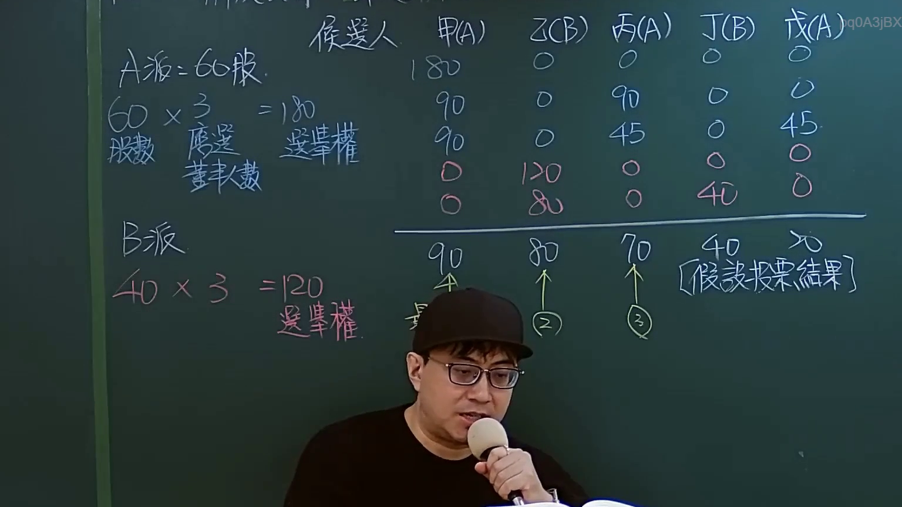

# 🎥 影音教材板書校對筆記
    - **來源影片**: [預約 Sandbox 11-1](file:///J:/test_ingest/公司法/ch11/預約 Sandbox 11-1.mp4)
    - **課程分類**: `[公司法`
    - **課堂章節**: `ch11]`
    - **影片時間戳記**: `00:12:45` (765 秒)
    - **板書類型**: `影音板書`
    - **偵測時間**: 2026-07-26 04:09:35
    
    ## 🔍 擷取黑板板書對照圖
    
    
    ## 🧠 AI 智慧理解與知識庫演化註記
    ：

這塊板書詳細闡述了臺灣公司法中關於**累積投票制（Cumulative Voting）**的董事選舉機制。其核心目的是為保障少數股東的權益，使其有機會推選代表進入董事會。

1.  **基本概念識別**：
    *   **候選人 (Candidates)**: 板書列出了五位候選人：甲(A)、乙(B)、丙(A)、丁(B)、戊(A)。括號內的字母(A)或(B)應代表其所屬的派系或推薦方。
    *   **應選董事數 (Number of Directors to be Elected)**: 從「A派: 60股 x 3 = 180」和「B派: 40股 x 3 = 120」的計算可以看出，本次股東會應選出3名董事。
    *   **選舉權 (Voting Power/Rights)**: 在累積投票制下，每一股份擁有的選舉權數量，等於應選董事人數。
        *   **A派**: 擁有60股，因此總選舉權為 60股 × 3位董事 = 180票。
        *   **B派**: 擁有40股，因此總選舉權為 40股 × 3位董事 = 120票。

2.  **投票策略與分配範例**：
    板書中的表格展示了股東如何策略性地分配其票數：
    *   A派的180票可以集中投給一人（例如，全數投給甲），或分散投給多人（例如，90票給甲，90票給丙；或90票給甲，45票給丙，45票給戊）。
    *   B派的120票也同樣可以集中投給一人（例如，全數投給乙），或分散投給多人（例如，80票給乙，40票給丁）。
    這些例子說明了累積投票制允許股東將其全部票數集中投給一位或多位候選人，以最大化其屬意候選人的當選機會。

3.  **假設投票結果 (Assumed Voting Results)**：
    表格下方的「假設投票結果」顯示了各候選人最終獲得的票數：
    *   甲(A): 90票
    *   乙(B): 80票
    *   丙(A): 70票
    *   丁(B): 40票
    *   戊(A): 70票

4.  **董事當選排名**：
    根據票數高低，並考量到應選3名董事的條件：
    *   **第一名**: 甲(A) 90票 (板書上「90」旁有圈「4」，可能代表票數順位或分配方式，但從「假設投票結果」的票數來看，90票是最高，故應為第一名。)
    *   **第二名**: 乙(B) 80票 (板書上「80」旁有圈「2」)
    *   **第三名**: 丙(A) 70票 (板書上「70」旁有圈「3」)
    由於戊(A)也獲得70票，與丙(A)同票，實務上若未有特別章程規定，可能需要抽籤或依其他約定方式決定，但根據板書上的標示，丙(A)被標示為第三名。

5.  **法條對照與演化註記**：
    *   **臺灣《公司法》第198條**：此條文明確規範了累積投票制在董事選舉中的應用。
        *   「股東會選任董事時，除章程另有規定外，每一股份有與應選出董事人數相同之選舉權，得集中選舉一人，或分配選舉數人，由所得選票代表選舉權較多者，當選為董事。」
        *   對於公開發行股票之公司，累積投票制是強制採用的，以確保股東民主。非公開發行公司則可透過章程選擇其他投票方式。
    *   板書內容完全符合《公司法》第198條的精神，透過具體數字計算和投票結果，生動地演示了累積投票制如何運作，以及如何讓少數股東（例如B派，儘管其總票數較少，但透過集中投票仍能讓乙(B)當選）有機會選出其代表。
    
    ## 📊 可編輯之 Mermaid 關係流程圖
    ```mermaid
    ：
graph TD
    A派["A派 (60股)"] --> A派_選舉權["A派選舉權 = 60股 * 3位董事 = 180票"]
    B派["B派 (40股)"] --> B派_選舉權["B派選舉權 = 40股 * 3位董事 = 120票"]

    subgraph 應選董事席次
        董_數["應選董事數 = 3"]
    end

    A派_選舉權 & B派_選舉權 --> 投票階段["股東會投票階段 (累積投票制)"]
    投票階段 --> 候選人_列表["候選人 甲(A), 乙(B), 丙(A), 丁(B), 戊(A)"]

    候選人_列表 -- "投票分配策略" --> 假設投票結果["假設投票結果"]

    假設投票結果 --> 甲_票數["甲(A) 90票"]
    假設投票結果 --> 乙_票數["乙(B) 80票"]
    假設投票結果 --> 丙_票數["丙(A) 70票"]
    假設投票結果 --> 丁_票數["丁(B) 40票"]
    假設投票結果 --> 戊_票數["戊(A) 70票"]

    甲_票數 -- "第一名" --> 當選董事1["董事 甲(A)"]
    乙_票數 -- "第二名" --> 當選董事2["董事 乙(B)"]
    丙_票數 -- "第三名" --> 當選董事3["董事 丙(A)"]

    subgraph 法律依據
        公司法_198["公司法 第198條 (累積投票制)"]
    end
    公司法_198 --> 投票階段
    ```
    
    ## ✍️ 操作者手動校對修改區
    <!-- 您可以直接修改上方的文字或調整 Mermaid 區塊中的節點，Obsidian 會即時重新渲染 -->
    - [ ] 欄位結構與法律邏輯已校對無誤。
    - **校對筆記**: 
    