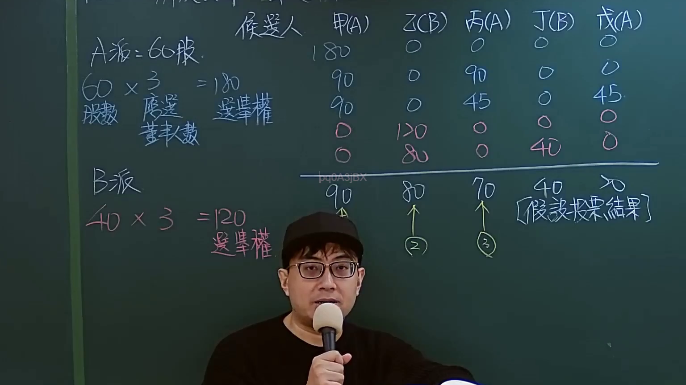
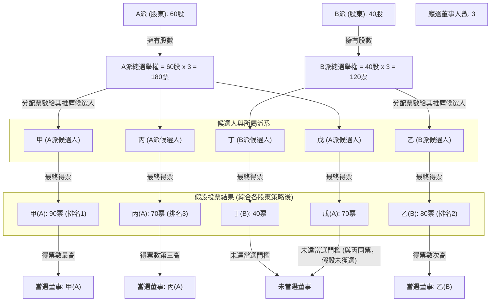

# 🎥 影音教材板書校對筆記
    - **來源影片**: [預約 Sandbox 11-1](file:///J:/test_ingest/公司法/ch11/預約 Sandbox 11-1.mp4)
    - **課程分類**: `[公司法`
    - **課堂章節**: `ch11]`
    - **影片時間戳記**: `00:15:15` (915 秒)
    - **板書類型**: `影音板書`
    - **偵測時間**: 2026-07-26 04:10:30
    
    ## 🔍 擷取黑板板書對照圖
    
    
    ## 🧠 AI 智慧理解與知識庫演化註記
    ：
這張板書圖片詳細說明了臺灣公司法中關於「累積投票制」(Cumulative Voting System) 選舉董事的計算方式與策略應用。老師透過具體的數字範例，闡釋了不同派系股東如何運用其投票權，以期達到選出所屬董事的目的。

**1. 板書文字內容高精度 OCR：**

*   **左側計算與基礎資訊：**
    *   A派: 60股.
    *   60 × 3 = 180 (計算A派總投票權)
    *   股數 應選 董事人數 (解釋計算公式：股數 × 應選董事人數 = 總投票權)
    *   B派
    *   40 × 3 = 120 (計算B派總投票權)
    *   選舉權 (表示股東的投票權利)

*   **右側候選人與投票分配表格：**
    *   **表頭：** 候選人 甲(A) 乙(B) 丙(A) 丁(B) 戊(A) (括號內表示候選人所屬派系)
    *   **投票分配範例（由上至下）：**
        *   第一行: 180 | 0 | 0 | 0 | 0 (A派集中所有票數給甲)
        *   第二行: 90 | 0 | 45 | 0 | 45 (A派分散票數給甲、丙、戊)
        *   第三行: 0 | 120 | 0 | 0 | 0 (B派集中所有票數給乙)
        *   第四行: 0 | 80 | 0 | 40 | 0 (B派分散票數給乙、丁)
    *   **分隔線**

*   **最終假設投票結果：**
    *   甲(A): 90 ↑ (1) (甲獲得90票，排名第一)
    *   乙(B): 80 ↑ (2) (乙獲得80票，排名第二)
    *   丙(A): 70 ↑ (3) (丙獲得70票，排名第三)
    *   丁(B): 40 (丁獲得40票)
    *   戊(A): 70 (戊獲得70票)
    *   [假設投票結果] (標註此為最終的模擬結果)

**2. 板書詳細解讀與法條對照：**

此板書內容的核心在於闡述公司法中的「累積投票制」，其主要目的在於保護少數股東的權益，使其有機會推選其代表進入董事會。

*   **法律學理與爭點：**
    *   **累積投票制 (Cumulative Voting System)**: 依據臺灣《公司法》第198條規定，股東會選舉董事時，除非公司章程另有規定，應採累積投票制。其精神在於每股有與應選出董事人數相同之選舉權，股東可以將所有選票集中投給一人，或分配給數人。
    *   **計算方式**: 板書明確展示了累積投票權的計算：**股數 × 應選董事人數 = 總投票權**。
        *   A派持有60股，應選董事3人，故A派總投票權為 60 × 3 = 180票。
        *   B派持有40股，應選董事3人，故B派總投票權為 40 × 3 = 120票。
    *   **投票策略**: 板書中的多個投票分配範例，顯示了股東如何策略性地運用其總投票權。
        *   **集中投票**: 例如A派將180票全部投給甲，或B派將120票全部投給乙，這是在確保特定候選人當選時的常見策略。
        *   **分散投票**: 例如A派將180票分散為甲90、丙45、戊45，或B派將120票分散為乙80、丁40，這是在嘗試選出多位董事時的策略。透過精算，少數股東可能可以在總票數不如多數股東的情況下，仍確保至少一名代表當選。
    *   **當選結果**: 根據《公司法》第198條後段：「由所得選票代表選舉權較多者，當選為董事。」板書中的「假設投票結果」顯示了各候選人最終的得票數及排名。
        *   應選董事人數為3人，因此得票最高的3位候選人將當選。
        *   在此範例中，甲(A) 90票、乙(B) 80票、丙(A) 70票（與戊(A)同票）分別為前三高票。因此，甲、乙確定當選。至於丙和戊同為70票，若僅剩一個席次，通常會依公司章程或抽籤等方式決定。板書上標註丙為排名3並有箭頭，暗示丙在此案例中當選。這體現了即使是少數股東（如B派僅40股），透過累積投票制仍能選出一名董事（乙(B)），保護其在董事會中的發言權。

*   **法條對照 (臺灣現行法律)：**
    *   **公司法第198條 (董事之選任及其表決權限制)**：
        *   第一項：「股東會選任董事時，除公司章程另有規定外，應採累積投票制。」（這是累積投票制的法源依據）
        *   第二項：「前項所稱累積投票制，係指每股有與應選出董事人數相同之選舉權，得集中選舉一人，或分配選舉數人，由所得選票代表選舉權較多者，當選為董事。」（明確定義了累積投票制的運作方式與當選原則，與板書內容完全吻合）

**3. 生成 Mermaid 邏輯圖：**


    
    ## 📊 可編輯之 Mermaid 關係流程圖
    ```mermaid
    graph TD
    A["影音板書"] --> B["尚無關聯關係"]
    ```
    
    ## ✍️ 操作者手動校對修改區
    <!-- 您可以直接修改上方的文字或調整 Mermaid 區塊中的節點，Obsidian 會即時重新渲染 -->
    - [ ] 欄位結構與法律邏輯已校對無誤。
    - **校對筆記**: 
    