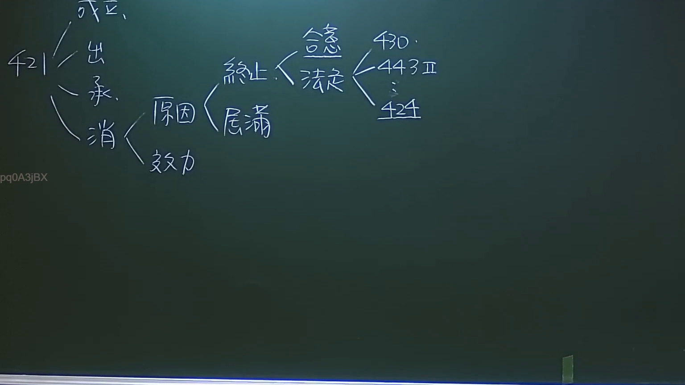

# 🎥 影音教材板書校對筆記
- **來源影片**: [預約27 2024-09-05 01-34-00-883](file:///J:/民法/ch27/預約27 2024-09-05 01-34-00-883.mp4)
- **課程分類**: `[民法`
- **課堂章節**: `ch27]`
- **影片時間戳記**: `02:55:30` (10530 秒)
- **板書類型**: `影音板書`
- **偵測時間**: 2026-07-19 16:45:37

## 🔍 擷取黑板板書對照圖


## 🧠 AI 智慧理解與知識庫演化註記
：
本板書核心在於闡釋臺灣民法第421條「租賃契約」之法律關係架構。
1. **OCR文字辨識內容**：
   - 421條衍生出「成立」、「出租人（承租人）」、「消滅」之法律體系。
   - 消滅之分類：區分為「原因」與「效力」。
   - 原因之細分：包括「終止」（合意、法定）與「屆滿」。
   - 法定終止之依據：板書列舉了第430條（修繕義務）、第443條第2項（轉租）、第424條（危及健康）等相關條文。

2. **法條對照與學理演化**：
   - **民法第421條**：租賃之定義，為諾成契約。
   - **消滅原因**：
     - **屆滿**：租期屆滿，契約當然消滅（民法第450條）。
     - **終止**：針對未定期限或特定事由之契約，分為「合意終止」（契約自由原則）與「法定終止」（如：430條修繕未果、443條違反轉租規定、424條租賃物危及安全健康）。
   - **法律邏輯**：租賃法律關係中，出租人與承租人之權利義務，隨著租賃契約之「成立」開始，並在「消滅」階段中，透過「屆滿」或「終止」來處理契約之結尾。板書特別強調了法定終止事由的多樣性，反映出法律對租賃雙方利益平衡的保護。

## 📊 可編輯之 Mermaid 關係流程圖
```mermaid
：
graph LR
    A["民法第421條 租賃"] --> B["成立"]
    A --> C["出租人/承租人"]
    A --> D["消滅"]
    D --> E["原因"]
    D --> F["效力"]
    E --> G["終止"]
    E --> H["屆滿"]
    G --> I["合意"]
    G --> J["法定"]
    J --> K["430條 修繕"]
    J --> L["443條II 轉租"]
    J --> M["424條 危及健康"]
```

## ✍️ 操作者手動校對修改區
<!-- 您可以直接修改上方的文字或調整 Mermaid 區塊中的節點，Obsidian 會即時重新渲染 -->
- [ ] 欄位結構與法律邏輯已校對無誤。
- **校對筆記**: 
