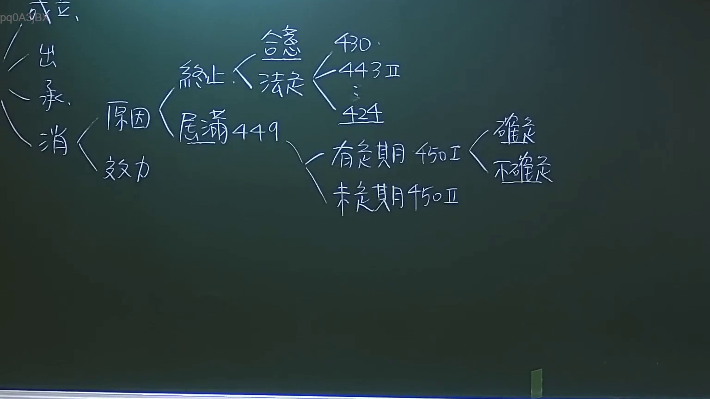

# 🎥 影音教材板書校對筆記
- **來源影片**: [預約27 2024-09-05 01-34-00-883](file:///J:/民法/ch27/預約27 2024-09-05 01-34-00-883.mp4)
- **課程分類**: `[民法`
- **課堂章節**: `ch27]`
- **影片時間戳記**: `03:00:45` (10845 秒)
- **板書類型**: `影音板書`
- **偵測時間**: 2026-07-19 16:45:44

## 🔍 擷取黑板板書對照圖


## 🧠 AI 智慧理解與知識庫演化註記
：
本板書核心議題為「租賃契約之消滅原因」。法律架構上，租賃關係的消滅分為「終止」與「租期屆滿」兩大類型，對應我國民法債編租賃章節之規範：

1. **終止契約**：
   - 「合意」終止：基於契約自由原則。
   - 「法定」終止：包含民法第430條（修繕義務不履行）、第443條第2項（轉租之限制）、第424條（不定期租賃契約之終止）。

2. **租期屆滿（民法第449條）**：
   - 有定期租賃（民法第450條第1項）：依期限屆滿而消滅，細分為「確定期限」與「不確定期限」。
   - 未定期租賃（民法第450條第2項）：當事人得隨時終止。

此板書完整呈現了租賃關係消滅的法源依據邏輯，係透過法條引述（430, 443II, 424, 449, 450I/II）建立起租賃債權消滅的法律效力檢核體系。

## 📊 可編輯之 Mermaid 關係流程圖
```mermaid
：
graph LR
    A["租賃契約消滅"] --> B["終止"]
    A --> C["原因效力"]
    B --> D["合意"]
    B --> E["法定"]
    E --> F["430"]
    E --> G["443 II"]
    E --> H["424"]
    C --> I["屆滿 449"]
    I --> J["有定期 450 I"]
    I --> K["未定期 450 II"]
    J --> L["確定"]
    J --> M["不確定"]
```

## ✍️ 操作者手動校對修改區
<!-- 您可以直接修改上方的文字或調整 Mermaid 區塊中的節點，Obsidian 會即時重新渲染 -->
- [ ] 欄位結構與法律邏輯已校對無誤。
- **校對筆記**: 
